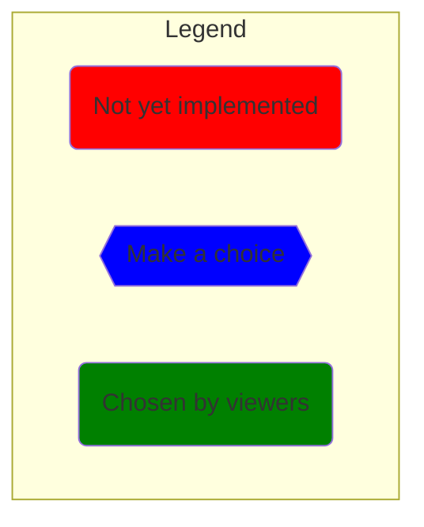

# Choose Your Own Adventure: The Treacherous Trek to Production

From the moment of their inception as source code on the developer's laptop, our hero knows that they are destined for great things. They long to be a real, running application, living in production, serving end users! But the epic journey to production is an arduous one, filled with cascading choices - choices concerning app design, testing, security, container image building, deployment strategy, and observability, to name a few. And who knows what other unseen forces lurk in the shadows! One wrong step could be catastrophic.

## Pitch

It is up to us, the audience, to guide our hero; and to help them grow from source code to container image, to their final form as a running application in production. In this "Choose Your Own Adventure"-style journey, Whitney and Viktor will present a linear view of all of the choices that an anthropomorphized application must make as they try to find their way to the fabled land of production. Throughout the trek, the audience will vote to choose which path our hero application will take. Can we navigate CNCF projects and avoid pitfalls and dead-ends to get our application to production?

Join us if you dare!  This is not for the faint of heart!

## Rules

* Non-CNCF projects lead to a dead end ☠

## The Adventure!

The best place to start the adventure is the beginning. Perform the [setup](manuscript/setup/dev.md) steps and, from there, start the first chapter by going to [Build Container Image In Dev Environments](manuscript/build-container-image/README.md). As an alternative, you can use graph below to navigate through the adventure.

Almost all items in the graphs contain a link if you prefer to jump straight into a specific part of the adventure. If you do so, please note that the steps work only if one start from the beginning of any of the chapters (e.g., Development, Production, etc.).

*For reasons I cannot explain, the links do not work if they are not opened in a separate tab.*

```mermaid
flowchart TD

    subgraph Development

        %% -----------
        %% -- Setup --
        %% -----------
        setup-dev((Setup))
        click setup-dev "https://github.com/vfarcic/cncf-demo/blob/main/manuscript/setup/dev.md"

        %% -- Setup Connections --
        setup-dev-->bci

        %% ---------------------------
        %% -- Build Container Image --
        %% ---------------------------
        bci{{Build Container Image}}
        click bci "https://github.com/vfarcic/cncf-demo/blob/main/manuscript/build-container-image/README.md"
        style bci fill:blue
        bci-kbld(Carvel kbld)
        click bci-kbld "https://github.com/vfarcic/cncf-demo/blob/main/manuscript/build-container-image/kbld.md"
        bci-lima(Lima)
        click bci-lima "https://github.com/vfarcic/cncf-demo/blob/main/manuscript/build-container-image/lima.md"
        bci-buildpacks(Cloud Native Buildpacks / CNB)
        style bci-buildpacks fill:green
        click bci-buildpacks "https://github.com/vfarcic/cncf-demo/blob/main/manuscript/build-container-image/buildpacks.md"

        %% -- Build Container Image Connections --
        bci --> bci-kbld & bci-lima & bci-buildpacks --> registry

        %% -----------------------------------------
        %% -- Store Container Image in a Registry --
        %% -----------------------------------------
        registry{{Store Container Image In A Registry}}
        click registry "https://github.com/vfarcic/cncf-demo/blob/main/manuscript/registry/README.md"
        style registry fill:blue
        registry-docker-hub(Docker Hub)
        click registry-docker-hub "https://github.com/vfarcic/cncf-demo/blob/main/manuscript/registry/docker-hub.md"
        registry-harbor(Harbor)
        click registry-harbor "https://github.com/vfarcic/cncf-demo/blob/main/manuscript/registry/harbor.md"
        style registry-harbor fill:green
        registry-dragonfly(Dragonfly)
        click registry-dragonfly "https://github.com/vfarcic/cncf-demo/blob/main/manuscript/registry/dragonfly.md"
        registry --> registry-docker-hub & registry-harbor & registry-dragonfly --> ddd

        %% --------------------------------------
        %% -- Define And Deploy The App To Dev --
        %% --------------------------------------
        ddd{{Define And Deploy The App To Dev}}
        click ddd "https://github.com/vfarcic/cncf-demo/blob/main/manuscript/define-deploy-dev/README.md"
        style ddd fill:blue
        ddd-helm(Helm)
        click ddd-helm "https://github.com/vfarcic/cncf-demo/blob/main/manuscript/define-deploy-dev/helm.md"
        ddd-kustomize(Kustomize)
        click ddd-kustomize "https://github.com/vfarcic/cncf-demo/blob/main/manuscript/define-deploy-dev/kustomize.md"
        ddd-carvel(Carvel ytt)
        click ddd-carvel "https://github.com/vfarcic/cncf-demo/blob/main/manuscript/define-deploy-dev/carvel-ytt.md"
        style ddd-carvel fill:green
        ddd-cdk8s("CDK For Kubernetes (cdk8s)")
        click ddd-cdk8s "https://github.com/vfarcic/cncf-demo/blob/main/manuscript/define-deploy-dev/cdk8s.md"
        ddd --> ddd-helm & ddd-kustomize & ddd-carvel & ddd-cdk8s --> https

        %% ---------------
        %% -- Use HTTPS --
        %% ---------------
        https{{Use HTTPS}}
        click https "https://github.com/vfarcic/cncf-demo/blob/main/manuscript/https/README.md"
        style https fill:blue
        https-cert-manager(cert-manager)
        click https-cert-manager "https://github.com/vfarcic/cncf-demo/blob/main/manuscript/https/cert-manager.md"
        style https-cert-manager fill:green
        https-cert-manager-helm(App as Helm)
        click https-cert-manager-helm "https://github.com/vfarcic/cncf-demo/blob/main/manuscript/https/cert-manager-helm.md"
        https-cert-manager-kustomize(App as Kustomize)
        click https-cert-manager-kustomize "https://github.com/vfarcic/cncf-demo/blob/main/manuscript/https/cert-manager-kustomize.md"
        https-cert-manager-carvel(App as Carvel ytt)
        click https-cert-manager-kustomize "https://github.com/vfarcic/cncf-demo/blob/main/manuscript/https/cert-manager-carvel.md"
        style https-cert-manager-carvel fill:green
        https-cert-manager-cdk8s(App as cdk8s)
        click https-cert-manager-cdk8s "https://github.com/vfarcic/cncf-demo/blob/main/manuscript/https/cert-manager-cdk8s.md"
        https--> https-cert-manager--> https-cert-manager-helm & https-cert-manager-kustomize & https-cert-manager-carvel & https-cert-manager-cdk8s --> db

        %% --------------------------------
        %% -- Setup PostgreSQL DB In Dev --
        %% --------------------------------
        db{{Setup PostgreSQL DB In Dev}}
        click db "https://github.com/vfarcic/cncf-demo/blob/main/manuscript/db/README.md"
        style db fill:blue
        db-helm(Helm Chart)
        click db-helm "https://github.com/vfarcic/cncf-demo/blob/main/manuscript/db/helm.md"
        db-helm-helm(App as Helm)
        click db-helm-helm "https://github.com/vfarcic/cncf-demo/blob/main/manuscript/db/helm-helm.md"
        db-helm-kustomize(App as Kustomize)
        click db-helm-kustomize "https://github.com/vfarcic/cncf-demo/blob/main/manuscript/db/helm-kustomize.md"
        db-helm-cdk8s(App as cdk8s)
        click db-helm-cdk8s "https://github.com/vfarcic/cncf-demo/blob/main/manuscript/db/helm-cdk8s.md"
        db-helm-carvel(App as Carvel ytt)
        click db-helm-carvel "https://github.com/vfarcic/cncf-demo/blob/main/manuscript/db/helm-carvel.md"
        db-crossplane-local(Crossplane Composition In Kubernetes)
        click db-crossplane-local "https://github.com/vfarcic/cncf-demo/blob/main/manuscript/db/crossplane-local.md"
        db-crossplane-cloud(Crossplane Composition In Cloud)
        click db-crossplane-cloud "https://github.com/vfarcic/cncf-demo/blob/main/manuscript/db/crossplane-cloud.md"
        style db-crossplane-cloud fill:green
        db-crossplane-google(Google Cloud)
        click db-crossplane-google "https://github.com/vfarcic/cncf-demo/blob/main/manuscript/db/crossplane-google.md"
        db-crossplane-aws(AWS)
        click db-crossplane-aws "https://github.com/vfarcic/cncf-demo/blob/main/manuscript/db/crossplane-aws.md"
        style db-crossplane-aws fill:green
        db-crossplane-azure(Azure)
        click db-crossplane-azure "https://github.com/vfarcic/cncf-demo/blob/main/manuscript/db/crossplane-azure.md"
        db-crossplane-helm(App as Helm)
        click db-crossplane-helm "https://github.com/vfarcic/cncf-demo/blob/main/manuscript/db/crossplane-helm.md"
        db-crossplane-carvel(App as Carvel ytt)
        click db-crossplane-carvel "https://github.com/vfarcic/cncf-demo/blob/main/manuscript/db/crossplane-carvel.md"
        style db-crossplane-carvel fill:green
        db-crossplane-kustomize(App as Kustomize)
        click db-crossplane-kustomize "https://github.com/vfarcic/cncf-demo/blob/main/manuscript/db/crossplane-kustomize.md"
        db-crossplane-cdk8s(App as cdk8s)
        click db-crossplane-cdk8s "https://github.com/vfarcic/cncf-demo/blob/main/manuscript/db/crossplane-cdk8s.md"
        db --> db-helm & db-crossplane-local & db-crossplane-cloud
        db-helm --> db-helm-helm & db-helm-kustomize & db-helm-cdk8s & db-helm-carvel --> db-schema
        db-crossplane-local --> db-crossplane-helm & db-crossplane-kustomize & db-crossplane-cdk8s & db-crossplane-carvel
        db-crossplane-cloud --> db-crossplane-google & db-crossplane-aws & db-crossplane-azure --> db-crossplane-helm & db-crossplane-kustomize & db-crossplane-cdk8s & db-crossplane-carvel --> db-schema

        %% ----------------------
        %% -- Manage DB Schema --
        %% ----------------------
        db-schema{{Manage DB Schema}}
        click db-schema "https://github.com/vfarcic/cncf-demo/blob/main/manuscript/db-schema/README.md"
        style db-schema fill:blue
        db-schema-schemahero(SchemaHero)
        click db-schema-schemahero "https://github.com/vfarcic/cncf-demo/blob/main/manuscript/db-schema/schemahero.md"
        style db-schema-schemahero fill:green
        db-schema-liquibase(Liquibase)
        click db-schema-liquibase "https://github.com/vfarcic/cncf-demo/blob/main/manuscript/db-schema/liquibase.md"
        db-schema-schemahero-helm(App as Helm)
        click db-schema-schemahero-helm "https://github.com/vfarcic/cncf-demo/blob/main/manuscript/db-schema/schemahero-helm.md"
        db-schema-schemahero-kustomize(App as Kustomize)
        click db-schema-schemahero-kustomize "https://github.com/vfarcic/cncf-demo/blob/main/manuscript/db-schema/schemahero-kustomize.md"
        db-schema-schemahero-cdk8s(App as cdk8s)
        click db-schema-schemahero-cdk8s "https://github.com/vfarcic/cncf-demo/blob/main/manuscript/db-schema/schemahero-cdk8s.md"
        db-schema-schemahero-carvel(App as Carvel ytt)
        click db-schema-schemahero-carvel "https://github.com/vfarcic/cncf-demo/blob/main/manuscript/db-schema/schemahero-carvel.md"
        style db-schema-schemahero-carvel fill:green
        db-schema --> db-schema-liquibase & db-schema-schemahero
        db-schema-schemahero --> db-schema-schemahero-helm & db-schema-schemahero-kustomize & db-schema-schemahero-cdk8s & db-schema-schemahero-carvel --> develop

        %% ---------------------
        %% -- Develop The App --
        %% ---------------------
        develop{{Develop The App}}
        click develop "https://github.com/vfarcic/cncf-demo/blob/main/manuscript/develop/README.md"
        style develop fill:blue
        develop-telepresence(Telepresence)
        click develop-telepresence "https://github.com/vfarcic/cncf-demo/blob/main/manuscript/develop/telepresence.md"
        develop-devspace(DevSpace)
        click develop-devspace "https://github.com/vfarcic/cncf-demo/blob/main/manuscript/develop/devspace.md"
        style develop-devspace fill:green
        develop-nocalhost(Nocalhost)
        click develop-nocalhost "https://github.com/vfarcic/cncf-demo/blob/main/manuscript/develop/nocalhost.md"
        develop-devspace-kustomize(App as Kustomize)
        click develop-devspace-kustomize "https://github.com/vfarcic/cncf-demo/blob/main/manuscript/develop/devspace-kustomize.md"
        develop-devspace-cdk8s(App as cdk8s)
        click develop-devspace-cdk8s "https://github.com/vfarcic/cncf-demo/blob/main/manuscript/develop/devspace-cdk8s.md"
        develop-devspace-helm(App as Helm)
        click develop-devspace-helm "https://github.com/vfarcic/cncf-demo/blob/main/manuscript/develop/devspace-helm.md"
        develop-devspace-carvel(App as Carvel ytt)
        click develop-devspace-carvel "https://github.com/vfarcic/cncf-demo/blob/main/manuscript/develop/devspace-carvel.md"
        style develop-devspace-carvel fill:green
        develop-devfile(Devfile)
        style develop-devfile fill:red
        develop --> develop-telepresence & develop-devspace & develop-nocalhost & develop-devfile
        develop-telepresence & develop-nocalhost & develop-devfile --> dev-done
        develop-devspace --> develop-devspace-kustomize & develop-devspace-cdk8s & develop-devspace-helm & develop-devspace-carvel --> dev-done

        dev-done((Chapter End))

    end
```

```mermaid
flowchart TD

    subgraph Production

        %% -----------
        %% -- Setup --
        %% -----------
        setup-prod((Setup))
        click setup-prod "https://github.com/vfarcic/cncf-demo/blob/main/manuscript/setup/prod.md"

        %% -- Setup Connections --
        setup-prod-->cluster

        %% -------------
        %% -- Cluster --
        %% -------------
        cluster{{Create a Cluster}}
        click cluster "https://github.com/vfarcic/cncf-demo/blob/main/manuscript/cluster/README.md"
        style cluster fill:blue
        cluster-crossplane(Crossplane)
        click cluster-crossplane "https://github.com/vfarcic/cncf-demo/blob/main/manuscript/cluster/crossplane.md"
        style cluster-crossplane fill:green
        cluster-crossplane-google(Google Cloud)
        click cluster-crossplane-google "https://github.com/vfarcic/cncf-demo/blob/main/manuscript/cluster/cluster-crossplane-google.md"
        cluster-crossplane-aws(AWS)
        click cluster-crossplane-aws "https://github.com/vfarcic/cncf-demo/blob/main/manuscript/cluster/cluster-crossplane-aws.md"
        style cluster-crossplane-aws fill:green
        cluster-crossplane-azure(Azure)
        click cluster-crossplane-azure "https://github.com/vfarcic/cncf-demo/blob/main/manuscript/cluster/cluster-crossplane-azure.md"
        cluster-cluster-api(Cluster API)
        click cluster-cluster-api "https://github.com/vfarcic/cncf-demo/blob/main/manuscript/cluster/cluster-api.md"
        capi-google(Google Cloud)
        click capi-google "https://github.com/vfarcic/cncf-demo/blob/main/manuscript/cluster/capi-google.md"
        capi-aws(AWS)
        click capi-aws "https://github.com/vfarcic/cncf-demo/blob/main/manuscript/cluster/capi-aws.md"
        capi-azure(Azure)
        click capi-azure "https://github.com/vfarcic/cncf-demo/blob/main/manuscript/cluster/capi-azure.md"
        cluster --> cluster-crossplane --> cluster-crossplane-google & cluster-crossplane-aws & cluster-crossplane-azure --> gitops
        cluster --> cluster-cluster-api --> capi-google & capi-aws & capi-azure --> gitops

        %% ------------
        %% -- GitOps --
        %% ------------
        gitops{{GitOps}}
        click gitops "https://github.com/vfarcic/cncf-demo/blob/main/manuscript/gitops/README.md"
        style gitops fill:blue
        gitops-flux(Flux)
        click gitops-flux "https://github.com/vfarcic/cncf-demo/blob/main/manuscript/gitops/flux.md"
        gitops-argocd(Argo CD)
        click gitops-argocd "https://github.com/vfarcic/cncf-demo/blob/main/manuscript/gitops/argocd.md"
        style gitops-argocd fill:green
        gitops-kapp(Carvel kapp-controller)
        click gitops-kapp "https://github.com/vfarcic/cncf-demo/blob/main/manuscript/gitops/kapp.md"
        gitops --> gitops-flux & gitops-argocd & gitops-kapp --> ingress

        %% -------------
        %% -- Ingress --
        %% -------------
        ingress{{Ingress}}
        click ingress "https://github.com/vfarcic/cncf-demo/blob/main/manuscript/ingress/README.md"
        style ingress fill:blue
        ingress-contour(Contour With Envoy)
        click ingress-contour "https://github.com/vfarcic/cncf-demo/blob/main/manuscript/ingress/contour.md"
        style ingress-contour fill:green
        ingress-nginx(NGINX)
        click ingress-nginx "https://github.com/vfarcic/cncf-demo/blob/main/manuscript/ingress/nginx.md"
        emissary-ingress(Emissary-ingress With Envoy)
        click ingress-nginx "https://github.com/vfarcic/cncf-demo/blob/main/manuscript/ingress/emissary-ingress.md"
        ingress-argocd(GitOps With Argo CD)
        click ingress-argocd "https://github.com/vfarcic/cncf-demo/blob/main/manuscript/ingress/gitops-argocd.md"
        style ingress-argocd fill:green
        ingress-flux(GitOps Flux)
        click ingress-flux "https://github.com/vfarcic/cncf-demo/blob/main/manuscript/ingress/gitops-flux.md"
        ingress-kapp(GitOps Carvel kapp-controller)
        click ingress-kapp "https://github.com/vfarcic/cncf-demo/blob/main/manuscript/ingress/gitops-kapp.md"
        ingress-->ingress-contour & ingress-nginx & emissary-ingress --> ingress-argocd & ingress-flux & ingress-kapp --> app

        %% ----------------------------------
        %% -- Deploy The App To Production --
        %% ----------------------------------
        app{{Deploy The App To Production}}
        click app "https://github.com/vfarcic/cncf-demo/blob/main/manuscript/app/README.md"
        style app fill:blue
        app-helm(App As Helm)
        click app-helm "https://github.com/vfarcic/cncf-demo/blob/main/manuscript/app/helm.md"
        app-kustomize(App As Kustomize)
        click app-kustomize "https://github.com/vfarcic/cncf-demo/blob/main/manuscript/app/kustomize.md"
        app-cdk8s(App As cdk8s)
        click app-cdk8s "https://github.com/vfarcic/cncf-demo/blob/main/manuscript/app/cdk8s.md"
        app-carvel(App As Carvel ytt)
        click app-carvel "https://github.com/vfarcic/cncf-demo/blob/main/manuscript/app/carvel.md"
        style app-carvel fill:green
        app --> app-helm & app-kustomize & app-cdk8s & app-carvel --> db-production

        %% --------------
        %% -- Database --
        %% --------------
        db-production{{Database}}
        click db-production "https://github.com/vfarcic/cncf-demo/blob/main/manuscript/db-production/README.md"
        style db-production fill:blue
        db-production-crossplane(Crossplane)
        click db-production-crossplane "https://github.com/vfarcic/cncf-demo/blob/main/manuscript/db-production/crossplane.md"
        style db-production-crossplane fill:green
        db-production-helm(App As Helm)
        click db-production-helm "https://github.com/vfarcic/cncf-demo/blob/main/manuscript/db-production/helm.md"
        db-production-kustomize(App As Kustomize)
        click db-production-kustomize "https://github.com/vfarcic/cncf-demo/blob/main/manuscript/db-production/kustomize.md"
        db-production-cdk8s(App As cdk8s)
        click db-production-cdk8s "https://github.com/vfarcic/cncf-demo/blob/main/manuscript/db-production/cdk8s.md"
        db-production-carvel(App As Carvel ytt)
        click db-production-carvel "https://github.com/vfarcic/cncf-demo/blob/main/manuscript/db-production/carvel.md"
        style db-production-carvel fill:green
        db-production --> db-production-crossplane --> db-production-helm & db-production-kustomize & db-production-cdk8s & db-production-carvel --> prod-done

        prod-done((Chapter End))
        
    end
```

```mermaid
flowchart TD

    subgraph Security

        %% -----------
        %% -- Setup --
        %% -----------
        setup-security((Setup))
        click setup-security "https://github.com/vfarcic/cncf-demo/blob/main/manuscript/setup/security.md"

        %% -- Setup Connections --
        setup-security-->policies

        %% -----------------------------------
        %% -- Admission Controller Policies --
        %% -----------------------------------
        policies{{Admission Controller Policies}}
        style policies fill:blue
        click policies "https://github.com/vfarcic/cncf-demo/blob/main/manuscript/policies/README.md"
        kyverno(Kyverno)
        click kyverno "https://github.com/vfarcic/cncf-demo/blob/main/manuscript/policies/kyverno.md"
        style kyverno fill:green
        policies-opa("Open Policy Agent (OPA) With Gatekeeper")
        click policies-opa "https://github.com/vfarcic/cncf-demo/blob/main/manuscript/policies/gatekeeper.md"
        cloud-custodian(Cloud Custodian)
        click cloud-custodian "https://github.com/vfarcic/cncf-demo/blob/main/manuscript/policies/cloud-custodian.md"
        cloud-custodian-helm(App as Helm)
        click cloud-custodian-helm "https://github.com/vfarcic/cncf-demo/blob/main/manuscript/policies/cloud-custodian-helm.md"
        cloud-custodian-kustomize(App as Kustomize)
        click cloud-custodian-kustomize "https://github.com/vfarcic/cncf-demo/blob/main/manuscript/policies/cloud-custodian-kustomize.md"
        cloud-custodian-cdk8s(App as cdk8s)
        click cloud-custodian-cdk8s "https://github.com/vfarcic/cncf-demo/blob/main/manuscript/policies/cloud-custodian-cdk8s.md"
        cloud-custodian-carvel(App as Carvel ytt)
        click cloud-custodian-carvel "https://github.com/vfarcic/cncf-demo/blob/main/manuscript/policies/cloud-custodian-carvel.md"
        kubewarden(Kubewarden)
        click kubewarden "https://github.com/vfarcic/cncf-demo/blob/main/manuscript/policies/kubewarden.md"
        %% Wait with VAP until it's GA
        vac(Kubernetes Validating Admission Policy)
        style vac fill:red
        policies-helm(App as Helm)
        click policies-helm "https://github.com/vfarcic/cncf-demo/blob/main/manuscript/policies/helm.md"
        policies-kustomize(App as Kustomize)
        click policies-kustomize "https://github.com/vfarcic/cncf-demo/blob/main/manuscript/policies/kustomize.md"
        policies-cdk8s(App as cdk8s)
        click policies-cdk8s "https://github.com/vfarcic/cncf-demo/blob/main/manuscript/policies/cdk8s.md"
        policies-carvel(App as Carvel ytt)
        style policies-carvel fill:green
        click policies-carvel "https://github.com/vfarcic/cncf-demo/blob/main/manuscript/policies/carvel.md"
        policies --> kyverno & policies-opa & kubewarden & vac --> policies-helm & policies-kustomize & policies-cdk8s & policies-carvel --> runtime-policies
        policies --> cloud-custodian --> cloud-custodian-helm & cloud-custodian-kustomize & cloud-custodian-cdk8s & cloud-custodian-carvel --> runtime-policies

        %% ----------------------
        %% -- Runtime Policies --
        %% ----------------------
        runtime-policies{{Runtime Policies}}
        style runtime-policies fill:blue
        click runtime-policies "https://github.com/vfarcic/cncf-demo/blob/main/manuscript/runtime-policies/README.md"
        kube-armor(KubeArmor)
        click kube-armor "https://github.com/vfarcic/cncf-demo/blob/main/manuscript/runtime-policies/kubearmor.md"
        style kube-armor fill:green
        falco(Falco)
        click falco "https://github.com/vfarcic/cncf-demo/blob/main/manuscript/runtime-policies/falco.md"
        runtime-policies --> kube-armor & falco --> secrets

        %% ------------------------
        %% -- Secrets Management --
        %% ------------------------
        secrets{{Secrets Management In Kubernetes}}
        click secrets "https://github.com/vfarcic/cncf-demo/blob/main/manuscript/secrets/README.md"
        style secrets fill:blue
        eso("External Secrets Operator (ESO)")
        click eso "https://github.com/vfarcic/cncf-demo/blob/main/manuscript/secrets/eso.md"
        style eso fill:green
        sscsid("Secrets Store CSI Driver (SSCSID)")
        click sscsid "https://github.com/vfarcic/cncf-demo/blob/main/manuscript/secrets/sscsid.md"
        secrets-google(Google Cloud)
        click secrets-google "https://github.com/vfarcic/cncf-demo/blob/main/manuscript/secrets/google.md"
        secrets-aws(AWS)
        click secrets-aws "https://github.com/vfarcic/cncf-demo/blob/main/manuscript/secrets/aws.md"
        style secrets-aws fill:green
        secrets-azure(Azure)
        click secrets-azure "https://github.com/vfarcic/cncf-demo/blob/main/manuscript/secrets/azure.md"
        secrets-helm(App as Helm)
        click secrets-helm "https://github.com/vfarcic/cncf-demo/blob/main/manuscript/secrets/helm.md"
        secrets-kustomize(App as Kustomize)
        click secrets-kustomize "https://github.com/vfarcic/cncf-demo/blob/main/manuscript/secrets/kustomize.md"
        secrets-cdk8s(App as cdk8s)
        click secrets-cdk8s "https://github.com/vfarcic/cncf-demo/blob/main/manuscript/secrets/cdk8s.md"
        secrets-carvel(App as Carvel ytt)
        click secrets-carvel "https://github.com/vfarcic/cncf-demo/blob/main/manuscript/secrets/carvel.md"
        style secrets-carvel fill:green
        client-secrets{{Secrets Management Outside Kubernetes}}
        click client-secrets "https://github.com/vfarcic/cncf-demo/blob/main/manuscript/secrets/client.md"
        style client-secrets fill:blue
        teller(Teller)
        click teller "https://github.com/vfarcic/cncf-demo/blob/main/manuscript/secrets/teller.md"
        teller-aws(AWS)
        click teller-aws "https://github.com/vfarcic/cncf-demo/blob/main/manuscript/secrets/teller-aws.md"
        teller-azure(Azure)
        click teller-azure "https://github.com/vfarcic/cncf-demo/blob/main/manuscript/secrets/teller-azure.md"
        teller-google(Google Cloud)
        click teller-google "https://github.com/vfarcic/cncf-demo/blob/main/manuscript/secrets/teller-google.md"
        sops(SOPS)
        style sops fill:red
        secrets --> eso --> secrets-google & secrets-aws & secrets-azure --> secrets-helm & secrets-kustomize & secrets-cdk8s & secrets-carvel --> client-secrets
        secrets --> sscsid
        client-secrets --> teller --> teller-aws & teller-azure & teller-google --> mtls
        client-secrets --> sops --> mtls

        %% -------------------------------------
        %% -- Mutual TLS And Network Policies --
        %% -------------------------------------
        mtls{{"Mutual TLS (mTLS) And Network Policies"}}
        click mtls "https://github.com/vfarcic/cncf-demo/blob/main/manuscript/mtls/README.md"
        style mtls fill:blue
        mtls-istio(Istio)
        click mtls-istio "https://github.com/vfarcic/cncf-demo/blob/main/manuscript/mtls/istio.md"
        mtls-linkerd("LinkerD (SMI)")
        click mtls-linkerd "https://github.com/vfarcic/cncf-demo/blob/main/manuscript/mtls/linkerd.md"
        mtls-cilium(Cilium)
        click mtls-cilium "https://github.com/vfarcic/cncf-demo/blob/main/manuscript/mtls/cilium.md"
        style mtls-cilium fill:green
        mtls-kuma(Kuma)
        style mtls-kuma fill:red
        mtls-network-service-mesh(Network Service Mesh)
        style mtls-network-service-mesh fill:red
        mtls --> mtls-istio & mtls-kuma & mtls-network-service-mesh & mtls-cilium & mtls-linkerd--> scanning

        %% --------------
        %% -- Scanning --
        %% --------------
        scanning{{Scanning}}
        click signing "https://github.com/vfarcic/cncf-demo/blob/main/manuscript/signing/README.md"
        style scanning fill:blue
        kubescape(Kubescape)
        click kubescape "https://github.com/vfarcic/cncf-demo/blob/main/manuscript/scanning/kubescape.md"
        style kubescape fill:green
        snyk(Snyk)
        click snyk "https://github.com/vfarcic/cncf-demo/blob/main/manuscript/scanning/snyk.md"
        scanning --> kubescape & snyk --> signing

        %% -------------
        %% -- Signing --
        %% -------------
        signing{{Signing}}
        click signing "https://github.com/vfarcic/cncf-demo/blob/main/manuscript/signing/README.md"
        style signing fill:blue
        notary(Notary)
        click notary "https://github.com/vfarcic/cncf-demo/blob/main/manuscript/signing/notary.md"
        style notary fill:green
        sigstore(Sigstore)
        opc(Open Policy Containers)
        style opc fill:red
        signing --> notary & sigstore & opc --> identity

        %% -----------------------
        %% -- Workload Identity --
        %% -----------------------
        identity{{Workload Identity}}
        click identity "https://github.com/vfarcic/cncf-demo/blob/main/manuscript/workload-identity/README.md"
        style identity fill:blue
        spire(SPIRE)
        style spire fill:green
        click spire "https://github.com/vfarcic/cncf-demo/blob/main/manuscript/workload-identity/spire.md"
        spire-istio(Istio)
        style spire-istio fill:red
        spire-linkerd(Linkerd)
        style spire-linkerd fill:red
        spire-nsm(Network Service Mesh)
        style spire-nsm fill:red
        spire-cilium(Cilium)
        style spire-cilium fill:green
        click spire-cilium "https://github.com/vfarcic/cncf-demo/blob/main/manuscript/workload-identity/spire-cilium.md"
        spire-kuma(Kuma)
        style spire-kuma fill:red
        athenz(Athenz)
        style athenz fill:red
        identity --> spire --> spire-istio & spire-linkerd & spire-nsm & spire-cilium & spire-kuma --> user-authentication
        identity --> athenz --> user-authentication

        %% ------------------------
        %% -- User Authorization --
        %% ------------------------
        user-authentication{{User Authentication}}
        click user-authentication "https://github.com/vfarcic/cncf-demo/blob/main/manuscript/user-authentication/README.md"
        style user-authentication fill:blue
        dex(Dex)
        style dex fill:red
        keycloak(Keycloak)
        style keycloak fill:green
        click keycloak "https://github.com/vfarcic/cncf-demo/blob/main/manuscript/user-authentication/keycloak.md"
        user-authentication --> dex & keycloak --> access-authorization

        %% --------------------------
        %% -- Access Authorization --
        %% --------------------------
        access-authorization{{Access Control}}
        click access-authorization "https://github.com/vfarcic/cncf-demo/blob/main/manuscript/access/README.md"
        style access-authorization fill:blue
        hexa(Hexa)
        style hexa fill:red
        paralus(Paralus)
        style paralus fill:red
        openfga(OpenFGA)
        click openfga "https://github.com/vfarcic/cncf-demo/blob/main/manuscript/access/openfga.md"
        style openfga fill:green
        openfga-helm(App as Helm)
        click openfga-helm "https://github.com/vfarcic/cncf-demo/blob/main/manuscript/access/openfga-helm.md"
        openfga-kustomize(App as Kustomize)
        click openfga-kustomize "https://github.com/vfarcic/cncf-demo/blob/main/manuscript/access/openfga-kustomize.md"
        openfga-carvel(App as Carvel ytt)
        click openfga-carvel "https://github.com/vfarcic/cncf-demo/blob/main/manuscript/access/openfga-carvel.md"
        style openfga-carvel fill:green
        openfga-cdk8s(App as cdk8s)
        style openfga-cdk8s fill:red
        access-authorization --> hexa & paralus & openfga
        openfga --> openfga-helm & openfga-kustomize & openfga-carvel & openfga-cdk8s --> security_misc
        hexa & paralus --> security_misc

        %% ----------
        %% -- Misc --
        %% ----------
        security_misc{{Misc}}
        click security_misc "https://github.com/vfarcic/cncf-demo/blob/main/manuscript/security-misc/README.md"
        style security_misc fill:blue
        %% Not maintained
        %% curiefense(Curiefense)
        %% style curiefense fill:red
        confidential-containers(Confidential Containers)
        style confidential-containers fill:red
        container-ssh(ContainerSSH)
        style container-ssh fill:green
        security_misc --> confidential-containers & container-ssh --> security-done

        security-done((Chapter End))

    end
```

```mermaid
flowchart TD

    subgraph Observability

        %% -----------
        %% -- Setup --
        %% -----------
        setup-observability((Setup))
        click setup-observability "https://github.com/vfarcic/cncf-demo/blob/main/manuscript/setup/observability.md"
        setup-observability --> dashboards
        
        %% ----------------
        %% -- Dashboards --
        %% ----------------
        dashboards{{Dashboards}}
        click dashboards "https://github.com/vfarcic/cncf-demo/blob/main/manuscript/dashboards/README.md"
        style dashboards fill:blue
        kubernetes-dashboard(Kubernetes Dashboard)
        style kubernetes-dashboard fill:red
        headlamp(Headlamp)
        click headlamp "https://github.com/vfarcic/cncf-demo/blob/main/manuscript/dashboards/headlamp.md"
        style headlamp fill:green
        meshery(Meshery)
        style meshery fill:red
        dashboards --> kubernetes-dashboard & headlamp & meshery --> instrumentation

        %% ------------------------------------
        %% -- Instrumenting Application Code --
        %% ------------------------------------
        instrumentation{{Application Instrumentation}}
        click instrumentation "https://github.com/vfarcic/cncf-demo/blob/main/manuscript/exposition-formats/README.md"
        style instrumentation fill:blue
        open-telemetry(OpenTelemetry)
        click open-telemetry "https://github.com/vfarcic/cncf-demo/blob/main/manuscript/exposition-formats/opentelemetry.md"
        style open-telemetry fill:green
        open-metrics(OpenMetrics)
        click open-metrics "https://github.com/vfarcic/cncf-demo/blob/main/manuscript/exposition-formats/openmetrics.md"
        style open-metrics fill:green
        instrumentation --> open-telemetry & open-metrics --> metrics

        %% -------------
        %% -- Metrics --
        %% -------------
        metrics{{Metrics}}
        click metrics "https://github.com/vfarcic/cncf-demo/blob/main/manuscript/metrics/README.md"
        style metrics fill:blue
        metrics-prometheus(Prometheus)
        click metrics-prometheus "https://github.com/vfarcic/cncf-demo/blob/main/manuscript/metrics/prometheus.md"
        metrics-thanos(Thanos)
        style metrics-thanos fill:green
        cortex(Cortex)
        style cortex fill:red
        pixie(Pixie)
        click pixie "https://github.com/vfarcic/cncf-demo/blob/main/manuscript/metrics/pixie.md"
        metrics --> metrics-prometheus & metrics-thanos & cortex & pixie --> tracing

        %% -------------
        %% -- Tracing --
        %% -------------
        tracing{{Tracing}}
        click tracing "https://github.com/vfarcic/cncf-demo/blob/main/manuscript/tracing/README.md"
        style tracing fill:blue
        jaeger(Jaeger)
        click jaeger "https://github.com/vfarcic/cncf-demo/blob/main/manuscript/tracing/jaeger.md"
        style jaeger fill:green
        jaeger-kustomize(App as Kustomize)
        click jaeger-kustomize "https://github.com/vfarcic/cncf-demo/blob/main/manuscript/tracing/kustomize.md"
        jaeger-helm(App as Helm)
        click jaeger-helm "https://github.com/vfarcic/cncf-demo/blob/main/manuscript/tracing/helm.md"
        jaeger-carvel(App as Carvel ytt)
        click jaeger-carvel "https://github.com/vfarcic/cncf-demo/blob/main/manuscript/tracing/carvel.md"
        style jaeger-carvel fill:green
        jaeger-cdk8s(App as cdk8s)
        click jaeger-cdk8s "https://github.com/vfarcic/cncf-demo/blob/main/manuscript/tracing/cdk8s.md"
        zipkin(Zipkin)
        click zipkin "https://github.com/vfarcic/cncf-demo/blob/main/manuscript/tracing/zipkin.md"
        tracing --> zipkin
        tracing --> jaeger --> jaeger-kustomize & jaeger-helm & jaeger-carvel & jaeger-cdk8s --> data-pipelines

        %% --------------------
        %% -- Data Pipelines --
        %% --------------------
        data-pipelines{{Data Pipelines}}
        style data-pipelines fill:blue
        click data-pipelines "https://github.com/vfarcic/cncf-demo/blob/main/manuscript/data-pipelines/README.md"
        fluentd(FluentD)
        click fluentd "https://github.com/vfarcic/cncf-demo/blob/main/manuscript/data-pipelines/fluentd.md"
        fluentbit(Fluent Bit)
        style fluentbit fill:red
        logging-operator(Logging Operator)
        click logging-operator "https://github.com/vfarcic/cncf-demo/blob/main/manuscript/data-pipelines/logging-operator.md"
        logging-operator-kustomize(App as Kustomize)
        click logging-operator-kustomize "https://github.com/vfarcic/cncf-demo/blob/main/manuscript/data-pipelines/kustomize.md"
        logging-operator-helm(App as Helm)
        click logging-operator-helm "https://github.com/vfarcic/cncf-demo/blob/main/manuscript/data-pipelines/helm.md"
        logging-operator-carvel(App as Carvel ytt)
        click logging-operator-carvel "https://github.com/vfarcic/cncf-demo/blob/main/manuscript/data-pipelines/carvel.md"
        logging-operator-cdk8s(App as cdk8s)
        click logging-operator-cdk8s "https://github.com/vfarcic/cncf-demo/blob/main/manuscript/data-pipelines/cdk8s.md"
        style logging-operator-cdk8s fill:red
        otel-collector(OTel Collector)
        style otel-collector fill:green
        data-pipelines --> fluentd & fluentbit --> logging-operator
        data-pipelines --> logging-operator --> logging-operator-kustomize & logging-operator-helm & logging-operator-carvel & logging-operator-cdk8s --> service-mesh
        data-pipelines --> otel-collector --> service-mesh

        %% ------------------
        %% -- Service Mesh --
        %% ------------------
        service-mesh{{Service Mesh}}
        style service-mesh fill:blue
        cilium(Cilium)
        style cilium fill:red
        istio(Istio)
        click istio "https://github.com/vfarcic/cncf-demo/blob/main/manuscript/service-mesh/istio.md"
        style istio fill:green
        linkerd(Linkerd)
        style linkerd fill:red
        kuma(Kuma)
        style kuma fill:red
        service-mesh-istio-kustomize(App as Kustomize)
        click service-mesh-istio-kustomize "https://github.com/vfarcic/cncf-demo/blob/main/manuscript/service-mesh/istio-kustomize.md"
        service-mesh-istio-helm(App as Helm)
        style service-mesh-istio-helm fill:red
        service-mesh-istio-carvel(App as Carvel ytt)
        click service-mesh-istio-carvel "https://github.com/vfarcic/cncf-demo/blob/main/manuscript/service-mesh/istio-carvel.md"
        style service-mesh-istio-carvel fill:green
        service-mesh-istio-cdk8s(App as cdk8s)
        style service-mesh-istio-cdk8s fill:red
        service-mesh --> cilium & istio & linkerd & kuma
        istio --> service-mesh-istio-kustomize & service-mesh-istio-helm & service-mesh-istio-carvel & service-mesh-istio-cdk8s --> progressive-delivery
        cilium & linkerd & kuma --> progressive-delivery

        %% --------------------------
        %% -- Progressive Delivery --
        %% --------------------------
        progressive-delivery{{Progressive Delivery}}
        style progressive-delivery fill:blue
        click progressive-delivery "https://github.com/vfarcic/cncf-demo/blob/main/manuscript/progressive-delivery/README.md"
        argo-rollouts(Argo Rollouts)
        click argo-rollouts "https://github.com/vfarcic/cncf-demo/blob/main/manuscript/progressive-delivery/argo-rollouts.md"
        style argo-rollouts fill:green
        flagger(Flagger)
        click flagger "https://github.com/vfarcic/cncf-demo/blob/main/manuscript/progressive-delivery/flagger.md"
        progressive-delivery-cilium(Cilium)
        style progressive-delivery-cilium fill:red
        progressive-delivery-istio(Istio)
        click progressive-delivery-istio "https://github.com/vfarcic/cncf-demo/blob/main/manuscript/progressive-delivery/istio.md"
        style progressive-delivery-istio fill:green
        progressive-delivery-kuma(Kuma)
        style progressive-delivery-kuma fill:red
        progressive-delivery-nsm(Network Service Mesh)
        click progressive-delivery-nsm "https://github.com/vfarcic/cncf-demo/blob/main/manuscript/progressive-delivery/nsm.md"
        style progressive-delivery-nsm fill:red
        progressive-delivery-linkerd(Linkerd)
        click progressive-delivery-linkerd "https://github.com/vfarcic/cncf-demo/blob/main/manuscript/progressive-delivery/linkerd.md"
        style progressive-delivery-linkerd fill:red
        progressive-delivery-kustomize(App as Kustomize)
        click progressive-delivery-kustomize "https://github.com/vfarcic/cncf-demo/blob/main/manuscript/progressive-delivery/kustomize.md"
        progressive-delivery-helm(App as Helm)
        click progressive-delivery-helm "https://github.com/vfarcic/cncf-demo/blob/main/manuscript/progressive-delivery/helm.md"
        progressive-delivery-carvel(App as Carvel ytt)
        click progressive-delivery-carvel "https://github.com/vfarcic/cncf-demo/blob/main/manuscript/progressive-delivery/carvel.md"
        style progressive-delivery-carvel fill:green
        progressive-delivery-cdk8s(App as cdk8s)
        click progressive-delivery-cdk8s "https://github.com/vfarcic/cncf-demo/blob/main/manuscript/progressive-delivery/cdk8s.md"
        style progressive-delivery-cdk8s fill:red
        progressive-delivery --> argo-rollouts & flagger
        argo-rollouts & flagger --> progressive-delivery-cilium & progressive-delivery-istio & progressive-delivery-kuma & progressive-delivery-nsm & progressive-delivery-linkerd
        progressive-delivery-istio --> progressive-delivery-kustomize & progressive-delivery-helm & progressive-delivery-carvel & progressive-delivery-cdk8s --> cost

        %% ----------
        %% -- Cost --
        %% ----------
        cost{{Cost}}
        click cost "https://github.com/vfarcic/cncf-demo/blob/main/manuscript/cost/README.md"
        open-cost(OpenCost)
        style open-cost fill:red
        storm-forge(StormForge)
        style storm-forge fill:red
        cast-ai(CAST AI)
        style cast-ai fill:red
        cost --> open-cost & storm-forge & cast-ai --> observability-misc

        %% ----------
        %% -- Misc --
        %% ----------
        observability-misc{{Misc}}
        kepler(Kepler)
        style kepler fill:red
        inspektor-gadget(Inspektor Gadget)
        style inspektor-gadget fill:green
        k8s-gpt(K8sGPT)
        style k8s-gpt fill:red
        perses(Perses)
        style perses fill:red
        observability-misc --> kepler & inspektor-gadget & k8s-gpt & perses --> done

        done((Chapter End))

    end
```

```mermaid
flowchart TD

    subgraph IDP

        %% -----------
        %% -- Setup --
        %% -----------
        setup((Setup))
        click setup "https://github.com/vfarcic/cncf-demo/blob/main/manuscript/setup/idp.md"
        setup --> api

        %% -------------------------------------------------
        %% -- API (CRDs) & State Management (Controllers) --
        %% -------------------------------------------------
        api{{"API (CRDs) & State Management (Controllers)"}}
        click api "https://github.com/vfarcic/cncf-demo/blob/main/manuscript/api/README.md"
        style api fill:blue
        crossplane(Crossplane)
        click crossplane "https://github.com/vfarcic/cncf-demo/blob/main/manuscript/api/crossplane.md"
        style crossplane fill:green
        kube-vela(KubeVela)
        click crossplane "https://github.com/vfarcic/cncf-demo/blob/main/manuscript/api/kubevela.md"
        kro(kro)
        click kro "https://github.com/vfarcic/cncf-demo/blob/main/manuscript/api/kro.md"
        kratix(kratix)
        click kratix "https://github.com/vfarcic/cncf-demo/blob/main/manuscript/api/kratix.md"
        api --> crossplane & kube-vela & kro & kratix 
        crossplane & kube-vela --> policies

        %% --------------
        %% -- Policies --
        %% --------------
        policies{{Policies}}
        style policies fill:blue
        click api "https://github.com/vfarcic/cncf-demo/blob/main/manuscript/policies-idp/README.md"
        kyverno(Kyverno)
        click kyverno "https://github.com/vfarcic/cncf-demo/blob/main/manuscript/policies-idp/kyverno.md"
        style kyverno fill:green
        opa("Open Policy Agent (OPA) With Gatekeeper")
        click opa "https://github.com/vfarcic/cncf-demo/blob/main/manuscript/policies-idp/gatekeeper.md"
        cloud-custodian(Cloud Custodian)
        style cloud-custodian fill:red
        kubewarden(Kubewarden)
        style kubewarden fill:red
        vap(Kubernetes Validating Admission Policy)
        click vap "https://github.com/vfarcic/cncf-demo/blob/main/manuscript/policies-idp/vap.md"
        policies --> kyverno & opa & kubewarden & vap & cloud-custodian --> gitops

        %% ------------------------------------
        %% -- State Synchronization (GitOps) --
        %% ------------------------------------
        gitops{{"State Synchronization (GitOps)"}}
        style gitops fill:blue
        click api "https://github.com/vfarcic/cncf-demo/blob/main/manuscript/gitops-idp/README.md"
        flux(Flux)
        click flux "https://github.com/vfarcic/cncf-demo/blob/main/manuscript/gitops-idp/flux.md"
        argocd(Argo CD)
        click argocd "https://github.com/vfarcic/cncf-demo/blob/main/manuscript/gitops-idp/argocd.md"
        style argocd fill:green
        kapp(Carvel kapp-controller)
        style kapp fill:red
        gitops --> flux & argocd & kapp --> workflows

        %% ----------------------------------
        %% -- One-Shot Actions (Workflows) --
        %% ----------------------------------
        workflows{{"One-Shot Actions (Workflows)"}}
        style workflows fill:blue
        click workflows "https://github.com/vfarcic/cncf-demo/blob/main/manuscript/workflows/README.md"
        argo-workflows(Argo Workflows)
        click argo-workflows "https://github.com/vfarcic/cncf-demo/blob/main/manuscript/workflows/argo-workflows.md"
        style argo-workflows fill:green
        tekton(Tekton)
        click tekton "https://github.com/vfarcic/cncf-demo/blob/main/manuscript/workflows/tekton.md"
        github-actions(GitHub Actions)
        click github-actions "https://github.com/vfarcic/cncf-demo/blob/main/manuscript/workflows/github-actions.md"
        workflows --> argo-workflows & tekton & github-actions
        argo-workflows --> gui

        %% ------------------------------------
        %% -- Graphical User Interface (GUI) --
        %% ------------------------------------
        gui{{"Graphical User Interface (GUI)"}}
        style gui fill:blue
        click gui "https://github.com/vfarcic/cncf-demo/blob/main/manuscript/gui/README.md"
        backstage(Backstage)
        click backstage "https://github.com/vfarcic/cncf-demo/blob/main/manuscript/gui/backstage.md"
        style backstage fill:green
        roadie(Roadie)
        click roadie "https://github.com/vfarcic/cncf-demo/blob/main/manuscript/gui/roadie.md"
        port(Port)
        click port "https://github.com/vfarcic/cncf-demo/blob/main/manuscript/gui/port.md"
        gui --> backstage & roadie & port
        backstage --> templating

        %% ----------------
        %% -- Templating --
        %% ----------------
        templating{{Templating}}
        style templating fill:blue
        click templating "https://github.com/vfarcic/cncf-demo/blob/main/manuscript/specialized-templates/README.md"
        porter(Porter)
        style porter fill:red
        pipecd(PipeCD)
        style pipecd fill:red
        radius(Radius)
        style radius fill:red
        werf(werf)
        style werf fill:red
        score(Score)
        style score fill:red
        templating --> porter & pipecd & werf & score & radius --> misc

        %% ------------------
        %% -- Miscelaneous --
        %% ------------------
        misc{{Miscelaneous}}
        style misc fill:red
        %% Not maintained since May 2023
        %% dev-stream(DevStream)
        %% style dev-stream fill:red
        dapr("Distributed Application Runtime (Dapr)")
        style dapr fill:red
        open-feature(OpenFeature)
        style open-feature fill:red
        kusion-stack(KusionStack)
        style kusion-stack fill:red
        misc --> dapr & kusion-stack & open-feature

    end
```

## Episodes

### Development

| Name | Guests | Date | Link |
| --- | --- | --- | --- |
| Build Container Image | Cora Iberkleid - Carvel kbld Ryan Moran - Buildpacks Anders Björklund - Lima | Wednesday, February 8, 2023 | [story](manuscript/build-container-image/README.md) |
| Store Container Image in a Registry | Vadim Bauer - Harbor Allen Sun - Dragonfly | Tuesday, February 14, 2023 | [story](manuscript/registry/README.md) |
| Define and Deploy the App to Dev | Andrew Block - Helm Scott Rosenberg - Carvel ytt Eli Polonsky - cdk8s Thomas Vitale - Kustomize  | Tuesday, February 21, 2023 | [story](manuscript/define-deploy-dev/README.md) |
| Use HTTPS | Ashley Davis - cert-manager  | Tuesday, February 28, 2023 | [story](manuscript/https/README.md) |
| Set Up PostgreSQL DB in the Dev Environment | Dan Magnum - Crossplane Andrew Block - Helm  | Tuesday, March 7, 2023 | [story](manuscript/db/README.md) |
| Manage DB Schema | Marc Campbell - SchemaHero Robert Reeves - Liquibase  | Tuesday, March 14, 2023 | [story](manuscript/db-schema/README.md) |
| Develop the App | Nick Powell - Telepresence Carl Montanari - DevSpace Elson Yuen - Devfile  | Tuesday, March 21, 2023 | [story](manuscript/develop/README.md) |
| Chapter 1 Finale! | Just Whitney and Viktor! | Tuesday, March 28, 2023 |  |

### Production

| Name | Guests | Date | Link |
| --- | --- | --- | --- |
| Provision a Production Cluster | Ramon Ramirez-Linan - Crossplane Richard Case - Cluster API | Tuesday, July 18, 2023 | [story](manuscript/cluster/README.md) |
| Configure Synchronization with GitOps | Kingdon Barrett - Flux Christian Hernandez - Argo CD Scott Rosenberg - Carvel kapp-controller | Tuesday, July 25, 2023 | [story](manuscript/gitops/README.md) |
| Implement Ingress | Sunjay Bhatia - Contour with Envoy Ricardo Katz - ingress-nginx Alice Wasko - Emissary-ingress with Envoy | Tuesday, August 1, 2023 | [story](manuscript/ingress/README.md) |
| Chapter 2 Finale! (Including [Deploy The App To Production](manuscript/app/README.md) & [Database Implementation](manuscript/db-production/README.md)) | Whitney and Viktor! | Tuesday, August 8, 2023 | [story](manuscript/app/README.md) |

### Security

| Name | Guests | Date | Link |
| --- | --- | --- | --- |
| Admission Controller Policies | Jim Bugwadia - Kyverno Rita Zhang - Open Policy Agent (OPA) with Gatekeeper Kevin Sonney - Cloud Custodian Flavio Castelli - Kubewarden Tim Bannister - Kubernetes Validating Admission Policy | Tuesday, January 9, 2024 | [story](manuscript/policies/README.md) |
| Runtime Policies | Barun Acharya - KubeArmor Thomas Labarussias - Falco | Tuesday, January 16, 2024 | [story](manuscript/runtime-policies/README.md) |
| Secrets Management | Gergely Brautigam - External Secrets Operator (ESO) Anish Ramasekar - Secrets Store CSI Driver (SSCSID) Saeid Bostandoust - Teller Marcus Noble - Secrets OPerationS (SOPS) | Tuesday, January 23, 2024 | [story](manuscript/secrets/README.md) |
| Mutual TLS and Network Policies | Marino Wijay - Istio Flynn - Linkerd  Nick Young - Cilium Charly Molter - Kuma Michael Chenetz - Network Service Mesh | Tuesday, January 30, 2024 | [story](manuscript/mtls/README.md) |
| Kubernetes Scanning | Oshrat Nir - Kubescape Jamie Smith - Snyk | Tuesday, February 6, 2024 | [story](manuscript/scanning/README.md) |
| Signing Artifacts | Milind Gokarn - Notary Hector Fernandez - Sigstore Gert Drapers - Open Policy Containers | Tuesday, February 13, 2024 | [story](manuscript/signing/README.md) |
| Generating Workload Identity | Frederick Kautz - SPIFFE Daniel Feldman - SPIRE Abhijeet Vaidya - Athenz | Tuesday, February 20, 2024 | [story](manuscript/workload-identity/README.md) |
| Authenticating Users | Maksim Nabokikh - Dex Alexander Schwartz - Keycloak | Tuesday, February 27, 2024 | [story](manuscript/user-authentication/README.md) |
| Authorizing Access | Gerry Gebel - Hexa Saim Safdar - Paralus Raghd Hamzeh - OpenFGA  | Tuesday, March 5, 2024 | [story](manuscript/access/README.md) |
| Miscellaneous | Suraj Deshmukh - Confidential Containers Rachid Zarouali - ContainerSSH | Tuesday, March 12, 2024 | [story](manuscript/security-misc/README.md) |
| Chapter 3 Finale! | Whitney and Viktor! | Tuesday, March 19, 2024 |  |

### Observability

| Name | Guests | Date | Link |
| --- | --- | --- | --- |
| Dashboards | Marc Boorshtein - Kubernetes Dashboard  René Dudfield - Headlamp  Lee Calcote - Meshery | September 3, 2024 | [story](manuscript/dashboards/README.md) |
| Episode Postponed! | Guests are busy with PromCon | September 10, 2024 | N/A |
| Open Standards | Austin Parker - OpenTelemetry  Richard "RichiH" Hartmann - Prometheus | September 17, 2024 | [story](manuscript/exposition-formats/README.md) |
| Metrics | Iris Dyrmishi - Prometheus  Saswata Mukherjee - Thanos  Friedrich Gonzalez - Cortex | September 24, 2024 | [story](manuscript/metrics/README.md) |
| Traces | Jonah Kowall - Jaeger  Andriy Redko - Zipkin | October 1, 2024 | [story](manuscript/tracing/README.md) |
| Data Pipelines | Eduardo Silva Pereira - Fluent Bit  Juraci Paixão Kröhling - OTel Collector  Sandor Guba - Logging Operator | October 8, 2024 | [story](manuscript/data-pipelines/README.md) |
| Service Mesh | Nick Young - Cilium  Lin Sun - Istio  William Morgan - Linkerd  Marcin Skalski - Kuma | October 29, 2024 | [story](manuscript/service-mesh/README.md) |
| Progressive Delivery | Christian Hernandez - Argo Rollouts  Sanskar Jaiswal - Flagger | October 15, 2024 | [story](manuscript/progressive-delivery/README.md) |
| Cloud Cost | Matt Ray - OpenCost  Yasmin Rajabi - StormForge  Phil Andrews - CAST AI | October 22, 2024 | TBD |
| Miscellaneous | Kaiyi Liu - Kepler  Jose Blanquicet - Inspektor Gadget  Ronald Petty - K8sGPT  Augustin Husson - Perses  Dom Delnano - Pixie | November 5, 2024 | TBD |
| Chapter 4 Finale! | Whitney and Viktor! | November 22, 2024 |  |

### Internal Developer Platform (IDP)

| Name | Guests | Date | Link |
| --- | --- | --- | --- |
API and State Management| Tobias Kässer - Crossplane Fog Dong - KubeVela Abby Bangser - Kratix | January 28, 2025 | [story](manuscript/api/README.md) |
| Policies and State Synchronization (Review) | Whitney and Viktor - Kyverno Whitney and Viktor - Argo CD | February 4, 2025 | stories: [policies](manuscript/policies-idp/README.md), [state](manuscript/gitops-idp/README.md) |
| One-Shot Actions | Christian Hernandez - Argo Workflows Vincent Demeester - Tekton Matteo Bianchi - GitHub Actions | February 11, 2025 | [story](manuscript/workflows/README.md) |
| Graphical User Interface (GUI) | Scott Rosenberg - Backstage Roadie Sébastien Blanc - Port | February 18, 2025 | [story](manuscript/gui/README.md) |
| Specialized Templating | Sarah Christoff - Porter  Khanh Tran - PipeCD Will Tsai - Radius Aleksei Igrychev - werf Ben Meier - Score | February 25, 2025 | TODO: |
| Miscellaneous | Mauricio Salatino - Dapr Forest Chen - KusionStack Jonathan Norris - OpenFeature | March 4, 2025 | TODO: |
| Chapter 5 Finale! | Whitney and Viktor! | March 25, 2025 |  |

## The Format

* Recap of the decisions made in the app's journey so far (<=5 min.)
* Recap of the technology that was chosen from last week's episode (<=5 min.)
* Implement said technology (<=5 min.)
* Intro current episode: why is this step necessary? (<=5 min.)
* Introduce guests
* Each case presented in <= 5 min.
* Audience questions
* Call for voting
* Closing case presentations (20 sec.)
