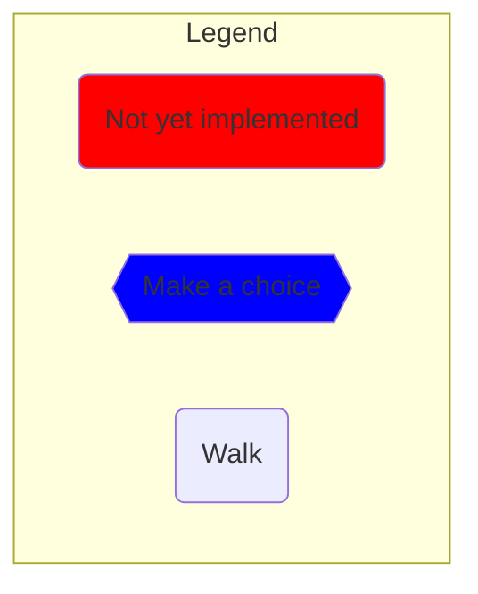
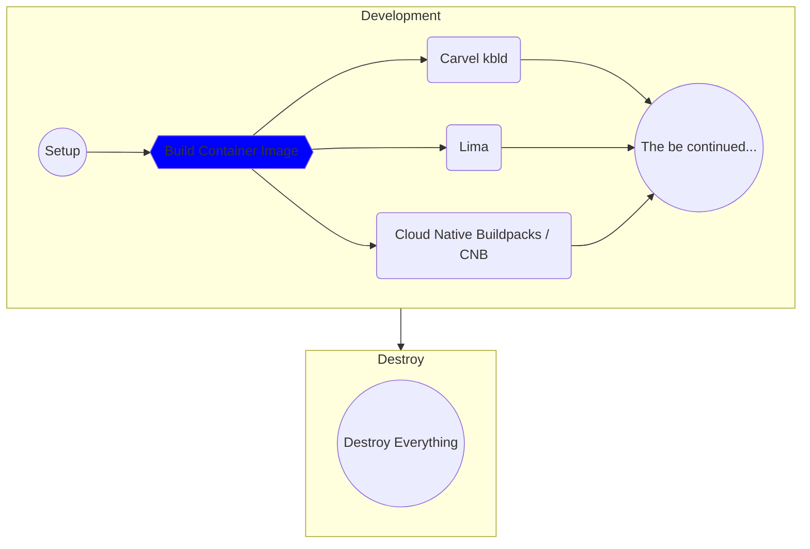

# Choose Your Own Adventure: The Treacherous Trek to Production

From the moment of their inception as source code on the developer’s laptop, our hero knows that they are destined for great things. They long to be a real, running application, living in production, serving end users! But the epic journey to production is an arduous one, filled with cascading choices—choices concerning app design, testing, security, container image building, deployment strategy, and observability, to name a few. And who knows what other unseen forces lurk in the shadows! One wrong step could be catastrophic.

## Pitch

It is up to us, the audience, to guide our hero; and to help them grow from source code to container image, to their final form as a running application in production. In this ‘Choose Your Own Adventure’-style journey, Whitney and Viktor will present a linear view of all of the choices that an anthropomorphized application must make as they try to find their way to the fabled land of production. Throughout the trek, the audience will vote to choose which path our hero application will take. Can we navigate CNCF projects and avoid pitfalls and dead-ends to get our application to production?

Join us if you dare!  This is not for the faint of heart!

## Rules

* Non-CNCF projects lead to a dead end ☠

## The Adventure!

The best place to start the adventure is the beginning. Perform the [setup](manuscript/setup/dev.md) steps and, from there, start the first chapter by to [Build Container Image In Dev Environments](manuscript/build-container-image/README.md). As an alternative, you can use graph below to navigate the adventure.

Almost all items in the graphs contain a link if you prefer to jump straight into a specific part of the aadventure. If you do so, please note that the steps work only if one start from the beginning of any of the chapters (e.g., Development, Production, etc.).

*For reasons I cannot explain, the links do not work if they are not opened in a separate tab.*

## Episodes

### Development

| Name | Guests | Date | Link |
| --- | --- | --- | --- |
| Build Container Image | Cora Iberkleid - Carvel kbld Ryan Moran - Buildpacks Anders Björklund - Lima | Wednesday, February 8, 2023 | [story](manuscript/build-container-image/README.md) |
| Store Container Image in a Registry | Vadim Bauer - Harbor  | Tuesday, February 14, 2023 | [story](manuscript/registry/README.md) |
| Define And Deploy The App To Dev | Andrew Block - Helm Scott Rosenberg - Carvel ytt  | Tuesday, February 21, 2023 | [story](manuscript/define-deploy-dev/README.md) |
| Use HTTPS | Ashley Davis - cert-manager  | Tuesday, February 28, 2023 | [story](manuscript/https/README.md) |
| Setup PostgreSQL DB In Dev | TODO: | TODO: | [story](manuscript/db/README.md) |
| Manage DB Schema | Marc Campbell - SchemaHero  | TODO: | [story](manuscript/db-schema/README.md) |
| Develop The App | TODO: | TODO: | [story](manuscript/develop/README.md) |

## The Format

* Recap of the decisions made in the app's journey so far (<=5 min.)
* Recap of the technology that was chosen from last week's episode (<=5 min.)
* Implement said technology (<=5 min.)
* Intro current episode: why is this step necessary? (<=5 min.)
* Introduce guests
* Each case presented in <= 5 min.
* Audience questions
* Call for voting
* Closing case presentations (20 sec.)
