# Setup Prerequisites

```bash
gh repo fork vfarcic/cncf-demo --clone --remote

cd cncf-demo

# Select the fork as the default repository
gh repo set-default

eval "$(teller sh)"

eksctl create cluster --config-file eksctl/config-cilium.yaml

sleep 10

kubectl --namespace kube-system patch daemonset aws-node \
    --type strategic \
    --patch '{"spec":{"template":{"spec":{"nodeSelector":{"io.cilium/aws-node-enabled":"true"}}}}}'

helm install cilium cilium/cilium --version "1.14.2" \
    --namespace kube-system --set eni.enabled=true \
    --set ipam.mode=eni --set routingMode=native \
    --set egressMasqueradeInterfaces=eth0 --wait

eksctl create addon --name aws-ebs-csi-driver --cluster dot-production \
    --service-account-role-arn arn:aws:iam::$AWS_ACCOUNT_ID:role/AmazonEKS_EBS_CSI_DriverRole \
    --region us-east-1 --force

kubectl create namespace production

yq --inplace ".image = \"index.docker.io/vfarcic/cncf-demo\"" \
    settings.yaml

yq --inplace ".tag = \"v0.0.1\"" settings.yaml

alias curl="curl --insecure"

chmod +x manuscript/cluster/crossplane.sh

./manuscript/cluster/crossplane.sh

chmod +x manuscript/cluster/crossplane-aws.sh

./manuscript/cluster/crossplane-aws.sh

source .env

kubectl --namespace production apply \
    --filename crossplane/aws-eks.yaml

kubectl get managed
```

## Start The Chapter

* [Create And Manage Production Kubernetes Cluster](../cluster/README.md)

## The Flow

```mermaid
flowchart TD

    subgraph Production

        %% -----------
        %% -- Setup --
        %% -----------
        setup-prod((Setup))
        click setup-prod "https://github.com/vfarcic/cncf-demo/blob/main/manuscript/setup/prod.md"

        %% -- Setup Connections --
        setup-prod-->cluster

        %% -------------
        %% -- Cluster --
        %% -------------
        cluster{{Create a Cluster}}
        click cluster "https://github.com/vfarcic/cncf-demo/blob/main/manuscript/cluster/README.md"
        style cluster fill:blue
        cluster-crossplane(Crossplane)
        click cluster-crossplane "https://github.com/vfarcic/cncf-demo/blob/main/manuscript/cluster/crossplane.md"
        cluster-crossplane-aws(AWS)
        click cluster-crossplane-aws "https://github.com/vfarcic/cncf-demo/blob/main/manuscript/cluster/cluster-crossplane-aws.md"
        cluster-cluster-api(Cluster API)
        click cluster-cluster-api "https://github.com/vfarcic/cncf-demo/blob/main/manuscript/cluster/cluster-api.md"
        style cluster-cluster-api fill:red
        capi-aws(AWS)
        click capi-aws "https://github.com/vfarcic/cncf-demo/blob/main/manuscript/cluster/capi-aws.md"
        style capi-aws fill:red
        cluster --> cluster-crossplane --> cluster-crossplane-aws --> gitops
        cluster --> cluster-cluster-api --> capi-aws --> gitops

        %% ------------
        %% -- GitOps --
        %% ------------
        gitops{{GitOps}}
        click gitops "https://github.com/vfarcic/cncf-demo/blob/main/manuscript/gitops/README.md"
        style gitops fill:blue
        gitops-flux(Flux)
        style gitops-flux fill:red
        click gitops-flux "https://github.com/vfarcic/cncf-demo/blob/main/manuscript/gitops/flux.md"
        gitops-argocd(Argo CD)
        click gitops-argocd "https://github.com/vfarcic/cncf-demo/blob/main/manuscript/gitops/argocd.md"
        style gitops-argocd fill:red
        gitops-kapp(Carvel kapp-controller)
        click gitops-kapp "https://github.com/vfarcic/cncf-demo/blob/main/manuscript/gitops/kapp.md"
        gitops --> gitops-flux & gitops-argocd & gitops-kapp --> ingress

        %% -------------
        %% -- Ingress --
        %% -------------
        ingress{{Ingress}}
        click ingress "https://github.com/vfarcic/cncf-demo/blob/main/manuscript/ingress/README.md"
        style ingress fill:blue
        ingress-contour(Contour With Envoy)
        click ingress-contour "https://github.com/vfarcic/cncf-demo/blob/main/manuscript/ingress/contour.md"
        ingress-nginx(NGINX)
        click ingress-nginx "https://github.com/vfarcic/cncf-demo/blob/main/manuscript/ingress/nginx.md"
        style ingress-nginx fill:red
        emissary-ingress(Emissary-ingress With Envoy)
        click ingress-nginx "https://github.com/vfarcic/cncf-demo/blob/main/manuscript/ingress/emissary-ingress.md"
        style emissary-ingress fill:red
        ingress-argocd(GitOps With Argo CD)
        click ingress-argocd "https://github.com/vfarcic/cncf-demo/blob/main/manuscript/ingress/gitops-argocd.md"
        style ingress-argocd fill:red
        ingress-flux(GitOps Flux)
        click ingress-flux "https://github.com/vfarcic/cncf-demo/blob/main/manuscript/ingress/gitops-flux.md"
        style ingress-flux fill:red
        ingress-kapp(GitOps Carvel kapp-controller)
        click ingress-kapp "https://github.com/vfarcic/cncf-demo/blob/main/manuscript/ingress/gitops-kapp.md"
        ingress-->ingress-contour & ingress-nginx & emissary-ingress --> ingress-argocd & ingress-flux & ingress-kapp --> app

        %% ----------------------------------
        %% -- Deploy The App To Production --
        %% ----------------------------------
        app{{Deploy The App To Production}}
        click app "https://github.com/vfarcic/cncf-demo/blob/main/manuscript/app/README.md"
        style app fill:blue
        app-helm(App As Helm)
        click app-helm "https://github.com/vfarcic/cncf-demo/blob/main/manuscript/app/helm.md"
        app-kustomize(App As Kustomize)
        click app-kustomize "https://github.com/vfarcic/cncf-demo/blob/main/manuscript/app/kustomize.md"
        style app-kustomize fill:red
        app-cdk8s(App As cdk8s)
        click app-cdk8s "https://github.com/vfarcic/cncf-demo/blob/main/manuscript/app/cdk8s.md"
        style app-cdk8s fill:red
        app-carvel(App As Carvel ytt)
        click app-carvel "https://github.com/vfarcic/cncf-demo/blob/main/manuscript/app/carvel.md"
        style app-carvel fill:red
        app --> app-helm & app-kustomize & app-cdk8s & app-carvel --> prod-done

        prod-done((Chapter End))

    end
```



## Destroy

```bash
eksctl delete addon --name aws-ebs-csi-driver \
    --cluster dot-production --region us-east-1

eksctl delete nodegroup --name primary --cluster dot-production \
    --drain=false --region us-east-1 --wait

eksctl delete cluster --config-file eksctl/config-cilium.yaml \
    --wait
```