## The Whole README.md

*This is a temporary work-in-progress file. **Do NOT use it.** Go to the [README.md](README) file instead.

Almost all items in the graphs contain a link if you prefer to jump straight into a specific part of the aadventure. If you do so, please note that the steps work only if one start from the beginning of any of the chapters (e.g., Development, Produciton, etc.).

*For reasons I cannot explain, the links do not work if they are not opened in a separate tab.*

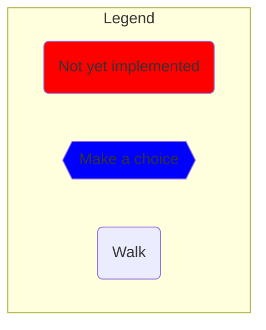

```mermaid
flowchart TD

    subgraph Development

        %% -----------
        %% -- Setup --
        %% -----------
        setup-dev((Setup))
        click setup-dev "https://github.com/vfarcic/cncf-demo/blob/main/manuscript/setup/dev.md"

        %% -- Setup Connections --
        setup-dev-->bci

        %% ---------------------------
        %% -- Build Container Image --
        %% ---------------------------
        bci{{Build Container Image}}
        click bci "https://github.com/vfarcic/cncf-demo/blob/main/manuscript/build-container-image/README.md"
        style bci fill:blue
        kbld(Carvel kbld)
        click kbld "https://github.com/vfarcic/cncf-demo/blob/main/manuscript/build-container-image/kbld.md"
        lima(Lima)
        click lima "https://github.com/vfarcic/cncf-demo/blob/main/manuscript/build-container-image/lima.md"
        buildpacks(Cloud Native Buildpacks / CNB)
        click buildpacks "https://github.com/vfarcic/cncf-demo/blob/main/manuscript/build-container-image/buildpacks.md"
        ko(ko)
        style ko fill:red
        slimtoolkit(SlimToolkit)
        style slimtoolkit fill:red
        bci --> kbld & lima & buildpacks & ko & slimtoolkit --> registry

        %% -----------------------------------------
        %% -- Store Container Image in a Registry --
        %% -----------------------------------------
        registry{{Store Container Image In A Registry}}
        click registry "https://github.com/vfarcic/cncf-demo/blob/main/manuscript/registry/README.md"
        style registry fill:blue
        docker-hub(Docker Hub)
        click docker-hub "https://github.com/vfarcic/cncf-demo/blob/main/manuscript/registry/docker-hub.md"
        harbor(Harbor)
        click harbor "https://github.com/vfarcic/cncf-demo/blob/main/manuscript/registry/harbor.md"
        dragonfly(Dragonfly)
        click dragonfly "https://github.com/vfarcic/cncf-demo/blob/main/manuscript/registry/dragonfly.md"
        zot(zot)
        style zot fill:red
        registry --> docker-hub & harbor & dragonfly & zot --> ddd

        %% --------------------------------------
        %% -- Define And Deploy The App To Dev --
        %% --------------------------------------
        ddd{{Define And Deploy The App To Dev}}
        click ddd "https://github.com/vfarcic/cncf-demo/blob/main/manuscript/define-deploy-dev/README.md"
        style ddd fill:blue
        ddd-helm(Helm)
        click ddd-helm "https://github.com/vfarcic/cncf-demo/blob/main/manuscript/define-deploy-dev/helm.md"
        ddd-kustomize(Kustomize)
        click ddd-kustomize "https://github.com/vfarcic/cncf-demo/blob/main/manuscript/define-deploy-dev/kustomize.md"
        ddd-carvel(Carvel ytt)
        click ddd-carvel "https://github.com/vfarcic/cncf-demo/blob/main/manuscript/define-deploy-dev/carvel-ytt.md"
        ddd-cdk8s("CDK For Kubernetes (cdk8s)")
        click ddd-cdk8s "https://github.com/vfarcic/cncf-demo/blob/main/manuscript/define-deploy-dev/cdk8s.md"
        kcl(KCL)
        style kcl fill:red
        kpt(kpt)
        style kpt fill:red
        ddd --> ddd-helm & ddd-kustomize & ddd-carvel & ddd-cdk8s & kcl & kpt --> https

        %% ---------------
        %% -- Use HTTPS --
        %% ---------------
        https{{Use HTTPS}}
        click https "https://github.com/vfarcic/cncf-demo/blob/main/manuscript/https/README.md"
        style https fill:blue
        https-cert-manager(cert-manager)
        click https-cert-manager "https://github.com/vfarcic/cncf-demo/blob/main/manuscript/https/cert-manager.md"
        https-cert-manager-helm(App as Helm)
        click https-cert-manager-helm "https://github.com/vfarcic/cncf-demo/blob/main/manuscript/https/cert-manager-helm.md"
        https-cert-manager-kustomize(App as Kustomize)
        click https-cert-manager-kustomize "https://github.com/vfarcic/cncf-demo/blob/main/manuscript/https/cert-manager-kustomize.md"
        https-cert-manager-carvel(App as Carvel ytt)
        click https-cert-manager-kustomize "https://github.com/vfarcic/cncf-demo/blob/main/manuscript/https/cert-manager-carvel.md"
        https-cert-manager-cdk8s(App as cdk8s)
        click https-cert-manager-cdk8s "https://github.com/vfarcic/cncf-demo/blob/main/manuscript/https/cert-manager-cdk8s.md"
        https--> https-cert-manager--> https-cert-manager-helm & https-cert-manager-kustomize & https-cert-manager-carvel & https-cert-manager-cdk8s --> db

        %% --------------------------------
        %% -- Setup PostgreSQL DB In Dev --
        %% --------------------------------
        db{{Setup PostgreSQL DB In Dev}}
        click db "https://github.com/vfarcic/cncf-demo/blob/main/manuscript/db/README.md"
        style db fill:blue
        db-helm(Helm Chart)
        click db-helm "https://github.com/vfarcic/cncf-demo/blob/main/manuscript/db/helm.md"
        db-helm-helm(App as Helm)
        click db-helm-helm "https://github.com/vfarcic/cncf-demo/blob/main/manuscript/db/helm-helm.md"
        db-helm-kustomize(App as Kustomize)
        click db-helm-kustomize "https://github.com/vfarcic/cncf-demo/blob/main/manuscript/db/helm-kustomize.md"
        db-helm-cdk8s(App as cdk8s)
        click db-helm-cdk8s "https://github.com/vfarcic/cncf-demo/blob/main/manuscript/db/helm-cdk8s.md"
        db-helm-carvel(App as Carvel ytt)
        click db-helm-carvel "https://github.com/vfarcic/cncf-demo/blob/main/manuscript/db/helm-carvel.md"
        db-crossplane-local(Crossplane Composition In Kubernetes)
        click db-crossplane-local "https://github.com/vfarcic/cncf-demo/blob/main/manuscript/db/crossplane-local.md"
        db-crossplane-cloud(Crossplane Composition In Cloud)
        click db-crossplane-cloud "https://github.com/vfarcic/cncf-demo/blob/main/manuscript/db/crossplane-cloud.md"
        db-crossplane-google(Google Cloud)
        click db-crossplane-google "https://github.com/vfarcic/cncf-demo/blob/main/manuscript/db/crossplane-google.md"
        db-crossplane-aws(AWS)
        click db-crossplane-aws "https://github.com/vfarcic/cncf-demo/blob/main/manuscript/db/crossplane-aws.md"
        db-crossplane-azure(Azure)
        click db-crossplane-azure "https://github.com/vfarcic/cncf-demo/blob/main/manuscript/db/crossplane-azure.md"
        db-crossplane-helm(App as Helm)
        click db-crossplane-helm "https://github.com/vfarcic/cncf-demo/blob/main/manuscript/db/crossplane-helm.md"
        db-crossplane-carvel(App as Carvel ytt)
        click db-crossplane-carvel "https://github.com/vfarcic/cncf-demo/blob/main/manuscript/db/crossplane-carvel.md"
        db-crossplane-kustomize(App as Kustomize)
        click db-crossplane-kustomize "https://github.com/vfarcic/cncf-demo/blob/main/manuscript/db/crossplane-kustomize.md"
        db-crossplane-cdk8s(App as cdk8s)
        click db-crossplane-cdk8s "https://github.com/vfarcic/cncf-demo/blob/main/manuscript/db/crossplane-cdk8s.md"
        db --> db-helm & db-crossplane-local & db-crossplane-cloud
        db-helm --> db-helm-helm & db-helm-kustomize & db-helm-cdk8s & db-helm-carvel --> db-schema
        db-crossplane-local --> db-crossplane-helm & db-crossplane-kustomize & db-crossplane-cdk8s & db-crossplane-carvel
        db-crossplane-cloud --> db-crossplane-google & db-crossplane-aws & db-crossplane-azure --> db-crossplane-helm & db-crossplane-kustomize & db-crossplane-cdk8s & db-crossplane-carvel --> db-schema

        %% ----------------------
        %% -- Manage DB Schema --
        %% ----------------------
        db-schema{{Manage DB Schema}}
        click db-schema "https://github.com/vfarcic/cncf-demo/blob/main/manuscript/db-schema/README.md"
        style db-schema fill:blue
        db-schema-schemahero(SchemaHero)
        click db-schema-schemahero "https://github.com/vfarcic/cncf-demo/blob/main/manuscript/db-schema/schemahero.md"
        db-schema-liquibase(Liquibase)
        click db-schema-liquibase "https://github.com/vfarcic/cncf-demo/blob/main/manuscript/db-schema/liquibase.md"
        db-schema-schemahero-helm(App as Helm)
        click db-schema-schemahero-helm "https://github.com/vfarcic/cncf-demo/blob/main/manuscript/db-schema/schemahero-helm.md"
        db-schema-schemahero-kustomize(App as Kustomize)
        click db-schema-schemahero-kustomize "https://github.com/vfarcic/cncf-demo/blob/main/manuscript/db-schema/schemahero-kustomize.md"
        db-schema-schemahero-cdk8s(App as cdk8s)
        click db-schema-schemahero-cdk8s "https://github.com/vfarcic/cncf-demo/blob/main/manuscript/db-schema/schemahero-cdk8s.md"
        db-schema-schemahero-carvel(App as Carvel ytt)
        click db-schema-schemahero-carvel "https://github.com/vfarcic/cncf-demo/blob/main/manuscript/db-schema/schemahero-carvel.md"
        db-schema --> db-schema-liquibase & db-schema-schemahero
        db-schema-schemahero --> db-schema-schemahero-helm & db-schema-schemahero-kustomize & db-schema-schemahero-cdk8s & db-schema-schemahero-carvel --> develop

        %% ---------------------
        %% -- Develop The App --
        %% ---------------------
        develop{{Develop The App}}
        click develop "https://github.com/vfarcic/cncf-demo/blob/main/manuscript/develop/README.md"
        style develop fill:blue
        telepresence(Telepresence)
        click telepresence "https://github.com/vfarcic/cncf-demo/blob/main/manuscript/develop/telepresence.md"
        devspace(DevSpace)
        click devspace "https://github.com/vfarcic/cncf-demo/blob/main/manuscript/develop/devspace.md"
        nocalhost(Nocalhost)
        click nocalhost "https://github.com/vfarcic/cncf-demo/blob/main/manuscript/develop/nocalhost.md"
        devspace-kustomize(App as Kustomize)
        click devspace-kustomize "https://github.com/vfarcic/cncf-demo/blob/main/manuscript/develop/devspace-kustomize.md"
        devspace-cdk8s(App as cdk8s)
        click devspace-cdk8s "https://github.com/vfarcic/cncf-demo/blob/main/manuscript/develop/devspace-cdk8s.md"
        devspace-helm(App as Helm)
        click devspace-helm "https://github.com/vfarcic/cncf-demo/blob/main/manuscript/develop/devspace-helm.md"
        devspace-carvel(App as Carvel ytt)
        click devspace-carvel "https://github.com/vfarcic/cncf-demo/blob/main/manuscript/develop/devspace-carvel.md"
        devfile(Devfile)
        style devfile fill:red
        develop --> telepresence & devspace & nocalhost & devfile
        telepresence & nocalhost & devfile --> dev-done
        devspace --> devspace-kustomize & devspace-cdk8s & devspace-helm & devspace-carvel --> dev-done

        dev-done((Chapter End))

    end
```

```mermaid
flowchart TD

    subgraph Production

        %% -----------
        %% -- Setup --
        %% -----------
        setup-prod((Setup))
        click setup-prod "https://github.com/vfarcic/cncf-demo/blob/main/manuscript/setup/prod.md"

        %% -- Setup Connections --
        setup-prod-->cluster

        %% -------------
        %% -- Cluster --
        %% -------------
        cluster{{Create a Cluster}}
        click cluster "https://github.com/vfarcic/cncf-demo/blob/main/manuscript/cluster/README.md"
        style cluster fill:blue
        cluster-crossplane(Crossplane)
        click cluster-crossplane "https://github.com/vfarcic/cncf-demo/blob/main/manuscript/cluster/crossplane.md"
        cluster-crossplane-google(Google Cloud)
        click cluster-crossplane-google "https://github.com/vfarcic/cncf-demo/blob/main/manuscript/cluster/cluster-crossplane-google.md"
        cluster-crossplane-aws(AWS)
        click cluster-crossplane-aws "https://github.com/vfarcic/cncf-demo/blob/main/manuscript/cluster/cluster-crossplane-aws.md"
        cluster-crossplane-azure(Azure)
        click cluster-crossplane-azure "https://github.com/vfarcic/cncf-demo/blob/main/manuscript/cluster/cluster-crossplane-azure.md"
        cluster-cluster-api(Cluster API)
        click cluster-cluster-api "https://github.com/vfarcic/cncf-demo/blob/main/manuscript/cluster/cluster-api.md"
        capi-google(Google Cloud)
        click capi-google "https://github.com/vfarcic/cncf-demo/blob/main/manuscript/cluster/capi-google.md"
        capi-aws(AWS)
        click capi-aws "https://github.com/vfarcic/cncf-demo/blob/main/manuscript/cluster/capi-aws.md"
        capi-azure(Azure)
        click capi-azure "https://github.com/vfarcic/cncf-demo/blob/main/manuscript/cluster/capi-azure.md"
        kubeclipper(KubeClipper)
        style kubeclipper fill:red
        cluster --> cluster-crossplane --> cluster-crossplane-google & cluster-crossplane-aws & cluster-crossplane-azure --> gitops
        cluster --> cluster-cluster-api --> capi-google & capi-aws & capi-azure --> gitops
        cluster --> kubeclipper --> gitops

        %% ------------
        %% -- GitOps --
        %% ------------
        gitops{{GitOps}}
        click gitops "https://github.com/vfarcic/cncf-demo/blob/main/manuscript/gitops/README.md"
        style gitops fill:blue
        gitops-flux(Flux)
        click gitops-flux "https://github.com/vfarcic/cncf-demo/blob/main/manuscript/gitops/flux.md"
        gitops-argocd(Argo CD)
        click gitops-argocd "https://github.com/vfarcic/cncf-demo/blob/main/manuscript/gitops/argocd.md"
        gitops-kapp(Carvel kapp-controller)
        click gitops-kapp "https://github.com/vfarcic/cncf-demo/blob/main/manuscript/gitops/kapp.md"
        gitops --> gitops-flux & gitops-argocd & gitops-kapp --> ingress

        %% -------------
        %% -- Ingress --
        %% -------------
        ingress{{Ingress}}
        click ingress "https://github.com/vfarcic/cncf-demo/blob/main/manuscript/ingress/README.md"
        style ingress fill:blue
        ingress-contour(Contour With Envoy)
        click ingress-contour "https://github.com/vfarcic/cncf-demo/blob/main/manuscript/ingress/contour.md"
        ingress-nginx(NGINX)
        click ingress-nginx "https://github.com/vfarcic/cncf-demo/blob/main/manuscript/ingress/nginx.md"
        emissary-ingress(Emissary-ingress With Envoy)
        click ingress-nginx "https://github.com/vfarcic/cncf-demo/blob/main/manuscript/ingress/emissary-ingress.md"
        ingress-argocd(GitOps With Argo CD)
        click ingress-argocd "https://github.com/vfarcic/cncf-demo/blob/main/manuscript/ingress/gitops-argocd.md"
        ingress-flux(GitOps Flux)
        click ingress-flux "https://github.com/vfarcic/cncf-demo/blob/main/manuscript/ingress/gitops-flux.md"
        ingress-kapp(GitOps Carvel kapp-controller)
        click ingress-kapp "https://github.com/vfarcic/cncf-demo/blob/main/manuscript/ingress/gitops-kapp.md"
        ingress-->ingress-contour & ingress-nginx & emissary-ingress --> ingress-argocd & ingress-flux & ingress-kapp --> app

        %% ----------------------------------
        %% -- Deploy The App To Production --
        %% ----------------------------------
        app{{Deploy The App To Production}}
        click app "https://github.com/vfarcic/cncf-demo/blob/main/manuscript/app/README.md"
        style app fill:blue
        app-helm(App as Helm)
        click app-helm "https://github.com/vfarcic/cncf-demo/blob/main/manuscript/app/helm.md"
        app-kustomize(App as Kustomize)
        click app-kustomize "https://github.com/vfarcic/cncf-demo/blob/main/manuscript/app/kustomize.md"
        app-cdk8s(App as cdk8s)
        click app-cdk8s "https://github.com/vfarcic/cncf-demo/blob/main/manuscript/app/cdk8s.md"
        app-carvel(App as Carvel ytt)
        click app-carvel "https://github.com/vfarcic/cncf-demo/blob/main/manuscript/app/carvel.md"
        app --> app-helm & app-kustomize & app-cdk8s & app-carvel --> db-production

        %% --------------
        %% -- Database --
        %% --------------
        db-production{{Database}}
        click db-production "https://github.com/vfarcic/cncf-demo/blob/main/manuscript/db-production/README.md"
        style db-production fill:blue
        db-production-crossplane(Crossplane)
        click db-production-crossplane "https://github.com/vfarcic/cncf-demo/blob/main/manuscript/db-production/crossplane.md"
        db-production-helm(App as Helm)
        click db-production-helm "https://github.com/vfarcic/cncf-demo/blob/main/manuscript/db-production/helm.md"
        db-production-kustomize(App as Kustomize)
        click db-production-kustomize "https://github.com/vfarcic/cncf-demo/blob/main/manuscript/db-production/kustomize.md"
        db-production-cdk8s(App as cdk8s)
        click db-production-cdk8s "https://github.com/vfarcic/cncf-demo/blob/main/manuscript/db-production/cdk8s.md"
        db-production-carvel(App as Carvel ytt)
        click db-production-carvel "https://github.com/vfarcic/cncf-demo/blob/main/manuscript/db-production/carvel.md"
        db-production --> db-production-crossplane --> db-production-helm & db-production-kustomize & db-production-cdk8s & db-production-carvel --> prod-done

        prod-done((Chapter End))

    end
```

```mermaid
flowchart TD

    subgraph Security

        %% -----------
        %% -- Setup --
        %% -----------
        setup-security((Setup))
        click setup-security "https://github.com/vfarcic/cncf-demo/blob/main/manuscript/setup/security.md"
        setup-security --> policies

        %% -----------------------------------
        %% -- Admission Controller Policies --
        %% -----------------------------------
        policies{{Admission Controller Policies}}
        style policies fill:blue
        click policies "https://github.com/vfarcic/cncf-demo/blob/main/manuscript/policies/README.md"
        policies-kyverno(Kyverno)
        click policies-kyverno "https://github.com/vfarcic/cncf-demo/blob/main/manuscript/policies/kyverno.md"
        policies-opa("Open Policy Agent (OPA) With Gatekeeper")
        click policies-opa "https://github.com/vfarcic/cncf-demo/blob/main/manuscript/policies/gatekeeper.md"
        cloud-custodian(Cloud Custodian)
        click cloud-custodian "https://github.com/vfarcic/cncf-demo/blob/main/manuscript/policies/cloud-custodian.md"
        cloud-custodian-helm(App as Helm)
        click cloud-custodian-helm "https://github.com/vfarcic/cncf-demo/blob/main/manuscript/policies/cloud-custodian-helm.md"
        cloud-custodian-kustomize(App as Kustomize)
        click cloud-custodian-kustomize "https://github.com/vfarcic/cncf-demo/blob/main/manuscript/policies/cloud-custodian-kustomize.md"
        cloud-custodian-cdk8s(App as cdk8s)
        click cloud-custodian-cdk8s "https://github.com/vfarcic/cncf-demo/blob/main/manuscript/policies/cloud-custodian-cdk8s.md"
        cloud-custodian-carvel(App as Carvel ytt)
        click cloud-custodian-carvel "https://github.com/vfarcic/cncf-demo/blob/main/manuscript/policies/cloud-custodian-carvel.md"
        kubewarden(Kubewarden)
        click kubewarden "https://github.com/vfarcic/cncf-demo/blob/main/manuscript/policies/kubewarden.md"
        %% Wait with VAP until it's GA
        vac(Kubernetes Validating Admission Policy)
        style vac fill:red
        policies-helm(App as Helm)
        click policies-helm "https://github.com/vfarcic/cncf-demo/blob/main/manuscript/policies/helm.md"
        policies-kustomize(App as Kustomize)
        click policies-kustomize "https://github.com/vfarcic/cncf-demo/blob/main/manuscript/policies/kustomize.md"
        policies-cdk8s(App as cdk8s)
        click policies-cdk8s "https://github.com/vfarcic/cncf-demo/blob/main/manuscript/policies/cdk8s.md"
        policies-carvel(App as Carvel ytt)
        click policies-carvel "https://github.com/vfarcic/cncf-demo/blob/main/manuscript/policies/carvel.md"
        policies --> policies-kyverno & policies-opa & kubewarden & vac --> policies-helm & policies-kustomize & policies-cdk8s & policies-carvel --> runtime-policies
        policies --> cloud-custodian --> cloud-custodian-helm & cloud-custodian-kustomize & cloud-custodian-cdk8s & cloud-custodian-carvel --> runtime-policies

        %% ----------------------
        %% -- Runtime Policies --
        %% ----------------------
        runtime-policies{{Runtime Policies}}
        style runtime-policies fill:blue
        click runtime-policies "https://github.com/vfarcic/cncf-demo/blob/main/manuscript/runtime-policies/README.md"
        kube-armor(KubeArmor)
        click kube-armor "https://github.com/vfarcic/cncf-demo/blob/main/manuscript/runtime-policies/kubearmor.md"
        falco(Falco)
        click falco "https://github.com/vfarcic/cncf-demo/blob/main/manuscript/runtime-policies/falco.md"
        runtime-policies --> kube-armor & falco --> secrets

        %% ------------------------
        %% -- Secrets Management --
        %% ------------------------
        secrets{{Secrets Management In Kubernetes}}
        click secrets "https://github.com/vfarcic/cncf-demo/blob/main/manuscript/secrets/README.md"
        style secrets fill:blue
        eso("External Secrets Operator (ESO)")
        click eso "https://github.com/vfarcic/cncf-demo/blob/main/manuscript/secrets/eso.md"
        sscsid("Secrets Store CSI Driver (SSCSID)")
        click sscsid "https://github.com/vfarcic/cncf-demo/blob/main/manuscript/secrets/sscsid.md"
        secrets-google(Google Cloud)
        click secrets-google "https://github.com/vfarcic/cncf-demo/blob/main/manuscript/secrets/google.md"
        secrets-aws(AWS)
        click secrets-aws "https://github.com/vfarcic/cncf-demo/blob/main/manuscript/secrets/aws.md"
        secrets-azure(Azure)
        click secrets-azure "https://github.com/vfarcic/cncf-demo/blob/main/manuscript/secrets/azure.md"
        secrets-helm(App as Helm)
        click secrets-helm "https://github.com/vfarcic/cncf-demo/blob/main/manuscript/secrets/helm.md"
        secrets-kustomize(App as Kustomize)
        click secrets-kustomize "https://github.com/vfarcic/cncf-demo/blob/main/manuscript/secrets/kustomize.md"
        secrets-cdk8s(App as cdk8s)
        click secrets-cdk8s "https://github.com/vfarcic/cncf-demo/blob/main/manuscript/secrets/cdk8s.md"
        secrets-carvel(App as Carvel ytt)
        click secrets-carvel "https://github.com/vfarcic/cncf-demo/blob/main/manuscript/secrets/carvel.md"
        client-secrets{{Secrets Management Outside Kubernetes}}
        click client-secrets "https://github.com/vfarcic/cncf-demo/blob/main/manuscript/secrets/client.md"
        style client-secrets fill:blue
        teller(Teller)
        click teller "https://github.com/vfarcic/cncf-demo/blob/main/manuscript/secrets/teller.md"
        teller-aws(AWS)
        click teller-aws "https://github.com/vfarcic/cncf-demo/blob/main/manuscript/secrets/teller-aws.md"
        teller-azure(Azure)
        click teller-azure "https://github.com/vfarcic/cncf-demo/blob/main/manuscript/secrets/teller-azure.md"
        teller-google(Google Cloud)
        click teller-google "https://github.com/vfarcic/cncf-demo/blob/main/manuscript/secrets/teller-google.md"
        sops(SOPS)
        style sops fill:red
        secrets --> eso --> secrets-google & secrets-aws & secrets-azure --> secrets-helm & secrets-kustomize & secrets-cdk8s & secrets-carvel --> client-secrets
        secrets --> sscsid
        client-secrets --> teller --> teller-aws & teller-azure & teller-google --> mtls
        client-secrets --> sops --> mtls

        %% -------------------------------------
        %% -- Mutual TLS And Network Policies --
        %% -------------------------------------
        mtls{{"Mutual TLS (mTLS) And Network Policies"}}
        click mtls "https://github.com/vfarcic/cncf-demo/blob/main/manuscript/mtls/README.md"
        style mtls fill:blue
        mtls-istio(Istio)
        click mtls-istio "https://github.com/vfarcic/cncf-demo/blob/main/manuscript/mtls/istio.md"
        mtls-linkerd("LinkerD (SMI)")
        click mtls-linkerd "https://github.com/vfarcic/cncf-demo/blob/main/manuscript/mtls/linkerd.md"
        mtls-cilium(Cilium)
        click mtls-cilium "https://github.com/vfarcic/cncf-demo/blob/main/manuscript/mtls/cilium.md"
        mtls-kuma(Kuma)
        style mtls-kuma fill:red
        mtls-network-service-mesh(Network Service Mesh)
        style mtls-network-service-mesh fill:red
        mtls --> mtls-istio & mtls-kuma & mtls-network-service-mesh & mtls-cilium & mtls-linkerd--> scanning

        %% --------------
        %% -- Scanning --
        %% --------------
        scanning{{Scanning}}
        click signing "https://github.com/vfarcic/cncf-demo/blob/main/manuscript/signing/README.md"
        style scanning fill:blue
        kubescape(Kubescape)
        click kubescape "https://github.com/vfarcic/cncf-demo/blob/main/manuscript/scanning/kubescape.md"
        snyk(Snyk)
        click snyk "https://github.com/vfarcic/cncf-demo/blob/main/manuscript/scanning/snyk.md"
        scanning --> kubescape & snyk --> signing

        %% -------------
        %% -- Signing --
        %% -------------
        signing{{Signing}}
        click signing "https://github.com/vfarcic/cncf-demo/blob/main/manuscript/signing/README.md"
        style signing fill:blue
        notary(Notary)
        click notary "https://github.com/vfarcic/cncf-demo/blob/main/manuscript/signing/notary.md"
        sigstore(Sigstore)
        click sigstore "https://github.com/vfarcic/cncf-demo/blob/main/manuscript/signing/sigstore.md"
        opc(Open Policy Containers)
        style opc fill:red
        signing --> notary & sigstore & opc --> identity

        %% -----------------------
        %% -- Workload Identity --
        %% -----------------------
        identity{{Workload Identity}}
        click identity "https://github.com/vfarcic/cncf-demo/blob/main/manuscript/workload-identity/README.md"
        style identity fill:blue
        spire(SPIRE)
        click spire "https://github.com/vfarcic/cncf-demo/blob/main/manuscript/workload-identity/spire.md"
        spire-istio(Istio)
        style spire-istio fill:red
        spire-linkerd(Linkerd)
        style spire-linkerd fill:red
        spire-nsm(Network Service Mesh)
        style spire-nsm fill:red
        spire-cilium(Cilium)
        click spire-cilium "https://github.com/vfarcic/cncf-demo/blob/main/manuscript/workload-identity/spire-cilium.md"
        spire-kuma(Kuma)
        style spire-kuma fill:red
        athenz(Athenz)
        style athenz fill:red
        identity --> spire --> spire-istio & spire-linkerd & spire-nsm & spire-cilium & spire-kuma --> user-authentication
        identity --> athenz --> user-authentication

        %% ------------------------
        %% -- User Authorization --
        %% ------------------------
        user-authentication{{User Authentication}}
        click user-authentication "https://github.com/vfarcic/cncf-demo/blob/main/manuscript/user-authentication/README.md"
        style user-authentication fill:blue
        dex(Dex)
        style dex fill:red
        keycloak(Keycloak)
        click keycloak "https://github.com/vfarcic/cncf-demo/blob/main/manuscript/user-authentication/keycloak.md"
        user-authentication --> dex & keycloak --> access-authorization

        %% --------------------------
        %% -- Access Authorization --
        %% --------------------------
        access-authorization{{Access Control}}
        click access-authorization "https://github.com/vfarcic/cncf-demo/blob/main/manuscript/access/README.md"
        style access-authorization fill:blue
        hexa(Hexa)
        style hexa fill:red
        paralus(Paralus)
        style paralus fill:red
        openfga(OpenFGA)
        click openfga "https://github.com/vfarcic/cncf-demo/blob/main/manuscript/access/openfga.md"
        openfga-helm(App as Helm)
        click openfga-helm "https://github.com/vfarcic/cncf-demo/blob/main/manuscript/access/openfga-helm.md"
        openfga-kustomize(App as Kustomize)
        click openfga-kustomize "https://github.com/vfarcic/cncf-demo/blob/main/manuscript/access/openfga-kustomize.md"
        openfga-carvel(App as Carvel ytt)
        click openfga-carvel "https://github.com/vfarcic/cncf-demo/blob/main/manuscript/access/openfga-carvel.md"
        openfga-cdk8s(App as cdk8s)
        style openfga-cdk8s fill:red
        access-authorization --> hexa & paralus & openfga
        openfga --> openfga-helm & openfga-kustomize & openfga-carvel & openfga-cdk8s --> security_misc
        hexa & paralus --> security_misc

        %% ----------
        %% -- Misc --
        %% ----------
        security_misc{{Misc}}
        click security_misc "https://github.com/vfarcic/cncf-demo/blob/main/manuscript/security-misc/README.md"
        %% Not maintained
        %% curiefense(Curiefense)
        %% style curiefense fill:red
        confidential-containers(Confidential Containers)
        style confidential-containers fill:red
        container-ssh(ContainerSSH)
        style container-ssh fill:red
        security_misc --> confidential-containers & container-ssh --> security-done

        security-done((Chapter End))

    end
```

```mermaid
flowchart TD

    subgraph Observability

        %% -----------
        %% -- Setup --
        %% -----------
        setup-observability((Setup))
        click setup-observability "https://github.com/vfarcic/cncf-demo/blob/main/manuscript/setup/observability.md"
        setup-observability --> dashboards
        
        %% ----------------
        %% -- Dashboards --
        %% ----------------
        dashboards{{Dashboards}}
        click dashboards "https://github.com/vfarcic/cncf-demo/blob/main/manuscript/dashboards/README.md"
        style dashboards fill:blue
        kubernetes-dashboard(Kubernetes Dashboard)
        style kubernetes-dashboard fill:red
        headlamp(Headlamp)
        click headlamp "https://github.com/vfarcic/cncf-demo/blob/main/manuscript/dashboards/headlamp.md"
        meshery(Meshery)
        style meshery fill:red
        dashboards --> kubernetes-dashboard & headlamp & meshery --> instrumentation

        %% ------------------------------------
        %% -- Instrumenting Application Code --
        %% ------------------------------------
        instrumentation{{Application Instrumentation}}
        click instrumentation "https://github.com/vfarcic/cncf-demo/blob/main/manuscript/exposition-formats/README.md"
        style instrumentation fill:blue
        open-telemetry(OpenTelemetry)
        click open-telemetry "https://github.com/vfarcic/cncf-demo/blob/main/manuscript/exposition-formats/opentelemetry.md"
        open-metrics(OpenMetrics)
        click open-metrics "https://github.com/vfarcic/cncf-demo/blob/main/manuscript/exposition-formats/openmetrics.md"
        instrumentation --> open-telemetry & open-metrics --> metrics

        %% -------------
        %% -- Metrics --
        %% -------------
        metrics{{Metrics}}
        click metrics "https://github.com/vfarcic/cncf-demo/blob/main/manuscript/metrics/README.md"
        style metrics fill:blue
        metrics-prometheus(Prometheus)
        click metrics-prometheus "https://github.com/vfarcic/cncf-demo/blob/main/manuscript/metrics/prometheus.md"
        metrics-thanos(Thanos)
        style metrics-thanos fill:red
        cortex(Cortex)
        style cortex fill:red
        metrics --> metrics-prometheus & metrics-thanos & cortex --> tracing

        %% -------------
        %% -- Tracing --
        %% -------------
        tracing{{Tracing}}
        click tracing "https://github.com/vfarcic/cncf-demo/blob/main/manuscript/tracing/README.md"
        style tracing fill:blue
        jaeger(Jaeger)
        click jaeger "https://github.com/vfarcic/cncf-demo/blob/main/manuscript/tracing/jaeger.md"
        jaeger-kustomize(App as Kustomize)
        click jaeger-kustomize "https://github.com/vfarcic/cncf-demo/blob/main/manuscript/tracing/kustomize.md"
        jaeger-helm(App as Helm)
        click jaeger-helm "https://github.com/vfarcic/cncf-demo/blob/main/manuscript/tracing/helm.md"
        jaeger-carvel(App as Carvel ytt)
        click jaeger-carvel "https://github.com/vfarcic/cncf-demo/blob/main/manuscript/tracing/carvel.md"
        jaeger-cdk8s(App as cdk8s)
        click jaeger-cdk8s "https://github.com/vfarcic/cncf-demo/blob/main/manuscript/tracing/cdk8s.md"
        tracing --> jaeger --> jaeger-kustomize & jaeger-helm & jaeger-carvel & jaeger-cdk8s --> logging

        %% -------------
        %% -- Logging --
        %% -------------
        logging{{Logging}}
        style logging fill:blue
        click logging "https://github.com/vfarcic/cncf-demo/blob/main/manuscript/logging/README.md"
        fluentd(FluentD)
        click fluentd "https://github.com/vfarcic/cncf-demo/blob/main/manuscript/logging/fluentd.md"
        logging-operator(Logging Operator)
        click logging-operator "https://github.com/vfarcic/cncf-demo/blob/main/manuscript/logging/logging-operator.md"
        logging-operator-kustomize(App as Kustomize)
        click logging-operator-kustomize "https://github.com/vfarcic/cncf-demo/blob/main/manuscript/logging/kustomize.md"
        logging-operator-helm(App as Helm)
        click logging-operator-helm "https://github.com/vfarcic/cncf-demo/blob/main/manuscript/logging/helm.md"
        logging-operator-carvel(App as Carvel ytt)
        click logging-operator-carvel "https://github.com/vfarcic/cncf-demo/blob/main/manuscript/logging/carvel.md"
        logging-operator-cdk8s(App as cdk8s)
        click logging-operator-cdk8s "https://github.com/vfarcic/cncf-demo/blob/main/manuscript/logging/cdk8s.md"
        style logging-operator-cdk8s fill:red
        vector(Vector)
        style vector fill:red
        logging --> vector --> data-pipelines
        logging --> fluentd --> logging-operator
        logging --> logging-operator --> logging-operator-kustomize & logging-operator-helm & logging-operator-carvel & logging-operator-cdk8s --> data-pipelines

        %% --------------------
        %% -- Data Pipelines --
        %% --------------------
        data-pipelines{{Data Pipelines}}
        style data-pipelines fill:red
        fluentbit(Fluent Bit)
        style fluentbit fill:red
        otel-collector(OTel Collector)
        style otel-collector fill:red
        data-pipelines --> fluentbit & otel-collector --> progressive-delivery

        %% --------------------------
        %% -- Progressive Delivery --
        %% --------------------------
        progressive-delivery{{Progressive Delivery}}
        style progressive-delivery fill:blue
        click progressive-delivery "https://github.com/vfarcic/cncf-demo/blob/main/manuscript/progressive-delivery/README.md"
        argo-rollouts(Argo Rollouts)
        click argo-rollouts "https://github.com/vfarcic/cncf-demo/blob/main/manuscript/progressive-delivery/argo-rollouts.md"
        argo-rollouts-istio(Istio)
        click argo-rollouts-istio "https://github.com/vfarcic/cncf-demo/blob/main/manuscript/progressive-delivery/istio.md"
        argo-rollouts-kuma(Kuma)
        click argo-rollouts-kuma "https://github.com/vfarcic/cncf-demo/blob/main/manuscript/progressive-delivery/kuma.md"
        style argo-rollouts-kuma fill:red
        argo-rollouts-nsm(Network Service Mesh)
        click argo-rollouts-nsm "https://github.com/vfarcic/cncf-demo/blob/main/manuscript/progressive-delivery/nsm.md"
        style argo-rollouts-nsm fill:red
        argo-rollouts-linkerd(Linkerd)
        click argo-rollouts-linkerd "https://github.com/vfarcic/cncf-demo/blob/main/manuscript/progressive-delivery/linkerd.md"
        style argo-rollouts-linkerd fill:red
        argo-rollouts-nginx(NGINX)
        click argo-rollouts-nginx "https://github.com/vfarcic/cncf-demo/blob/main/manuscript/progressive-delivery/nginx.md"
        style argo-rollouts-nginx fill:red
        argo-rollouts-contour(Contour)
        click argo-rollouts-contour "https://github.com/vfarcic/cncf-demo/blob/main/manuscript/progressive-delivery/contour.md"
        style argo-rollouts-contour fill:red
        argo-rollouts-emissary(Emissary-ingress)
        click argo-rollouts-emissary "https://github.com/vfarcic/cncf-demo/blob/main/manuscript/progressive-delivery/emissary.md"
        style argo-rollouts-emissary fill:red
        argo-rollouts-kustomize(App as Kustomize)
        click argo-rollouts-kustomize "https://github.com/vfarcic/cncf-demo/blob/main/manuscript/progressive-delivery/kustomize.md"
        style argo-rollouts-kustomize fill:red
        argo-rollouts-helm(App as Helm)
        click argo-rollouts-helm "https://github.com/vfarcic/cncf-demo/blob/main/manuscript/progressive-delivery/helm.md"
        style argo-rollouts-helm fill:red
        argo-rollouts-carvel(App as Carvel ytt)
        click argo-rollouts-carvel "https://github.com/vfarcic/cncf-demo/blob/main/manuscript/progressive-delivery/carvel.md"
        style argo-rollouts-carvel fill:red
        argo-rollouts-cdk8s(App as cdk8s)
        click argo-rollouts-cdk8s "https://github.com/vfarcic/cncf-demo/blob/main/manuscript/progressive-delivery/cdk8s.md"
        style argo-rollouts-cdk8s fill:red
        flagger(Flagger)
        style flagger fill:red
        keptn(Keptn)
        style flagger fill:red
        progressive-delivery --> argo-rollouts
        argo-rollouts --> argo-rollouts-kuma & argo-rollouts-nsm & argo-rollouts-linkerd & argo-rollouts-nginx & argo-rollouts-contour & argo-rollouts-emissary --> cost
        argo-rollouts --> argo-rollouts-istio --> argo-rollouts-kustomize & argo-rollouts-helm & argo-rollouts-carvel & argo-rollouts-cdk8s --> cost
        progressive-delivery --> flagger --> cost
        progressive-delivery --> keptn --> cost

        %% ----------
        %% -- Cost --
        %% ----------
        cost{{Cost}}
        style cost fill:red
        open-cost(OpenCost)
        style open-cost fill:red
        goldilocks(Goldilocks)
        style goldilocks fill:red
        cost --> open-cost & goldilocks --> service-mesh

        %% ------------------
        %% -- Service Mesh --
        %% ------------------
        service-mesh{{Service Mesh}}
        style service-mesh fill:red
        cilium(Cilium)
        style cilium fill:red
        istio(Istio)
        style istio fill:red
        linkerd(Linkerd)
        style linkerd fill:red
        kuma(Kuma)
        style kuma fill:red
        service-mesh --> cilium & istio & linkerd & kuma --> observability-misc

        %% ----------
        %% -- Misc --
        %% ----------
        observability-misc{{Misc}}
        style observability-misc fill:red
        kepler(Kepler)
        style kepler fill:red
        inspektor-gadget(Inspektor Gadget)
        style inspektor-gadget fill:red
        k8s-gpt(K8sGPT)
        style k8s-gpt fill:red
        pixie(Pixie)
        click pixie "https://github.com/vfarcic/cncf-demo/blob/main/manuscript/metrics/pixie.md"
        observability-misc --> kepler & inspektor-gadget & k8s-gpt & pixie --> done

        done((Chapter End))

    end
```

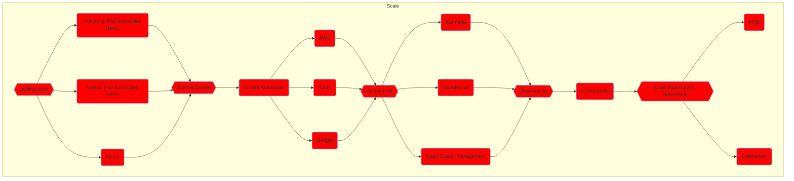

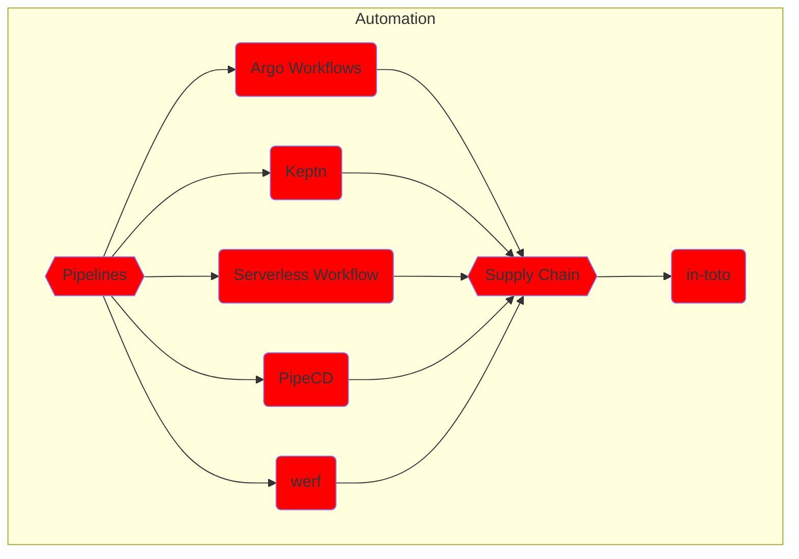

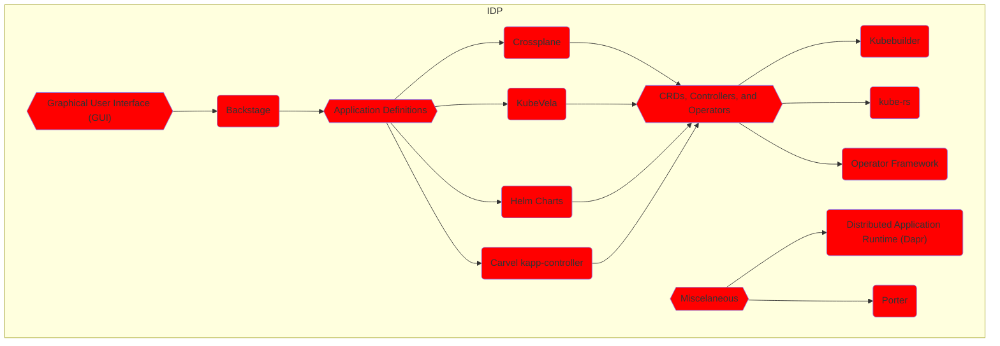

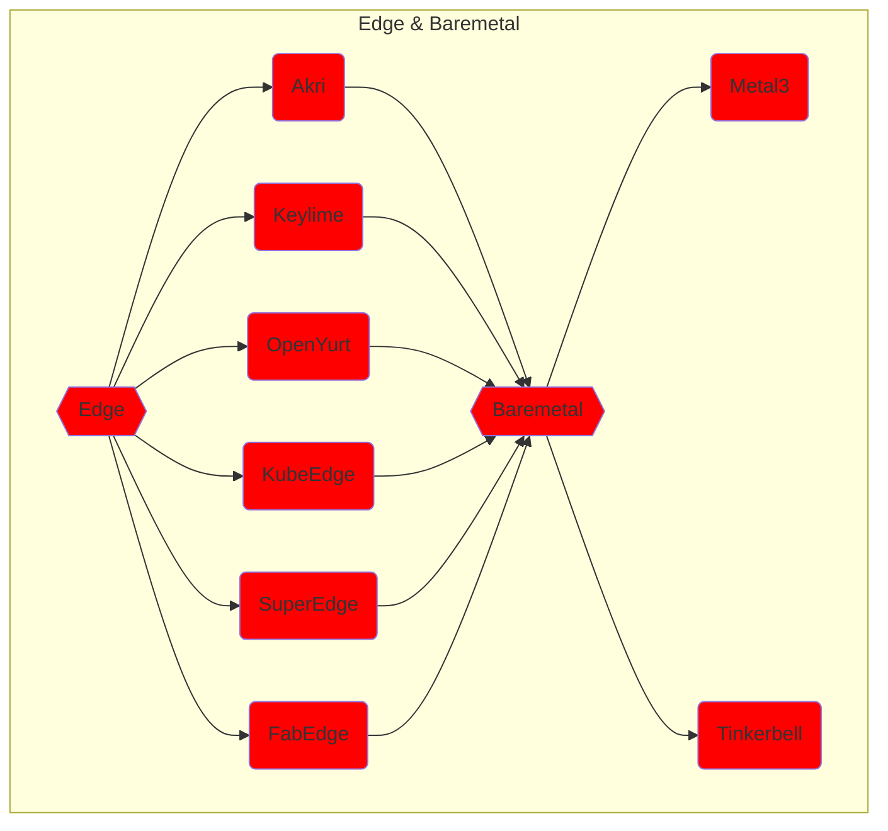

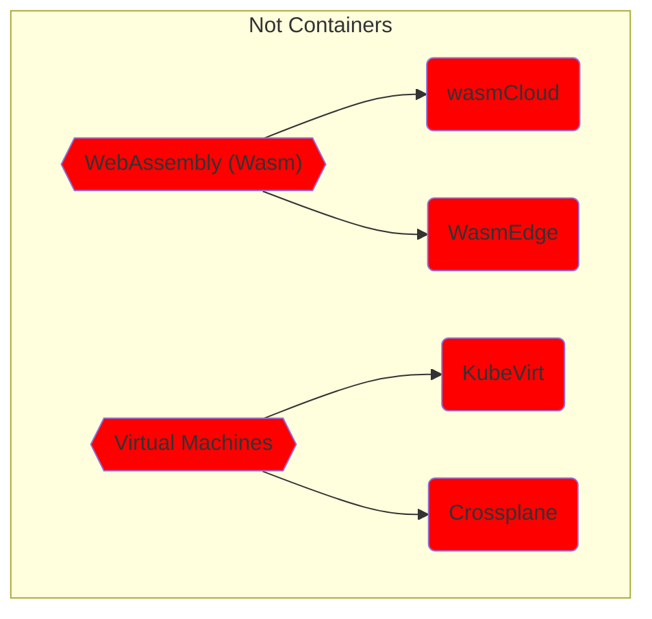

```mermaid
flowchart TD

    subgraph Misc

        %% ----------------
        %% -- Networking --
        %% ----------------
        networking{{Networking}}
        style networking fill:red
        networking-cni("Container Network Interface (CNI)")
        style networking-cni fill:red
        networking-antrea(Antrea)
        style networking-antrea fill:red
        networking-cilium(Cilium)
        style networking-cilium fill:red
        bfe(BFE)
        style bfe fill:red
        kube-ovn(Kube-OVN)
        style kube-ovn fill:red
        cni-genie(CNI-Genie)
        style cni-genie fill:red
        networking --> networking-cni --> networking-antrea & networking-cilium & bfe & kube-ovn --> cni-genie

        %% -------------
        %% -- Storage --
        %% -------------
        storage{{Storage}}
        style storage fill:red
        storage-piraeus-datastore(Piraeus Datastore)
        style storage-piraeus-datastore fill:red
        storage-curve(Curve)
        style storage-curve fill:red
        storage-rook(Rook)
        style storage-rook fill:red
        storage-longhorn(Longhorn)
        style storage-longhorn fill:red
        storage-cube-fs(CubeFS)
        style storage-cube-fs fill:red
        storage-pravega(Pravega)
        style storage-pravega fill:red
        carina(Carina)
        style carina fill:red
        hwameistor(HwameiStor)
        style hwameistor fill:red
        openebs(OpenEBS)
        style openebs fill:red
        storage --> storage-piraeus-datastore & storage-curve & storage-rook & storage-longhorn & storage-cube-fs & storage-pravega & carina & hwameistor & openebs --> backup

        %% ------------
        %% -- Backup --
        %% ------------
        backup{{Backup}}
        style backup fill:red
        backup-k8up(K8up)
        style backup-k8up fill:red
        backup --> backup-k8up

        %% -----------------------
        %% -- Chaos Engineering --
        %% -----------------------
        chaos-engineering{{Chaos Engineering}}
        style chaos-engineering fill:red
        chaosblade(Chaosblade)
        style chaosblade fill:red
        litmus(Litmus)
        style litmus fill:red
        chaos-mesh(Chaos Mesh)
        style chaos-mesh fill:red
        kraken(Kraken)
        style kraken fill:red
        chaos-engineering --> chaosblade & litmus & chaos-mesh & kraken

        %% --------------------
        %% -- Events Storage --
        %% --------------------
        events-storage{{Events Storage}}
        style events-storage fill:red
        events-storage-nats(NATS)
        style events-storage-nats fill:red
        events-storage-strimzi(Strimzi)
        style events-storage-strimzi fill:red
        events-storage --> events-storage-nats & events-storage-strimzi --> events
        
        %% ------------
        %% -- Events --
        %% ------------
        events{{Events}}
        style events fill:red
        events-cloud-events(CloudEvents)
        style events-cloud-events fill:red
        events --> events-cloud-events

        %% ----------------
        %% -- Serverless --
        %% ----------------
        serverless{{Serverless}}
        style serverless fill:red
        serverless-knative(Knative)
        style serverless-knative fill:red
        open-function(OpenFunction)
        style open-function fill:red
        serverless --> serverless-knative & open-function

        %% ---------------------------------
        %% -- Machine Learning & Big Data --
        %% ---------------------------------
        ml{{Machine Learning & Big Data}}
        style ml fill:red
        kube-dl(KubeDL)
        style kube-dl fill:red
        fluid(Fluid)
        style fluid fill:red
        ml --> kube-dl & fluid

        %% ---------------------
        %% -- Other Databases --
        %% ---------------------
        other-db{{Other Databases}}
        style other-db fill:red
        tikv(TiKV)
        style tikv fill:red
        vitess(Vitess)
        style vitess fill:red
        vineyard(Vineyard)
        style vineyard fill:red
        etcd(etcd)
        style etcd fill:red
        other-db --> tikv & vitess & vineyard & etcd

        %% ----------------------
        %% -- Jobs and Batches --
        %% ----------------------
        jobs{{Jobs and Batches}}
        style jobs fill:red
        volcano(Volcano)
        style volcano fill:red
        armada(Armada)
        style armada fill:red
        jobs --> volcano & armada

        %% -----------------------
        %% -- Container Runtime --
        %% -----------------------
        container-runtime{{Container Runtime}}
        style container-runtime fill:red
        cri-o(CRI-O)
        style cri-o fill:red
        containerd(containerd)
        style containerd fill:red
        container-runtime --> cri-o & containerd

        %% ---------
        %% -- TBD --
        %% ---------
        tbd{{TBD}}
        style tbd fill:red
        %% -- Deployment and life cycle of Konveyor (formerly Tackle) on Kubernetes and OpenShift (drop 1) --
        konveyor(Konveyor)
        style konveyor fill:red
        %% -- Kubernetes Rust State Machine Operator (drop 1) --
        krator(Krator)
        style krator fill:red
        %% - Kubernetes daemonset that performs safe automatic node reboots when the need to do so is indicated by the package management system of the underlying OS (drop 1) --
        kured(Kured)
        style kured fill:red
        %% -- OCI registry client - managing content like artifacts, images, packages --
        oras(ORAS)
        style oras fill:red
        %% -- Find, install and publish Kubernetes packages (drop 1) --
        artifact-hub(Artifact Hub)
        style artifact-hub fill:red
        %% -- The C based gRPC (C++, Python, Ruby, Objective-C, PHP, C#) (drop 1) --
        grpc(gRPC)
        style grpc fill:red
        %% -- DNS server that chains plugins (drop 1) --
        core-dns(CoreDNS)
        style core-dns fill:red
        %% -- Not maintained --
        %% virtual-kubelet(Virtual Kubelet)
        %% style virtual-kubelet fill:red
        %% -- Not maintained --
        %% tremor(Tremor)
        %% style tremor fill:red
        %% -- Not maintained --
        %% sealer(Sealer)
        %% style sealer fill:red
        %% -- Python reference implementation of The Update Framework (TUF) (drop 1) --
        tuf("The Update Framework (TUF)")
        style tuf fill:red
        %% -- Platform AbstRaction for SECurity service (drop 1) --
        parsec(Parsec)
        style parsec fill:red
        %% -- Not maintained --
        %% inclavare-containers(Inclavare Containers)
        %% style inclavare-containers fill:red
        %% -- Visibility into current and historical Kubernetes spend and resource allocation (drop 1) --
        %% -- Control Plane for Kubernetes APIs (drop 1) --
        kcp(kcp)
        style kcp fill:red
        %% -- Kubernetes native tool for mocking and testing API and micro-services (drop 1) --
        microcks(Microcks)
        style microcks fill:red
        %% -- A network load-balancer implementation for Kubernetes using standard routing protocols (drop 1) --
        metallb(MetalLB)
        style metallb fill:red
        %% -- Load Balancer Implementation for Kubernetes in Bare-Metal, Edge, and Virtualization (drop 1) --
        openelb(OpenELB)
        style openelb fill:red
        %% -- Virtual IP and load balancer for Kubernetes (drop 1) --
        kube-vip(kube-vip)
        style kube-vip fill:red
        %% -- Namespace management (drop 1) --
        capsule(Capsule)
        style capsule fill:red
        %% -- Multi-cluster management. KinD setup from the quickstart does not work (drop 1) --
        clusternet(Clusternet)
        style clusternet fill:red
        %% -- Removes old images from Kubernetes nodes (drop 1) --
        eraser(Eraser)
        style eraser fill:red
        %% -- Speeds up service mesh (drop 1) --
        merbridge(Merbridge *)
        style merbridge fill:red
        %% -- Compatible with ETCD (drop 1) --
        xline(Xline)
        style xline fill:red
        open-feature(OpenFeature)
        style open-feature fill:red
        kanister(Kanister)
        style kanister fill:red
        trickster(Trickster)
        style trickster fill:red
    end
```

## TODO:

* Check whether there are new projects to be added
* Add Kubernetes SIG projects
