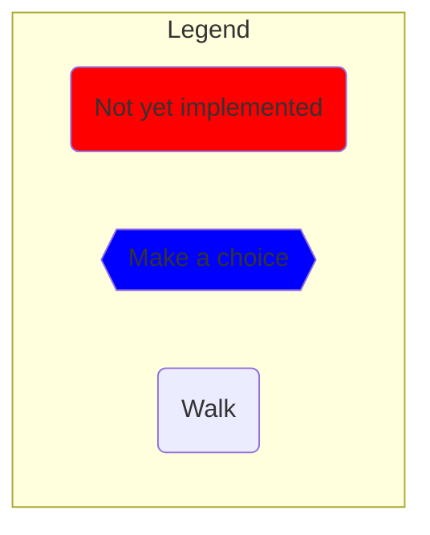
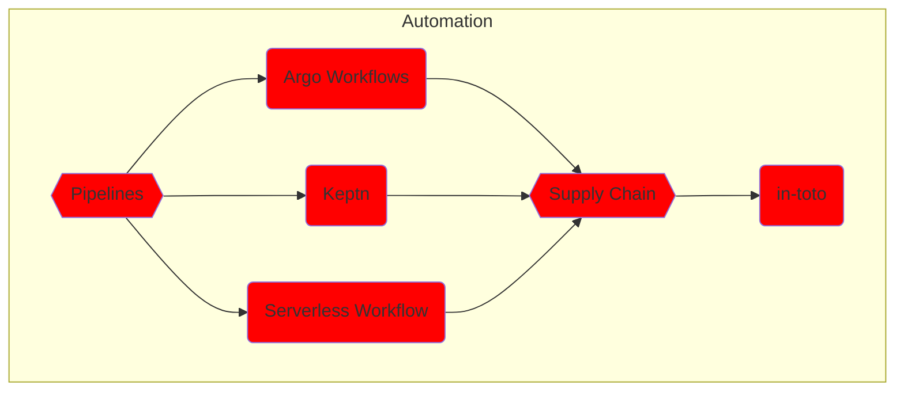
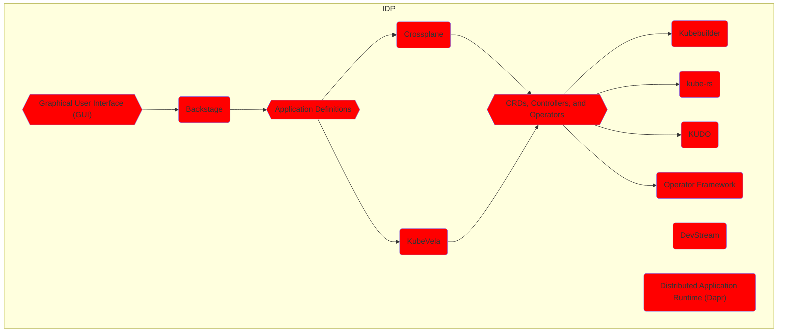
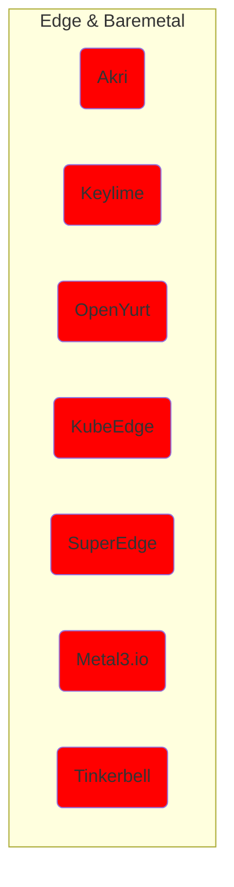
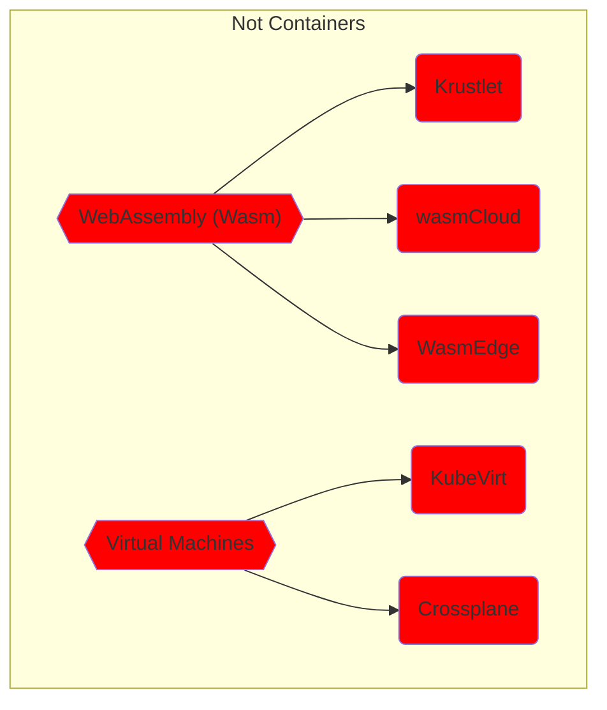

## The Whole README.md

*This is a temporary work-in-progress file. **Do NOT use it.** Go to the [README.md](README) file instead.

Almost all items in the graphs contain a link if you prefer to jump straight into a specific part of the aadventure. If you do so, please note that the steps work only if one start from the beginning of any of the chapters (e.g., Development, Produciton, etc.).

*For reasons I cannot explain, the links do not work if they are not opened in a separate tab.*



```mermaid
flowchart TD

    subgraph Development

        %% -----------
        %% -- Setup --
        %% -----------
        setup-dev((Setup))
        click setup-dev "https://github.com/vfarcic/cncf-demo/blob/main/manuscript/setup/dev.md"

        %% -- Setup Connections --
        setup-dev-->bci

        %% ---------------------------
        %% -- Build Container Image --
        %% ---------------------------
        bci{{Build Container Image}}
        click bci "https://github.com/vfarcic/cncf-demo/blob/main/manuscript/build-container-image/README.md"
        style bci fill:blue
        bci-kbld(Carvel kbld)
        click bci-kbld "https://github.com/vfarcic/cncf-demo/blob/main/manuscript/build-container-image/kbld.md"
        bci-lima(Lima)
        click bci-lima "https://github.com/vfarcic/cncf-demo/blob/main/manuscript/build-container-image/lima.md"
        bci-buildpacks(Cloud Native Buildpacks / CNB)
        click bci-buildpacks "https://github.com/vfarcic/cncf-demo/blob/main/manuscript/build-container-image/buildpacks.md"
        bci --> bci-kbld & bci-lima & bci-buildpacks --> registry

        %% -----------------------------------------
        %% -- Store Container Image in a Registry --
        %% -----------------------------------------
        registry{{Store Container Image In A Registry}}
        click registry "https://github.com/vfarcic/cncf-demo/blob/main/manuscript/registry/README.md"
        style registry fill:blue
        registry-docker-hub(Docker Hub)
        click registry-docker-hub "https://github.com/vfarcic/cncf-demo/blob/main/manuscript/registry/docker-hub.md"
        registry-harbor(Harbor)
        click registry-harbor "https://github.com/vfarcic/cncf-demo/blob/main/manuscript/registry/harbor.md"
        registry-dragonfly(Dragonfly)
        click registry-dragonfly "https://github.com/vfarcic/cncf-demo/blob/main/manuscript/registry/dragonfly.md"
        registry --> registry-docker-hub & registry-harbor & registry-dragonfly --> ddd

        %% --------------------------------------
        %% -- Define And Deploy The App To Dev --
        %% --------------------------------------
        ddd{{Define And Deploy The App To Dev}}
        click ddd "https://github.com/vfarcic/cncf-demo/blob/main/manuscript/define-deploy-dev/README.md"
        style ddd fill:blue
        ddd-helm(Helm)
        click ddd-helm "https://github.com/vfarcic/cncf-demo/blob/main/manuscript/define-deploy-dev/helm.md"
        ddd-kustomize(Kustomize)
        click ddd-kustomize "https://github.com/vfarcic/cncf-demo/blob/main/manuscript/define-deploy-dev/kustomize.md"
        ddd-carvel(Carvel ytt)
        click ddd-carvel "https://github.com/vfarcic/cncf-demo/blob/main/manuscript/define-deploy-dev/carvel-ytt.md"
        ddd-cdk8s("CDK For Kubernetes (cdk8s)")
        click ddd-cdk8s "https://github.com/vfarcic/cncf-demo/blob/main/manuscript/define-deploy-dev/cdk8s.md"
        ddd --> ddd-helm & ddd-kustomize & ddd-carvel & ddd-cdk8s --> https

        %% ---------------
        %% -- Use HTTPS --
        %% ---------------
        https{{Use HTTPS}}
        click https "https://github.com/vfarcic/cncf-demo/blob/main/manuscript/https/README.md"
        style https fill:blue
        https-cert-manager(cert-manager)
        click https-cert-manager "https://github.com/vfarcic/cncf-demo/blob/main/manuscript/https/cert-manager.md"
        https-cert-manager-helm(App as Helm)
        click https-cert-manager-helm "https://github.com/vfarcic/cncf-demo/blob/main/manuscript/https/cert-manager-helm.md"
        https-cert-manager-kustomize(App as Kustomize)
        click https-cert-manager-kustomize "https://github.com/vfarcic/cncf-demo/blob/main/manuscript/https/cert-manager-kustomize.md"
        https-cert-manager-carvel(App as Carvel ytt)
        click https-cert-manager-kustomize "https://github.com/vfarcic/cncf-demo/blob/main/manuscript/https/cert-manager-carvel.md"
        https-cert-manager-cdk8s(App as cdk8s)
        click https-cert-manager-cdk8s "https://github.com/vfarcic/cncf-demo/blob/main/manuscript/https/cert-manager-cdk8s.md"
        https--> https-cert-manager--> https-cert-manager-helm & https-cert-manager-kustomize & https-cert-manager-carvel & https-cert-manager-cdk8s --> db

        %% --------------------------------
        %% -- Setup PostgreSQL DB In Dev --
        %% --------------------------------
        db{{Setup PostgreSQL DB In Dev}}
        click db "https://github.com/vfarcic/cncf-demo/blob/main/manuscript/db/README.md"
        style db fill:blue
        db-helm(Helm Chart)
        click db-helm "https://github.com/vfarcic/cncf-demo/blob/main/manuscript/db/helm.md"
        db-helm-helm(App as Helm)
        click db-helm-helm "https://github.com/vfarcic/cncf-demo/blob/main/manuscript/db/helm-helm.md"
        db-helm-kustomize(App as Kustomize)
        click db-helm-kustomize "https://github.com/vfarcic/cncf-demo/blob/main/manuscript/db/helm-kustomize.md"
        db-helm-cdk8s(App as cdk8s)
        click db-helm-cdk8s "https://github.com/vfarcic/cncf-demo/blob/main/manuscript/db/helm-cdk8s.md"
        db-helm-carvel(App as Carvel ytt)
        click db-helm-carvel "https://github.com/vfarcic/cncf-demo/blob/main/manuscript/db/helm-carvel.md"
        db-crossplane-local(Crossplane Composition In Kubernetes)
        click db-crossplane-local "https://github.com/vfarcic/cncf-demo/blob/main/manuscript/db/crossplane-local.md"
        db-crossplane-cloud(Crossplane Composition In Cloud)
        click db-crossplane-cloud "https://github.com/vfarcic/cncf-demo/blob/main/manuscript/db/crossplane-cloud.md"
        db-crossplane-google(Google Cloud)
        click db-crossplane-google "https://github.com/vfarcic/cncf-demo/blob/main/manuscript/db/crossplane-google.md"
        db-crossplane-aws(AWS)
        click db-crossplane-aws "https://github.com/vfarcic/cncf-demo/blob/main/manuscript/db/crossplane-aws.md"
        db-crossplane-azure(Azure)
        click db-crossplane-azure "https://github.com/vfarcic/cncf-demo/blob/main/manuscript/db/crossplane-azure.md"
        db-crossplane-helm(App as Helm)
        click db-crossplane-helm "https://github.com/vfarcic/cncf-demo/blob/main/manuscript/db/crossplane-helm.md"
        db-crossplane-carvel(App as Carvel ytt)
        click db-crossplane-carvel "https://github.com/vfarcic/cncf-demo/blob/main/manuscript/db/crossplane-carvel.md"
        db-crossplane-kustomize(App as Kustomize)
        click db-crossplane-kustomize "https://github.com/vfarcic/cncf-demo/blob/main/manuscript/db/crossplane-kustomize.md"
        db-crossplane-cdk8s(App as cdk8s)
        click db-crossplane-cdk8s "https://github.com/vfarcic/cncf-demo/blob/main/manuscript/db/crossplane-cdk8s.md"
        db --> db-helm & db-crossplane-local & db-crossplane-cloud
        db-helm --> db-helm-helm & db-helm-kustomize & db-helm-cdk8s & db-helm-carvel --> db-schema
        db-crossplane-local --> db-crossplane-helm & db-crossplane-kustomize & db-crossplane-cdk8s & db-crossplane-carvel
        db-crossplane-cloud --> db-crossplane-google & db-crossplane-aws & db-crossplane-azure --> db-crossplane-helm & db-crossplane-kustomize & db-crossplane-cdk8s & db-crossplane-carvel --> db-schema

        %% ----------------------
        %% -- Manage DB Schema --
        %% ----------------------
        db-schema{{Manage DB Schema}}
        click db-schema "https://github.com/vfarcic/cncf-demo/blob/main/manuscript/db-schema/README.md"
        style db-schema fill:blue
        db-schema-schemahero(SchemaHero)
        click db-schema-schemahero "https://github.com/vfarcic/cncf-demo/blob/main/manuscript/db-schema/schemahero.md"
        db-schema-liquibase(Liquibase)
        click db-schema-liquibase "https://github.com/vfarcic/cncf-demo/blob/main/manuscript/db-schema/liquibase.md"
        db-schema-schemahero-helm(App as Helm)
        click db-schema-schemahero-helm "https://github.com/vfarcic/cncf-demo/blob/main/manuscript/db-schema/schemahero-helm.md"
        db-schema-schemahero-kustomize(App as Kustomize)
        click db-schema-schemahero-kustomize "https://github.com/vfarcic/cncf-demo/blob/main/manuscript/db-schema/schemahero-kustomize.md"
        db-schema-schemahero-cdk8s(App as cdk8s)
        click db-schema-schemahero-cdk8s "https://github.com/vfarcic/cncf-demo/blob/main/manuscript/db-schema/schemahero-cdk8s.md"
        db-schema-schemahero-carvel(App as Carvel ytt)
        click db-schema-schemahero-carvel "https://github.com/vfarcic/cncf-demo/blob/main/manuscript/db-schema/schemahero-carvel.md"
        db-schema --> db-schema-liquibase & db-schema-schemahero
        db-schema-schemahero --> db-schema-schemahero-helm & db-schema-schemahero-kustomize & db-schema-schemahero-cdk8s & db-schema-schemahero-carvel --> develop

        %% ---------------------
        %% -- Develop The App --
        %% ---------------------
        develop{{Develop The App}}
        click develop "https://github.com/vfarcic/cncf-demo/blob/main/manuscript/develop/README.md"
        style develop fill:blue
        develop-telepresence(Telepresence)
        click develop-telepresence "https://github.com/vfarcic/cncf-demo/blob/main/manuscript/develop/telepresence.md"
        develop-devspace(DevSpace)
        click develop-devspace "https://github.com/vfarcic/cncf-demo/blob/main/manuscript/develop/devspace.md"
        develop-nocalhost(Nocalhost)
        click develop-nocalhost "https://github.com/vfarcic/cncf-demo/blob/main/manuscript/develop/nocalhost.md"
        develop-devspace-kustomize(App as Kustomize)
        click develop-devspace-kustomize "https://github.com/vfarcic/cncf-demo/blob/main/manuscript/develop/devspace-kustomize.md"
        develop-devspace-cdk8s(App as cdk8s)
        click develop-devspace-cdk8s "https://github.com/vfarcic/cncf-demo/blob/main/manuscript/develop/devspace-cdk8s.md"
        develop-devspace-helm(App as Helm)
        click develop-devspace-helm "https://github.com/vfarcic/cncf-demo/blob/main/manuscript/develop/devspace-helm.md"
        develop-devspace-carvel(App as Carvel ytt)
        click develop-devspace-carvel "https://github.com/vfarcic/cncf-demo/blob/main/manuscript/develop/devspace-carvel.md"
        develop-devfile(Devfile)
        click develop-devfile "https://github.com/vfarcic/cncf-demo/blob/main/manuscript/develop/devfile.md"
        style develop-devfile fill:red
        develop --> develop-telepresence & develop-devspace & develop-nocalhost & develop-devfile
        develop-telepresence & develop-nocalhost & develop-devfile --> dev-done
        develop-devspace --> develop-devspace-kustomize & develop-devspace-cdk8s & develop-devspace-helm & develop-devspace-carvel --> dev-done

        dev-done((Chapter End))

    end

    Development-->Production

    subgraph Production

        %% -----------
        %% -- Setup --
        %% -----------
        setup-prod((Setup))
        click setup-prod "https://github.com/vfarcic/cncf-demo/blob/main/manuscript/setup/prod.md"

        %% -- Setup Connections --
        setup-prod-->cluster

        %% -------------
        %% -- Cluster --
        %% -------------
        cluster{{Create a Cluster}}
        click cluster "https://github.com/vfarcic/cncf-demo/blob/main/manuscript/cluster/README.md"
        style cluster fill:blue
        cluster-kubevela(KubeVela With Terraform)
        click cluster-kubevela "https://github.com/vfarcic/cncf-demo/blob/main/manuscript/cluster/kubevela.md"
        style cluster-kubevela fill:red
        cluster-crossplane(Crossplane)
        click cluster-crossplane "https://github.com/vfarcic/cncf-demo/blob/main/manuscript/cluster/crossplane.md"
        cluster-crossplane-google(Google Cloud)
        click cluster-crossplane-google "https://github.com/vfarcic/cncf-demo/blob/main/manuscript/cluster/cluster-crossplane-google.md"
        cluster-crossplane-aws(AWS)
        click cluster-crossplane-aws "https://github.com/vfarcic/cncf-demo/blob/main/manuscript/cluster/cluster-crossplane-aws.md"
        cluster-crossplane-azure(Azure)
        click cluster-crossplane-azure "https://github.com/vfarcic/cncf-demo/blob/main/manuscript/cluster/cluster-crossplane-azure.md"
        cluster-cluster-api(Cluster API)
        click cluster-cluster-api "https://github.com/vfarcic/cncf-demo/blob/main/manuscript/cluster/cluster-api.md"
        capi-google(Google Cloud)
        click capi-google "https://github.com/vfarcic/cncf-demo/blob/main/manuscript/cluster/capi-google.md"
        capi-aws(AWS)
        click capi-aws "https://github.com/vfarcic/cncf-demo/blob/main/manuscript/cluster/capi-aws.md"
        capi-azure(Azure)
        click capi-azure "https://github.com/vfarcic/cncf-demo/blob/main/manuscript/cluster/capi-azure.md"
        cluster --> cluster-crossplane --> cluster-crossplane-google & cluster-crossplane-aws & cluster-crossplane-azure --> gitops
        cluster --> cluster-cluster-api --> capi-google & capi-aws & capi-azure --> gitops
        cluster --> cluster-kubevela --> gitops

        %% ------------
        %% -- GitOps --
        %% ------------
        gitops{{GitOps}}
        click gitops "https://github.com/vfarcic/cncf-demo/blob/main/manuscript/gitops/README.md"
        style gitops fill:blue
        gitops-flux(Flux)
        click gitops-flux "https://github.com/vfarcic/cncf-demo/blob/main/manuscript/gitops/flux.md"
        gitops-argocd(Argo CD)
        click gitops-argocd "https://github.com/vfarcic/cncf-demo/blob/main/manuscript/gitops/argocd.md"
        gitops-kapp(Carvel kapp-controller)
        click gitops-kapp "https://github.com/vfarcic/cncf-demo/blob/main/manuscript/gitops/kapp.md"
        gitops --> gitops-flux & gitops-argocd & gitops-kapp --> ingress

        %% -------------
        %% -- Ingress --
        %% -------------
        ingress{{Ingress}}
        click ingress "https://github.com/vfarcic/cncf-demo/blob/main/manuscript/ingress/README.md"
        style ingress fill:blue
        ingress-contour(Contour With Envoy)
        click ingress-contour "https://github.com/vfarcic/cncf-demo/blob/main/manuscript/ingress/contour.md"
        ingress-nginx(NGINX)
        click ingress-nginx "https://github.com/vfarcic/cncf-demo/blob/main/manuscript/ingress/nginx.md"
        emissary-ingress(Emissary-ingress With Envoy)
        click ingress-nginx "https://github.com/vfarcic/cncf-demo/blob/main/manuscript/ingress/emissary-ingress.md"
        ingress-argocd(GitOps With Argo CD)
        click ingress-argocd "https://github.com/vfarcic/cncf-demo/blob/main/manuscript/ingress/gitops-argocd.md"
        ingress-flux(GitOps Flux)
        click ingress-flux "https://github.com/vfarcic/cncf-demo/blob/main/manuscript/ingress/gitops-flux.md"
        ingress-kapp(GitOps Carvel kapp-controller)
        click ingress-kapp "https://github.com/vfarcic/cncf-demo/blob/main/manuscript/ingress/gitops-kapp.md"
        ingress-->ingress-contour & ingress-nginx & emissary-ingress --> ingress-argocd & ingress-flux & ingress-kapp --> app

        %% ----------------------------------
        %% -- Deploy The App To Production --
        %% ----------------------------------
        app{{Deploy The App To Production}}
        click app "https://github.com/vfarcic/cncf-demo/blob/main/manuscript/app/README.md"
        style app fill:blue
        app-helm(App As Helm)
        click app-helm "https://github.com/vfarcic/cncf-demo/blob/main/manuscript/app/helm.md"
        app-kustomize(App As Kustomize)
        click app-kustomize "https://github.com/vfarcic/cncf-demo/blob/main/manuscript/app/kustomize.md"
        app-cdk8s(App As cdk8s)
        click app-cdk8s "https://github.com/vfarcic/cncf-demo/blob/main/manuscript/app/cdk8s.md"
        app-carvel(App As Carvel ytt)
        click app-carvel "https://github.com/vfarcic/cncf-demo/blob/main/manuscript/app/carvel.md"
        app --> app-helm & app-kustomize & app-cdk8s & app-carvel --> db-production

        %% --------------
        %% -- Database --
        %% --------------
        db-production{{Database}}
        click db-production "https://github.com/vfarcic/cncf-demo/blob/main/manuscript/db-production/README.md"
        style db-production fill:blue
        db-production-crossplane(Crossplane)
        click db-production-crossplane "https://github.com/vfarcic/cncf-demo/blob/main/manuscript/db-production/crossplane.md"
        db-production-kubevela(KubeVela With Terraform)
        style db-production-kubevela fill:red
        db-production-helm(App As Helm)
        click db-production-helm "https://github.com/vfarcic/cncf-demo/blob/main/manuscript/db-production/helm.md"
        db-production-kustomize(App As Kustomize)
        click db-production-kustomize "https://github.com/vfarcic/cncf-demo/blob/main/manuscript/db-production/kustomize.md"
        db-production-cdk8s(App As cdk8s)
        click db-production-cdk8s "https://github.com/vfarcic/cncf-demo/blob/main/manuscript/db-production/cdk8s.md"
        db-production-carvel(App As Carvel ytt)
        click db-production-carvel "https://github.com/vfarcic/cncf-demo/blob/main/manuscript/db-production/carvel.md"
        db-production --> db-production-crossplane & db-production-kubevela --> db-production-helm & db-production-kustomize & db-production-cdk8s & db-production-carvel --> prod-done

        prod-done((Chapter End))

    end

    Production-->Security

    subgraph Security

        %% -----------
        %% -- Setup --
        %% -----------
        setup-security((Setup))
        click setup-security "https://github.com/vfarcic/cncf-demo/blob/main/manuscript/setup/security.md"

        %% -- Setup Connections --
        setup-security-->policies

        %% --------------
        %% -- Policies --
        %% --------------
        policies{{Policies}}
        style policies fill:blue
        click policies "https://github.com/vfarcic/cncf-demo/blob/main/manuscript/policies/README.md"
        policies-kyverno(Kyverno)
        click policies-kyverno "https://github.com/vfarcic/cncf-demo/blob/main/manuscript/policies/kyverno.md"
        policies-opa("Open Policy Agent (OPA) With Gatekeeper")
        style policies-opa fill:red
        policies-cloud-custodian(Cloud Custodian)
        style policies-cloud-custodian fill:red
        kube-armor(KubeArmor)
        style kube-armor fill:red
        kubewarden(Kubewarden)
        style kubewarden fill:red
        %% Wait with VAC until Kubernetes v1.26 is available in GKE, EKS, and AKS
        vac(Kubernetes Validating Admission Policy)
        style vac fill:red
        falco(Falco)
        style falco fill:red
        policies-helm(App As Helm)
        style policies-helm fill:red
        policies-kustomize(App As Kustomize)
        click policies-kustomize "https://github.com/vfarcic/cncf-demo/blob/main/manuscript/policies/kustomize.md"
        policies-cdk8s(App As cdk8s)
        style policies-cdk8s fill:red
        policies-carvel(App As Carvel ytt)
        style policies-carvel fill:red
        policies --> policies-kyverno & policies-opa & policies-cloud-custodian & kube-armor & kubewarden & vac & falco --> policies-helm & policies-kustomize & policies-cdk8s & policies-carvel --> secrets

        %% ------------------------
        %% -- Secrets Management --
        %% ------------------------
        secrets{{Secrets Management}}
        click secrets "https://github.com/vfarcic/cncf-demo/blob/main/manuscript/secrets/README.md"
        style secrets fill:blue
        secrets-eso("External Secrets Operator (ESO)")
        click secrets-eso "https://github.com/vfarcic/cncf-demo/blob/main/manuscript/secrets/eso.md"
        secrets-eso-google(Google Cloud)
        click secrets-eso-google "https://github.com/vfarcic/cncf-demo/blob/main/manuscript/secrets/eso-google.md"
        secrets-eso-aws(AWS)
        click secrets-eso-aws "https://github.com/vfarcic/cncf-demo/blob/main/manuscript/secrets/eso-aws.md"
        secrets-eso-azure(Azure)
        click secrets-eso-azure "https://github.com/vfarcic/cncf-demo/blob/main/manuscript/secrets/eso-azure.md"
        style secrets-eso-azure fill:red
        secrets-eso-helm(App As Helm)
        style secrets-eso-helm fill:red
        secrets-eso-kustomize(App As Kustomize)
        secrets-eso-cdk8s(App As cdk8s)
        style secrets-eso-cdk8s fill:red
        secrets-eso-carvel(App As Carvel ytt)
        style secrets-eso-carvel fill:red
        secrets --> secrets-eso --> secrets-eso-google & secrets-eso-aws & secrets-eso-azure --> secrets-eso-helm & secrets-eso-kustomize & secrets-eso-cdk8s & secrets-eso-carvel --> mtls

        %% -------------------------------------
        %% -- Mutual TLS And Network Policies --
        %% -------------------------------------
        mtls{{"Mutual TLS (mTLS) And Network Policies"}}
        click mtls "https://github.com/vfarcic/cncf-demo/blob/main/manuscript/mtls/README.md"
        mtls-istio(Istio)
        click mtls "https://github.com/vfarcic/cncf-demo/blob/main/manuscript/mtls/istio.md"
        style mtls-istio fill:red
        mtls-smi("Service Mesh Interface (SMI)")
        click mtls "https://github.com/vfarcic/cncf-demo/blob/main/manuscript/mtls/smi.md"
        mtls-linkerd(LinkerD)
        click mtls "https://github.com/vfarcic/cncf-demo/blob/main/manuscript/mtls/linkerd.md"
        style mtls-linkerd fill:red
        mtls-open-service-mesh(Open Service Mesh)
        click mtls "https://github.com/vfarcic/cncf-demo/blob/main/manuscript/mtls/osm.md"
        style mtls-open-service-mesh fill:red
        mtls-aeraki-mesh(Aeraki Mesh)
        click mtls "https://github.com/vfarcic/cncf-demo/blob/main/manuscript/mtls/aeraki-mesh.md"
        style mtls-aeraki-mesh fill:red
        mtls-cilium(Cilium)
        click mtls "https://github.com/vfarcic/cncf-demo/blob/main/manuscript/mtls/cilium.md"
        style mtls-cilium fill:red
        mtls-kuma(Kuma)
        click mtls "https://github.com/vfarcic/cncf-demo/blob/main/manuscript/mtls/kuma.md"
        style mtls-kuma fill:red
        mtls-network-service-mesh(Network Service Mesh)
        click mtls "https://github.com/vfarcic/cncf-demo/blob/main/manuscript/mtls/nsm.md"
        style mtls-network-service-mesh fill:red
        mtls --> mtls-istio & mtls-aeraki-mesh & mtls-kuma & mtls-network-service-mesh & mtls-cilium --> scanning
        mtls --> mtls-smi --> mtls-linkerd & mtls-open-service-mesh --> scanning

        %% --------------
        %% -- Scanning --
        %% --------------
        scanning{{Scanning}}
        style scanning fill:red
        kubescape(Kubescape)
        style kubescape fill:red
        scanning --> kubescape --> signing

        %% -------------
        %% -- Signing --
        %% -------------
        signing{{Signing}}
        style signing fill:red
        notary(Notary)
        style notary fill:red
        signing --> notary --> access-control

        %% --------------------
        %% -- Access Control --
        %% --------------------
        access-control{{Access Control}}
        style access-control fill:red
        access-control-hexa(Hexa)
        style access-control-hexa fill:red
        dex(Dex)
        style dex fill:red
        athenz(Athenz)
        style athenz fill:red
        keycloak(Keycloak)
        style keycloak fill:red
        container-ssh(ContainerSSH)
        style container-ssh fill:red
        access-control --> access-control-hexa & dex & athenz & keycloak --> container-ssh --> misc

        %% ----------
        %% -- Misc --
        %% ----------
        misc{{Misc}}
        style misc fill:red
        curiefense(Curiefense)
        style curiefense fill:red
        confidential-containers(Confidential Containers)
        style confidential-containers fill:red
        misc --> curiefense & confidential-containers

    end

    Security-->Observability

    subgraph Observability

        %% ----------------
        %% -- Dashboards --
        %% ----------------
        dashboards{{Dashboards}}
        style dashboards fill:red
        dashboards-skooner(Skooner)
        style dashboards-skooner fill:red
        dashboards-kubernetes(Kubernetes Dashboard)
        style dashboards-kubernetes fill:red
        dashboards --> dashboards-skooner & dashboards-kubernetes --> metrics

        %% -------------
        %% -- Metrics --
        %% -------------
        metrics{{Metrics}}
        style metrics fill:red
        metrics-prometheus(Prometheus)
        style metrics-prometheus fill:red
        metrics-thanos(Thanos)
        style metrics-thanos fill:red
        pixie(Pixie)
        style pixie fill:red
        cortex(Cortex)
        style cortex fill:red
        fonio(Fonio)
        style fonio fill:red
        metrics --> metrics-prometheus & metrics-thanos & pixie & cortex & fonio --> instrumentation

        %% ---------------------
        %% -- Instrumentation --
        %% ---------------------
        instrumentation{{Instrumentation}}
        style instrumentation fill:red
        instrumentation-open-telemetry(OpenTelemetry)
        style instrumentation-open-telemetry fill:red
        instrumentation-open-metrics(OpenMetrics)
        style instrumentation-open-metrics fill:red

        %% -- Instrumentation Connections --
        instrumentation-->instrumentation-open-telemetry-->tracing
        instrumentation-->instrumentation-open-metrics-->tracing

        %% -------------
        %% -- Tracing --
        %% -------------
        tracing{{Tracing}}
        style tracing fill:red
        tracing-jaeger(Jaeger)
        style tracing-jaeger fill:red

        %% -- Tracing Connections --
        tracing --> tracing-jaeger --> logging

        %% -------------
        %% -- Logging --
        %% -------------
        logging{{Logging}}
        style logging fill:red
        logging-fluentd(FluentD)
        style logging-fluentd fill:red
        logging --> logging-fluentd --> progressive-delivery

        %% --------------------------
        %% -- Progressive Delivery --
        %% --------------------------
        progressive-delivery{{Progressive Delivery}}
        style progressive-delivery fill:red
        progressive-delivery-argo-rollouts(Argo Rollouts)
        style progressive-delivery-argo-rollouts fill:red
        progressive-delivery-flagger(Flagger)
        style progressive-delivery-flagger fill:red
        progressive-delivery --> progressive-delivery-argo-rollouts & progressive-delivery-flagger

        %% -----------
        %% -- TODO: --
        %% -----------
        kuberhealthy(kuberhealthy)
        style kuberhealthy fill:red

    end

    Observability-->Scale

    subgraph Scale

        %% -------------
        %% -- Scaling --
        %% -------------
        scaling{{Scaling}}
        style scaling fill:red
        hpa("Horizontal Pod Autoscaler (HPA)")
        style hpa fill:red
        keda(KEDA)
        style keda fill:red
        scaling --> hpa & keda --> deployment-mc

        %% ------------------------------
        %% -- Multi-Cluster Deployment --
        %% ------------------------------
        deployment-mc{{Deployment}}
        style deployment-mc fill:red
        deployment-mc-karmada(Karmada)
        style deployment-mc-karmada fill:red
        open-kruise(OpenKruise)
        style open-kruise fill:red
        deployment-mc --> deployment-mc-karmada & open-kruise --> lb-mc

        %% ---------------------------------
        %% -- Load Balancing & Networking --
        %% ---------------------------------
        lb-mc{{Load Balancing & Networking}}
        style lb-mc fill:red
        lb-mc-k8gb(k8gb)
        style lb-mc-k8gb fill:red
        lb-mc-submariner(Submariner)
        style lb-mc-submariner fill:red
        lb-mc --> lb-mc-k8gb & lb-mc-submariner

        %% -----------
        %% -- TODO: --
        %% -----------
        open-cluster-management(Open Cluster Management)
        style open-cluster-management fill:red
        clusterpedia(Clusterpedia)
        style clusterpedia fill:red

    end

    Scale-->Destroy

    subgraph Destroy

        destroy-all((Destroy Everything))
        click destroy-all "https://github.com/vfarcic/cncf-demo/blob/main/manuscript/destroy-all.md"

    end
```

```mermaid
flowchart TD

    subgraph Misc

        %% ----------------
        %% -- Networking --
        %% ----------------
        networking{{Networking}}
        style networking fill:red
        networking-cni("Container Network Interface (CNI)")
        style networking-cni fill:red
        networking-antrea(Antrea)
        style networking-antrea fill:red
        networking-cilium(Cilium)
        style networking-cilium fill:red
        bfe(BFE)
        style bfe fill:red
        kube-ovn(Kube-OVN)
        style kube-ovn fill:red
        cni-genie(CNI-Genie)
        style cni-genie fill:red
        networking --> networking-cni --> networking-antrea & networking-cilium & bfe & kube-ovn --> cni-genie

        %% -------------
        %% -- Storage --
        %% -------------
        storage{{Storage}}
        style storage fill:red
        storage-piraeus-datastore(Piraeus Datastore)
        style storage-piraeus-datastore fill:red
        storage-curve(Curve)
        style storage-curve fill:red
        storage-rook(Rook)
        style storage-rook fill:red
        storage-longhorn(Longhorn)
        style storage-longhorn fill:red
        storage-cube-fs(CubeFS)
        style storage-cube-fs fill:red
        storage-pravega(Pravega)
        style storage-pravega fill:red
        storage --> storage-piraeus-datastore & storage-curve & storage-rook & storage-longhorn & storage-cube-fs & storage-pravega --> backup

        %% ------------
        %% -- Backup --
        %% ------------
        backup{{Backup}}
        style backup fill:red
        backup-k8up(K8up)
        style backup-k8up fill:red
        backup --> backup-k8up

        %% -----------------------
        %% -- Chaos Engineering --
        %% -----------------------
        chaos-engineering{{Chaos Engineering}}
        style chaos-engineering fill:red
        chaos-engineering-chaosblade(Chaosblade)
        style chaos-engineering-chaosblade fill:red
        chaos-engineering-litmus(Litmus)
        style chaos-engineering-litmus fill:red
        chaos-engineering-chaos-mesh(Chaos Mesh)
        style chaos-engineering-chaos-mesh fill:red
        chaos-engineering --> chaos-engineering-chaosblade & chaos-engineering-litmus & chaos-engineering-chaos-mesh

        %% --------------------
        %% -- Events Storage --
        %% --------------------
        events-storage{{Events Storage}}
        style events-storage fill:red
        events-storage-nats(NATS)
        style events-storage-nats fill:red
        events-storage-strimzi(Strimzi)
        style events-storage-strimzi fill:red
        events-storage --> events-storage-nats & events-storage-strimzi --> events
        
        %% ------------
        %% -- Events --
        %% ------------
        events{{Events}}
        style events fill:red
        events-cloud-events(CloudEvents)
        style events-cloud-events fill:red
        events --> events-cloud-events

        %% ----------------
        %% -- Serverless --
        %% ----------------
        serverless{{Serverless}}
        style serverless fill:red
        serverless-knative(Knative)
        style serverless-knative fill:red
        serverless-devs(Serverless Devs)
        style serverless-devs fill:red
        serverless --> serverless-knative & serverless-devs

        %% ---------------------------------
        %% -- Machine Learning & Big Data --
        %% ---------------------------------
        kube-dl(KubeDL)
        style kube-dl fill:red
        fluid(Fluid)
        style fluid fill:red

        %% -----------
        %% -- TODO: --
        %% -----------
        konveyor(Konveyor)
        style konveyor fill:red
        krator(Krator)
        style krator fill:red
        kured(Kured)
        style kured fill:red
        oras(ORAS)
        style oras fill:red
        porter(Porter)
        style porter fill:red
        cri-o(CRI-O)
        style cri-o fill:red
        containerd(containerd)
        style containerd fill:red
        etcd(etcd)
        style etcd fill:red
        artifact-hub(Artifact Hub)
        style artifact-hub fill:red
        volcano(Volcano)
        style volcano fill:red        
        grpc(gRPC)
        style grpc fill:red
        core-dns(CoreDNS)
        style core-dns fill:red
        virtual-kubelet(Virtual Kubelet)
        style virtual-kubelet fill:red
        vineyard(Vineyard)
        style vineyard fill:red
        trickster(Trickster)
        style trickster fill:red
        tremor(Tremor)
        style tremor fill:red
        sealer(Sealer)
        style sealer fill:red
        vitess(Vitess)
        style vitess fill:red
        tikv(TiKV)
        style tikv fill:red
        spiffe(Spiffe)
        style spiffe fill:red
        spire(Spire)
        style spire fill:red
        tuf("The Update Framework (TUF)")
        style tuf fill:red
        parsec(Parsec)
        style parsec fill:red
        inclavare-containers(Inclavare Containers)
        style inclavare-containers fill:red
        secrets-teller(Teller)
        style secrets-teller fill:red
        mtls-meshery(Meshery)
        style mtls-meshery fill:red

    end
```












## TODO:

* Check whether there are new projects to be added
* Add Kubernetes SIG projects
