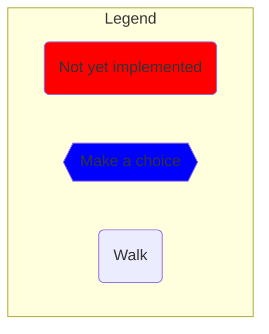
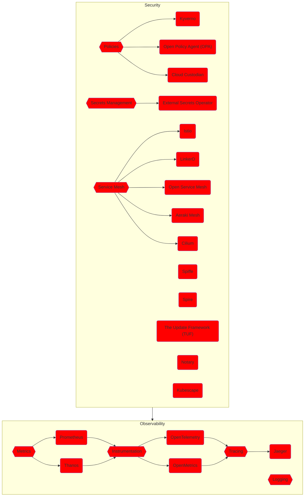
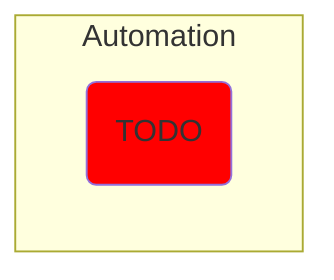
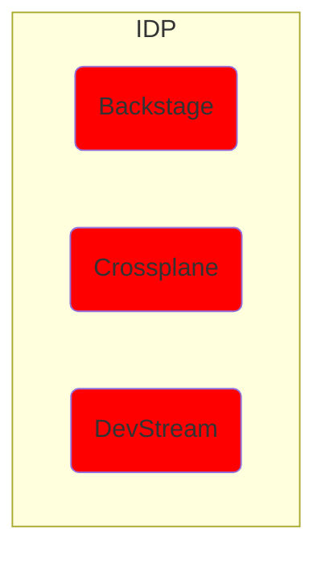
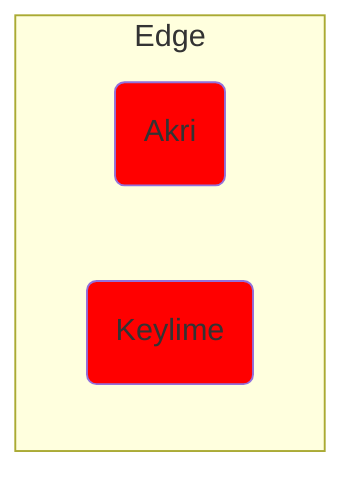
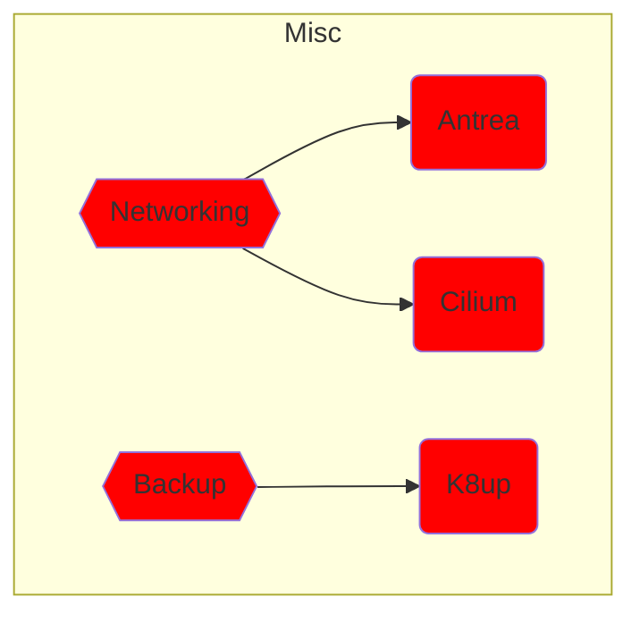
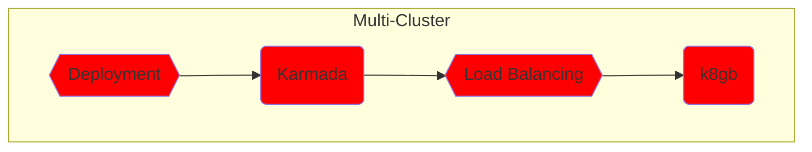

## The Whole Story

*This is a temporary work-in-progress file. **Do NOT use it.** Go to the [README.md](README) file instead.

Almost all items in the graphs contain a link if you prefer to jump straight into a specific part of the aadventure. If you do so, please note that the steps work only if one start from the beginning of any of the chapters (e.g., Development, Produciton, etc.).

*For reasons I cannot explain, the links do not work if they are not opened in a separate tab.*

```mermaid
flowchart TD

    subgraph Development

        %% -----------
        %% -- Setup --
        %% -----------
        setup-dev((Setup))
        click setup-dev "https://github.com/vfarcic/cncf-demo/blob/main/manuscript/setup/dev.md"

        %% -- Setup Connections --
        setup-dev-->bci

        %% ---------------------------
        %% -- Build Container Image --
        %% ---------------------------
        bci{{Build Container Image}}
        click bci "https://github.com/vfarcic/cncf-demo/blob/main/manuscript/build-container-image/story.md"
        style bci fill:blue
        bci-kbld(Carvel kbld)
        click bci-kbld "https://github.com/vfarcic/cncf-demo/blob/main/manuscript/build-container-image/kbld.md"
        bci-lima(Lima)
        click bci-lima "https://github.com/vfarcic/cncf-demo/blob/main/manuscript/build-container-image/lima.md"
        bci-buildpacks(Cloud Native Buildpacks / CNB)
        click bci-buildpacks "https://github.com/vfarcic/cncf-demo/blob/main/manuscript/build-container-image/buildpacks.md"
        bci --> bci-kbld & bci-lima & bci-buildpacks --> registry

        %% -----------------------------------------
        %% -- Store Container Image in a Registry --
        %% -----------------------------------------
        registry{{Store Container Image In A Registry}}
        click registry "https://github.com/vfarcic/cncf-demo/blob/main/manuscript/registry/story.md"
        style registry fill:blue
        registry-docker-hub(Docker Hub)
        click registry-docker-hub "https://github.com/vfarcic/cncf-demo/blob/main/manuscript/registry/docker-hub.md"
        registry-harbor(Harbor)
        click registry-harbor "https://github.com/vfarcic/cncf-demo/blob/main/manuscript/registry/harbor.md"
        registry-dragonfly(Dragonfly)
        click registry-dragonfly "https://github.com/vfarcic/cncf-demo/blob/main/manuscript/registry/dragonfly.md"
        style registry-dragonfly fill:red
        registry --> registry-docker-hub & registry-harbor & registry-dragonfly --> ddd

        %% --------------------------------------
        %% -- Define And Deploy The App To Dev --
        %% --------------------------------------
        ddd{{Define And Deploy The App To Dev}}
        click ddd "https://github.com/vfarcic/cncf-demo/blob/main/manuscript/define-deploy-dev/story.md"
        style ddd fill:blue
        ddd-helm(Helm)
        click ddd-helm "https://github.com/vfarcic/cncf-demo/blob/main/manuscript/define-deploy-dev/helm.md"
        ddd-kustomize(Kustomize)
        click ddd-kustomize "https://github.com/vfarcic/cncf-demo/blob/main/manuscript/define-deploy-dev/kustomize.md"
        ddd-carvel(Carvel ytt)
        click ddd-carvel "https://github.com/vfarcic/cncf-demo/blob/main/manuscript/define-deploy-dev/carvel-ytt.md"
        ddd --> ddd-helm & ddd-kustomize & ddd-carvel --> https

        %% ---------------
        %% -- Use HTTPS --
        %% ---------------
        https{{Use HTTPS}}
        click https "https://github.com/vfarcic/cncf-demo/blob/main/manuscript/https/story.md"
        style https fill:blue
        https-vault(HashiCorp Vault)
        click https-vault "https://github.com/vfarcic/cncf-demo/blob/main/manuscript/https/vault.md"
        https-venafi(Venafi)
        click https-venafi "https://github.com/vfarcic/cncf-demo/blob/main/manuscript/https/venafi.md"
        https-cert-manager(cert-manager)
        click https-cert-manager "https://github.com/vfarcic/cncf-demo/blob/main/manuscript/https/cert-manager.md"
        https-cert-manager-helm(App as Helm)
        click https-cert-manager-helm "https://github.com/vfarcic/cncf-demo/blob/main/manuscript/https/cert-manager-helm.md"
        https-cert-manager-kustomize(App as Kustomize)
        click https-cert-manager-kustomize "https://github.com/vfarcic/cncf-demo/blob/main/manuscript/https/cert-manager-kustomize.md"
        https-cert-manager-carvel(App as Carvel ytt)
        https--> https-vault & https-venafi & https-cert-manager
        https-cert-manager--> https-cert-manager-helm & https-cert-manager-kustomize & https-cert-manager-carvel --> db

        %% --------------------------------
        %% -- Setup PostgreSQL DB In Dev --
        %% --------------------------------
        db{{Setup PostgreSQL DB In Dev}}
        click db "https://github.com/vfarcic/cncf-demo/blob/main/manuscript/db/story.md"
        style db fill:blue

        %% -- DB Helm --
        db-helm(Helm Chart)
        click db-helm "https://github.com/vfarcic/cncf-demo/blob/main/manuscript/db/helm.md"
        db-helm-helm(App as Helm)
        click db-helm-helm "https://github.com/vfarcic/cncf-demo/blob/main/manuscript/db/helm-helm.md"
        db-helm-kustomize(App as Kustomize)
        click db-helm-kustomize "https://github.com/vfarcic/cncf-demo/blob/main/manuscript/db/helm-kustomize.md"
        db-helm-carvel(App as Carvel ytt)
        click db-helm-carvel "https://github.com/vfarcic/cncf-demo/blob/main/manuscript/db/helm-carvel.md"
        db-crossplane-local(Crossplane Composition In Kubernetes)
        click db-crossplane-local "https://github.com/vfarcic/cncf-demo/blob/main/manuscript/db/crossplane-local.md"
        db-crossplane-cloud(Crossplane Composition In Cloud)
        click db-crossplane-cloud "https://github.com/vfarcic/cncf-demo/blob/main/manuscript/db/crossplane-cloud.md"
        db-crossplane-google(Google Cloud)
        click db-crossplane-google "https://github.com/vfarcic/cncf-demo/blob/main/manuscript/db/crossplane-google.md"
        db-crossplane-aws(AWS)
        click db-crossplane-aws "https://github.com/vfarcic/cncf-demo/blob/main/manuscript/db/crossplane-aws.md"
        db-crossplane-azure(Azure)
        click db-crossplane-azure "https://github.com/vfarcic/cncf-demo/blob/main/manuscript/db/crossplane-azure.md"
        db-crossplane-helm(App as Helm)
        click db-crossplane-helm "https://github.com/vfarcic/cncf-demo/blob/main/manuscript/db/crossplane-helm.md"
        db-crossplane-carvel(App as Carvel ytt)
        click db-crossplane-carvel "https://github.com/vfarcic/cncf-demo/blob/main/manuscript/db/crossplane-carvel.md"
        db-crossplane-kustomize(App as Kustomize)
        click db-crossplane-kustomize "https://github.com/vfarcic/cncf-demo/blob/main/manuscript/db/crossplane-kustomize.md"
        db --> db-helm & db-crossplane-local & db-crossplane-cloud
        db-helm --> db-helm-helm & db-helm-kustomize & db-helm-carvel --> db-schema
        db-crossplane-local --> db-crossplane-helm & db-crossplane-kustomize & db-crossplane-carvel
        db-crossplane-cloud --> db-crossplane-google & db-crossplane-aws & db-crossplane-azure --> db-crossplane-helm & db-crossplane-kustomize & db-crossplane-carvel --> db-schema

        %% ----------------------
        %% -- Manage DB Schema --
        %% ----------------------
        db-schema{{Manage DB Schema}}
        click db-schema "https://github.com/vfarcic/cncf-demo/blob/main/manuscript/db-schema/story.md"
        style db-schema fill:blue
        db-schema-schemahero(SchemaHero)
        click db-schema-schemahero "https://github.com/vfarcic/cncf-demo/blob/main/manuscript/db-schema/schemahero.md"
        db-schema-liquibase(Liquibase)
        click db-schema-liquibase "https://github.com/vfarcic/cncf-demo/blob/main/manuscript/db-schema/liquibase.md"
        db-schema-flyway(Flyway)
        click db-schema-flyway "https://github.com/vfarcic/cncf-demo/blob/main/manuscript/db-schema/flyway.md"
        db-schema-schemahero-helm(App as Helm)
        click db-schema-schemahero-helm "https://github.com/vfarcic/cncf-demo/blob/main/manuscript/db-schema/schemahero-helm.md"
        db-schema-schemahero-kustomize(App as Kustomize)
        click db-schema-schemahero-kustomize "https://github.com/vfarcic/cncf-demo/blob/main/manuscript/db-schema/schemahero-kustomize.md"
        db-schema-schemahero-carvel(App as Carvel ytt)
        click db-schema-schemahero-carvel "https://github.com/vfarcic/cncf-demo/blob/main/manuscript/db-schema/schemahero-carvel.md"
        db-schema --> db-schema-flyway & db-schema-liquibase & db-schema-schemahero
        db-schema-schemahero --> db-schema-schemahero-helm & db-schema-schemahero-kustomize & db-schema-schemahero-carvel --> develop

        %% ---------------------
        %% -- Develop The App --
        %% ---------------------
        develop{{Develop The App}}
        click develop "https://github.com/vfarcic/cncf-demo/blob/main/manuscript/develop/story.md"
        style develop fill:blue
        develop-telepresence(Telepresence)
        click develop-telepresence "https://github.com/vfarcic/cncf-demo/blob/main/manuscript/develop/telepresence.md"
        develop-devspace(DevSpace)
        click develop-devspace "https://github.com/vfarcic/cncf-demo/blob/main/manuscript/develop/devspace.md"
        develop-nocalhost(Nocalhost)
        click develop-nocalhost "https://github.com/vfarcic/cncf-demo/blob/main/manuscript/develop/nocalhost.md"
        develop-devspace-kustomize(App as Kustomize)
        click develop-devspace-kustomize "https://github.com/vfarcic/cncf-demo/blob/main/manuscript/develop/devspace-kustomize.md"
        develop-devspace-helm(App as Helm)
        click develop-devspace-helm "https://github.com/vfarcic/cncf-demo/blob/main/manuscript/develop/devspace-helm.md"
        develop-devspace-carvel(App as Carvel ytt)
        click develop-devspace-carvel "https://github.com/vfarcic/cncf-demo/blob/main/manuscript/develop/devspace-carvel.md"
        develop --> develop-telepresence & develop-devspace & develop-nocalhost
        develop-telepresence & develop-nocalhost --> dev-done
        develop-devspace --> develop-devspace-kustomize & develop-devspace-helm & develop-devspace-carvel --> dev-done

        dev-done((Chapter End))

    end

    Development-->Production
    Development-->Destroy

    subgraph Production

        %% -----------
        %% -- Setup --
        %% -----------
        setup-prod((Setup))
        click setup-prod "https://github.com/vfarcic/cncf-demo/blob/main/manuscript/setup/prod.md"

        %% -- Setup Connections --
        setup-prod-->cluster

        %% -------------
        %% -- Cluster --
        %% -------------
        cluster{{Create a Cluster}}
        click cluster "https://github.com/vfarcic/cncf-demo/blob/main/manuscript/cluster/story.md"
        style cluster fill:blue
        cluster-pulumi(Pulumi)
        click cluster-pulumi "https://github.com/vfarcic/cncf-demo/blob/main/manuscript/cluster/pulumi.md"
        cluster-crossplane(Crossplane)
        click cluster-crossplane "https://github.com/vfarcic/cncf-demo/blob/main/manuscript/cluster/crossplane.md"
        cluster-terraform(Terraform)
        click cluster-terraform "https://github.com/vfarcic/cncf-demo/blob/main/manuscript/cluster/terraform.md"
        cluster-crossplane-google(Google Cloud)
        click cluster-crossplane-google "https://github.com/vfarcic/cncf-demo/blob/main/manuscript/cluster/cluster-crossplane-google.md"
        cluster-crossplane-aws(AWS)
        click cluster-crossplane-aws "https://github.com/vfarcic/cncf-demo/blob/main/manuscript/cluster/cluster-crossplane-aws.md"
        cluster-crossplane-azure(Azure)
        click cluster-crossplane-azure "https://github.com/vfarcic/cncf-demo/blob/main/manuscript/cluster/cluster-crossplane-azure.md"
        cluster --> cluster-pulumi & cluster-crossplane & cluster-terraform
        cluster-crossplane --> cluster-crossplane-google & cluster-crossplane-aws & cluster-crossplane-azure --> gitops

        %% ------------
        %% -- GitOps --
        %% ------------
        gitops{{GitOps}}
        click gitops "https://github.com/vfarcic/cncf-demo/blob/main/manuscript/gitops/story.md"
        style gitops fill:blue
        gitops-flux(Flux)
        click gitops-flux "https://github.com/vfarcic/cncf-demo/blob/main/manuscript/gitops/flux.md"
        gitops-argocd(Argo CD)
        click gitops-argocd "https://github.com/vfarcic/cncf-demo/blob/main/manuscript/gitops/argocd.md"
        gitops-rancher-fleet(Rancher Fleet)
        click gitops-rancher-fleet "https://github.com/vfarcic/cncf-demo/blob/main/manuscript/gitops/rancher-fleet.md"
        gitops --> gitops-flux & gitops-argocd & gitops-rancher-fleet
        gitops-flux & gitops-argocd --> ingress

        %% -------------
        %% -- Ingress --
        %% -------------
        ingress{{Ingress}}
        click ingress "https://github.com/vfarcic/cncf-demo/blob/main/manuscript/ingress/story.md"
        style ingress fill:blue
        ingress-contour(Envoy with Contour)
        click ingress-contour "https://github.com/vfarcic/cncf-demo/blob/main/manuscript/ingress/contour.md"
        ingress-nginx(NGINX)
        click ingress-nginx "https://github.com/vfarcic/cncf-demo/blob/main/manuscript/ingress/nginx.md"
        ingress-todo1(???)
        style ingress-todo1 fill:red
        ingress-argocd(GitOps With Argo CD)
        click ingress-argocd "https://github.com/vfarcic/cncf-demo/blob/main/manuscript/ingress/gitops-argocd.md"
        ingress-flux(GitOps Flux)
        click ingress-flux "https://github.com/vfarcic/cncf-demo/blob/main/manuscript/ingress/gitops-flux.md"
        ingress-->ingress-contour & ingress-nginx & ingress-todo1
        ingress-contour & ingress-nginx --> ingress-argocd & ingress-flux --> app

        %% ----------------------------------
        %% -- Deploy The App To Production --
        %% ----------------------------------
        app{{Deploy The App To Production}}
        click app "https://github.com/vfarcic/cncf-demo/blob/main/manuscript/app/story.md"
        style app fill:blue
        app-helm(App As Helm)
        click app-helm "https://github.com/vfarcic/cncf-demo/blob/main/manuscript/app/helm.md"
        app-kustomize(App As Kustomize)
        click app-kustomize "https://github.com/vfarcic/cncf-demo/blob/main/manuscript/app/kustomize.md"
        app-carvel(App As Carvel ytt)
        click app-argo-cd-carvel "https://github.com/vfarcic/cncf-demo/blob/main/manuscript/app/carvel.md"
        app --> app-helm & app-kustomize & app-carvel --> db-production

        %% --------------
        %% -- Database --
        %% --------------
        db-production{{Database}}
        click db-production "https://github.com/vfarcic/cncf-demo/blob/main/manuscript/db-production/story.md"
        style db-production fill:blue
        db-production-crossplane(Crossplane)
        click db-production-crossplane "https://github.com/vfarcic/cncf-demo/blob/main/manuscript/db-production/crossplane.md"
        db-production-todo1(???)
        style db-production-todo1 fill:red
        db-production-todo2(???)
        style db-production-todo2 fill:red
        db-production-crossplane-google(Google Cloud)
        click db-production-crossplane-google "https://github.com/vfarcic/cncf-demo/blob/main/manuscript/db-production/crossplane-google.md"
        style db-production-crossplane-google fill:red
        db-production-crossplane-aws(AWS)
        click db-production-crossplane-aws "https://github.com/vfarcic/cncf-demo/blob/main/manuscript/db-production/crossplane-aws.md"
        style db-production-crossplane-aws fill:red
        db-production-crossplane-azure(Azure)
        click db-production-crossplane-azure "https://github.com/vfarcic/cncf-demo/blob/main/manuscript/db-production/crossplane-azure.md"
        style db-production-crossplane-azure fill:red
        db-production --> db-production-crossplane & db-production-todo1 & db-production-todo2
        db-production-crossplane --> db-production-crossplane-google & db-production-crossplane-aws & db-production-crossplane-azure --> continue

        continue((The be continued...))

    end

    Production-->Destroy

    subgraph Destroy

        destroy-all((Destroy Everything))
        click destroy-all "https://github.com/vfarcic/cncf-demo/blob/main/manuscript/destroy-all.md"

    end
```

## TODO:

* Konveyor
* Krator
* Krustlet
* Kube-OVN
* kube-rs
* KubeArmor
* KubeDL
* Kuberhealthy
* Kubewarden
* KUDO
* Kuma
* Kured
* Meshery
* Metal3-io
* Network Service Mesh
* Open Cluster Management
* OpenGitOps
* OpenKruise
* OpenYurt
* ORAS
* Parsec
* Piraeus Datastore
* Pixie
* Porter
* Pravega
* sealer
* Serverless Devs
* Serverless Workflow
* Service Mesh Interface (SMI)
* Service Mesh Performance
* Skooner
* Strimzi
* Submariner
* SuperEdge
* Teller
* Tinkerbell
* Tremor
* Trickster
* Vineyard
* Virtual Kubelet
* wasmCloud
* WasmEdge Runtime
* KEDA (after Prometheus)
* KubeVirt
* k3s
* Dapr
* Falco
* Argo Rollout
* Knative
* KubeVela
* CDK For Kubernetes (cdk8s)
* Argo Workflows
* Keptn
* Argo CD
* Flux
* Argo Workflows
* FluentD
* CoreDNS
* TiKV
* Vitess
* Chaos Mesh
* CloudEvents
* Cortex
* CubeFS
* Emissary-ingress
* gRPC
* in-toto
* KubeEdge
* Litmus
* Longhorn
* NATS
* OperatorFramework
* Volcano
* Artifact Hub
* containerd
* etcd
* Rook
* Container Network Interface (CNI)
* CRI-O
* Athenz
* BFE
* Chaosblade
* Clusterpedia
* CNI-Genie
* Confidential Containers
* ContainerSSH
* Curiefense
* Curve
* Devfile
* Dex
* Fluid
* Fonio
* Hexa
* Inclavare Containers

* Check whether there are new projects to be added to the "story".
* Add Kubernetes SIG projects to the "story".
