## The Whole Story

```mermaid
flowchart TD

    subgraph "Legend"

        red(Not yet implemented)
        style red fill:red
        blue{{Make a choice}}
        style blue fill:blue
        transparent(Walk)

    end

    Legend---Development

    subgraph Development

        %% -----------
        %% -- Setup --
        %% -----------
        setup-dev((Setup))
        click setup-dev "https://github.com/vfarcic/cncf-demo/blob/main/manuscript/setup/dev.md"

        %% -- Setup Connections --
        setup-dev-->bci

        %% ---------------------------
        %% -- Build Container Image --
        %% ---------------------------
        bci{{Build Container Image}}
        click bci "https://github.com/vfarcic/cncf-demo/blob/main/manuscript/build-container-image/story.md"
        style bci fill:blue
        bci-kbld(Carvel kbld)
        click bci-kbld "https://github.com/vfarcic/cncf-demo/blob/main/manuscript/build-container-image/kbld.md"
        bci-lima(Lima)
        click bci-lima "https://github.com/vfarcic/cncf-demo/blob/main/manuscript/build-container-image/lima.md"
        bci-buildpacks(Cloud Native Buildpacks / CNB)
        click bci-buildpacks "https://github.com/vfarcic/cncf-demo/blob/main/manuscript/build-container-image/buildpacks.md"

        %% -- Build Container Image Connections --
        bci-->bci-kbld-->registry
        bci-->bci-lima-->registry
        bci-->bci-buildpacks-->registry

        registry{{Store Container Image In A Registry}}
        click registry "https://github.com/vfarcic/cncf-demo/blob/main/manuscript/registry/story.md"
        style registry fill:blue
        registry-docker-hub(Docker Hub)
        click registry-docker-hub "https://github.com/vfarcic/cncf-demo/blob/main/manuscript/registry/docker-hub.md"
        registry-harbor(Harbor)
        click registry-harbor "https://github.com/vfarcic/cncf-demo/blob/main/manuscript/registry/harbor.md"
        registry-dragonfly(Dragonfly)
        click registry-dragonfly "https://github.com/vfarcic/cncf-demo/blob/main/manuscript/registry/dragonfly.md"
        style registry-dragonfly fill:red

        registry-->registry-docker-hub-->ddd
        registry-->registry-harbor-->ddd
        registry-->registry-dragonfly-->ddd

        ddd{{Define And Deploy The App To Dev}}
        click ddd "https://github.com/vfarcic/cncf-demo/blob/main/manuscript/define-deploy-dev/story.md"
        style ddd fill:blue
        ddd-helm(Helm)
        click ddd-helm "https://github.com/vfarcic/cncf-demo/blob/main/manuscript/define-deploy-dev/helm.md"
        ddd-kustomize(Kustomize)
        click ddd-kustomize "https://github.com/vfarcic/cncf-demo/blob/main/manuscript/define-deploy-dev/kustomize.md"
        ddd-carvel(Carvel ytt)
        click ddd-carvel "https://github.com/vfarcic/cncf-demo/blob/main/manuscript/define-deploy-dev/carvel-ytt.md"

        ddd-->ddd-helm-->https
        ddd-->ddd-kustomize-->https
        ddd-->ddd-carvel-->https

        https{{Use HTTPS}}
        click https "https://github.com/vfarcic/cncf-demo/blob/main/manuscript/https/story.md"
        style https fill:blue
        https-vault(HashiCorp Vault)
        click https-vault "https://github.com/vfarcic/cncf-demo/blob/main/manuscript/https/vault.md"
        https-venafi(Venafi)
        click https-venafi "https://github.com/vfarcic/cncf-demo/blob/main/manuscript/https/venafi.md"
        https-cert-manager(cert-manager)
        click https-cert-manager "https://github.com/vfarcic/cncf-demo/blob/main/manuscript/https/cert-manager.md"
        https-cert-manager-helm(App as Helm)
        click https-cert-manager-helm "https://github.com/vfarcic/cncf-demo/blob/main/manuscript/https/cert-manager-helm.md"
        https-cert-manager-kustomize(App as Kustomize)
        click https-cert-manager-kustomize "https://github.com/vfarcic/cncf-demo/blob/main/manuscript/https/cert-manager-kustomize.md"
        https-cert-manager-carvel(App as Carvel ytt)

        https-->https-vault
        https-->https-venafi
        https-->https-cert-manager
        https-cert-manager-->https-cert-manager-helm-->db
        https-cert-manager-->https-cert-manager-kustomize-->db
        https-cert-manager-->https-cert-manager-carvel-->db

        %% --------
        %% -- DB --
        %% --------
        db{{Setup PostgreSQL DB In Dev}}
        click db "https://github.com/vfarcic/cncf-demo/blob/main/manuscript/db/story.md"
        style db fill:blue

        %% -- DB Helm --
        db-helm(Helm Chart)
        click db-helm "https://github.com/vfarcic/cncf-demo/blob/main/manuscript/db/helm.md"
        db-helm-helm(App as Helm)
        click db-helm-helm "https://github.com/vfarcic/cncf-demo/blob/main/manuscript/db/helm-helm.md"
        db-helm-kustomize(App as Kustomize)
        click db-helm-kustomize "https://github.com/vfarcic/cncf-demo/blob/main/manuscript/db/helm-kustomize.md"
        db-helm-carvel(App as Carvel ytt)
        click db-helm-carvel "https://github.com/vfarcic/cncf-demo/blob/main/manuscript/db/helm-carvel.md"

        %% -- DB Crossplane Local --
        db-crossplane-local(Crossplane Composition In Kubernetes)
        click db-crossplane-local "https://github.com/vfarcic/cncf-demo/blob/main/manuscript/db/crossplane-local.md"

        %% -- DB Crossplane Cloud --
        db-crossplane-cloud(Crossplane Composition In Cloud)
        click db-crossplane-cloud "https://github.com/vfarcic/cncf-demo/blob/main/manuscript/db/crossplane-cloud.md"
        db-crossplane-google(Google Cloud)
        click db-crossplane-google "https://github.com/vfarcic/cncf-demo/blob/main/manuscript/db/crossplane-google.md"
        db-crossplane-aws(AWS)
        click db-crossplane-aws "https://github.com/vfarcic/cncf-demo/blob/main/manuscript/db/crossplane-aws.md"
        db-crossplane-azure(Azure)
        click db-crossplane-azure "https://github.com/vfarcic/cncf-demo/blob/main/manuscript/db/crossplane-azure.md"

        %% -- DB Crossplane Apps --
        db-crossplane-helm(App as Helm)
        click db-crossplane-helm "https://github.com/vfarcic/cncf-demo/blob/main/manuscript/db/crossplane-helm.md"
        db-crossplane-carvel(App as Carvel ytt)
        db-crossplane-kustomize(App as Kustomize)
        click db-crossplane-kustomize "https://github.com/vfarcic/cncf-demo/blob/main/manuscript/db/crossplane-kustomize.md"
        click db-crossplane-carvel "https://github.com/vfarcic/cncf-demo/blob/main/manuscript/db/crossplane-carvel.md"

        %% -- DB Connections --
        db-->db-helm
        db-helm-->db-helm-helm-->db-schema
        db-helm-->db-helm-kustomize-->db-schema
        db-helm-->db-helm-carvel-->db-schema
        db-->db-crossplane-local
        db-crossplane-local-->db-crossplane-helm
        db-crossplane-local-->db-crossplane-kustomize
        db-crossplane-local-->db-crossplane-carvel
        db-->db-crossplane-cloud
        db-crossplane-cloud-->db-crossplane-google
        db-crossplane-google-->db-crossplane-helm
        db-crossplane-google-->db-crossplane-kustomize
        db-crossplane-google-->db-crossplane-carvel
        db-crossplane-cloud-->db-crossplane-aws
        db-crossplane-aws-->db-crossplane-helm
        db-crossplane-aws-->db-crossplane-carvel
        db-crossplane-aws-->db-crossplane-kustomize
        db-crossplane-cloud-->db-crossplane-azure
        db-crossplane-azure-->db-crossplane-helm
        db-crossplane-azure-->db-crossplane-kustomize-->db-schema
        db-crossplane-azure-->db-crossplane-carvel
        db-crossplane-helm-->db-schema
        db-crossplane-kustomize-->db-schema
        db-crossplane-carvel-->db-schema

        db-schema{{Manage DB Schema}}
        click db-schema "https://github.com/vfarcic/cncf-demo/blob/main/manuscript/db-schema/story.md"
        style db-schema fill:blue
        db-schema-schemahero(SchemaHero)
        click db-schema-schemahero "https://github.com/vfarcic/cncf-demo/blob/main/manuscript/db-schema/schemahero.md"
        db-schema-liquibase(Liquibase)
        click db-schema-liquibase "https://github.com/vfarcic/cncf-demo/blob/main/manuscript/db-schema/liquibase.md"
        db-schema-flyway(Flyway)
        click db-schema-flyway "https://github.com/vfarcic/cncf-demo/blob/main/manuscript/db-schema/flyway.md"
        db-schema-schemahero-helm(App as Helm)
        click db-schema-schemahero-helm "https://github.com/vfarcic/cncf-demo/blob/main/manuscript/db-schema/schemahero-helm.md"
        db-schema-schemahero-kustomize(App as Kustomize)
        click db-schema-schemahero-kustomize "https://github.com/vfarcic/cncf-demo/blob/main/manuscript/db-schema/schemahero-kustomize.md"
        db-schema-schemahero-carvel(App as Carvel ytt)
        click db-schema-schemahero-carvel "https://github.com/vfarcic/cncf-demo/blob/main/manuscript/db-schema/schemahero-carvel.md"

        db-schema-->db-schema-flyway
        db-schema-->db-schema-liquibase
        db-schema-->db-schema-schemahero
        db-schema-schemahero-->db-schema-schemahero-helm-->develop
        db-schema-schemahero-->db-schema-schemahero-kustomize-->develop
        db-schema-schemahero-->db-schema-schemahero-carvel-->develop

        %% -------------
        %% -- Develop --
        %% -------------
        develop{{Develop The App}}
        click develop "https://github.com/vfarcic/cncf-demo/blob/main/manuscript/develop/story.md"
        style develop fill:blue
        develop-telepresence(Telepresence)
        click develop-telepresence "https://github.com/vfarcic/cncf-demo/blob/main/manuscript/develop/telepresence.md"
        develop-devspace(DevSpace)
        click develop-devspace "https://github.com/vfarcic/cncf-demo/blob/main/manuscript/develop/devspace.md"
        develop-nocalhost(Nocalhost)
        click develop-nocalhost "https://github.com/vfarcic/cncf-demo/blob/main/manuscript/develop/nocalhost.md"
        style develop-nocalhost fill:red

        %% -- Develop DevSpace --
        develop-devspace-kustomize(App as Kustomize)
        click develop-devspace-kustomize "https://github.com/vfarcic/cncf-demo/blob/main/manuscript/develop/devspace-kustomize.md"
        develop-devspace-helm(App as Helm)
        click develop-devspace-helm "https://github.com/vfarcic/cncf-demo/blob/main/manuscript/develop/devspace-helm.md"
        develop-devspace-carvel(App as Carvel ytt)
        click develop-devspace-carvel "https://github.com/vfarcic/cncf-demo/blob/main/manuscript/develop/devspace-carvel.md"

        %% -- Develop Nocalhost --
        develop-nocalhost-kustomize(App as Kustomize)
        click develop-nocalhost-kustomize "https://github.com/vfarcic/cncf-demo/blob/main/manuscript/develop/nocalhost-kustomize.md"
        style develop-nocalhost-kustomize fill:red
        develop-nocalhost-helm(App as Helm)
        click develop-nocalhost-helm "https://github.com/vfarcic/cncf-demo/blob/main/manuscript/develop/nocalhost-helm.md"
        style develop-nocalhost-helm fill:red
        develop-nocalhost-carvel(App as Carvel ytt)
        click develop-nocalhost-carvel "https://github.com/vfarcic/cncf-demo/blob/main/manuscript/develop/nocalhost-carvel.md"
        style develop-nocalhost-carvel fill:red

        %% -- Develop Connections --
        develop-->develop-telepresence-->dev-done
        develop-->develop-devspace
        develop-->develop-nocalhost
        develop-devspace-->develop-devspace-kustomize-->dev-done
        develop-devspace-->develop-devspace-helm-->dev-done
        develop-devspace-->develop-devspace-carvel-->dev-done
        develop-nocalhost-->develop-nocalhost-kustomize-->dev-done
        develop-nocalhost-->develop-nocalhost-helm-->dev-done
        develop-nocalhost-->develop-nocalhost-carvel-->dev-done

        dev-done((Chapter End))

    end

    Development-->Production

    subgraph Production

        %% -----------
        %% -- Setup --
        %% -----------
        setup-prod((Setup))
        click setup-prod "https://github.com/vfarcic/cncf-demo/blob/main/manuscript/setup/prod.md"

        %% -- Setup Connections --
        setup-prod-->cluster

        %% -------------
        %% -- Cluster --
        %% -------------
        cluster{{Create a Cluster}}
        click cluster "https://github.com/vfarcic/cncf-demo/blob/main/manuscript/cluster/story.md"
        style cluster fill:blue
        cluster-cluster-api(Cluster API)
        click cluster-cluster-api "https://github.com/vfarcic/cncf-demo/blob/main/manuscript/cluster/cluster-api.md"
        cluster-crossplane(Crossplane)
        click cluster-crossplane "https://github.com/vfarcic/cncf-demo/blob/main/manuscript/cluster/crossplane.md"
        cluster-terraform(Terraform)
        click cluster-terraform "https://github.com/vfarcic/cncf-demo/blob/main/manuscript/cluster/terraform.md"

        %% -- Cluster Cluster API --
        cluster-cluster-api-google(Google Cloud)
        click cluster-cluster-api-google "https://github.com/vfarcic/cncf-demo/blob/main/manuscript/cluster/cluster-api-google.md"
        style cluster-cluster-api-google fill:red
        cluster-cluster-api-aws(AWS)
        click cluster-cluster-api-aws "https://github.com/vfarcic/cncf-demo/blob/main/manuscript/cluster/cluster-api-aws.md"
        style cluster-cluster-api-aws fill:red
        cluster-cluster-api-azure(Azure)
        click cluster-cluster-api-azure "https://github.com/vfarcic/cncf-demo/blob/main/manuscript/cluster/cluster-api-azure.md"
        style cluster-cluster-api-azure fill:red

        %% -- Cluster Crossplane --
        cluster-crossplane-google(Google Cloud)
        click cluster-crossplane-google "https://github.com/vfarcic/cncf-demo/blob/main/manuscript/cluster/cluster-crossplane-google.md"
        cluster-crossplane-aws(AWS)
        click cluster-crossplane-aws "https://github.com/vfarcic/cncf-demo/blob/main/manuscript/cluster/cluster-crossplane-aws.md"
        cluster-crossplane-azure(Azure)
        click cluster-crossplane-azure "https://github.com/vfarcic/cncf-demo/blob/main/manuscript/cluster/cluster-crossplane-azure.md"

        %% -- Cluster Connections --
        cluster-->cluster-cluster-api
        cluster-->cluster-crossplane
        cluster-->cluster-terraform
        cluster-cluster-api-->cluster-cluster-api-google-->gitops
        cluster-cluster-api-->cluster-cluster-api-aws-->gitops
        cluster-cluster-api-->cluster-cluster-api-azure-->gitops
        cluster-crossplane-->cluster-crossplane-google-->gitops
        cluster-crossplane-->cluster-crossplane-aws-->gitops
        cluster-crossplane-->cluster-crossplane-azure-->gitops

        %% ------------
        %% -- GitOps --
        %% ------------
        gitops{{GitOps}}
        click gitops "https://github.com/vfarcic/cncf-demo/blob/main/manuscript/gitops/story.md"
        style gitops fill:blue
        gitops-flux(Flux)
        click gitops-flux "https://github.com/vfarcic/cncf-demo/blob/main/manuscript/gitops/flux.md"
        style gitops-flux fill:red
        gitops-argocd(Argo CD)
        click gitops-argocd "https://github.com/vfarcic/cncf-demo/blob/main/manuscript/gitops/argocd.md"
        gitops-rancher-fleet(Rancher Fleet)
        click gitops-rancher-fleet "https://github.com/vfarcic/cncf-demo/blob/main/manuscript/gitops/rancher-fleet.md"

        %% -- GitOps Connections --
        gitops-->gitops-flux-->ingress
        gitops-->gitops-argocd-->ingress
        gitops-->gitops-rancher-fleet

        %% -------------
        %% -- Ingress --
        %% -------------
        ingress{{Ingress}}
        click ingress "https://github.com/vfarcic/cncf-demo/blob/main/manuscript/ingress/story.md"
        style ingress fill:blue
        ingress-contour(Envoy with Contour)
        click ingress-contour "https://github.com/vfarcic/cncf-demo/blob/main/manuscript/ingress/contour.md"
        ingress-nginx(NGINX)
        click ingress-nginx "https://github.com/vfarcic/cncf-demo/blob/main/manuscript/ingress/nginx.md"
        ingress-todo1(???)
        style ingress-todo1 fill:red
        ingress-argocd(GitOps With Argo CD)
        click ingress-argocd "https://github.com/vfarcic/cncf-demo/blob/main/manuscript/ingress/gitops-argocd.md"
        ingress-else(GitOps With Something Else)
        click ingress-else "https://github.com/vfarcic/cncf-demo/blob/main/manuscript/ingress/gitops-else.md"
        style ingress-else fill:red

        %% -- Ingress Connections --
        ingress-->ingress-contour
        ingress-->ingress-nginx
        ingress-->ingress-todo1
        ingress-contour-->ingress-argocd
        ingress-contour-->ingress-else
        ingress-nginx-->ingress-argocd
        ingress-nginx-->ingress-else
        ingress-argocd-->app
        ingress-else-->app

        %% ---------
        %% -- App --
        %% ---------
        app{{Deploy The App To Production}}
        click app "https://github.com/vfarcic/cncf-demo/blob/main/manuscript/app/story.md"
        style app fill:blue
        app-argo-cd(Argo CD)
        click app-argo-cd "https://github.com/vfarcic/cncf-demo/blob/main/manuscript/app/argo-cd.md"
        app-flux(Flux)
        click app-flux "https://github.com/vfarcic/cncf-demo/blob/main/manuscript/app/flux.md"

        %% -- App Argo CD --
        app-argo-cd-helm(App As Helm)
        click app-argo-cd-helm "https://github.com/vfarcic/cncf-demo/blob/main/manuscript/app/argo-cd-helm.md"
        app-argo-cd-kustomize(App As Kustomize)
        click app-argo-cd-kustomize "https://github.com/vfarcic/cncf-demo/blob/main/manuscript/app/argo-cd-kustomize.md"
        style app-argo-cd-kustomize fill:red
        app-argo-cd-carvel(App As Carvel ytt)
        click app-argo-cd-carvel "https://github.com/vfarcic/cncf-demo/blob/main/manuscript/app/argo-cd-carvel.md"

        %% -- App Flux --
        app-flux-helm(App As Helm)
        click app-flux-helm "https://github.com/vfarcic/cncf-demo/blob/main/manuscript/app/flux-helm.md"
        style app-flux-helm fill:red
        app-flux-kustomize(App As Kustomize)
        click app-flux-kustomize "https://github.com/vfarcic/cncf-demo/blob/main/manuscript/app/flux-kustomize.md"
        style app-flux-kustomize fill:red
        app-flux-carvel(App As Carvel ytt)
        click app-flux-carvel "https://github.com/vfarcic/cncf-demo/blob/main/manuscript/app/flux-carvel.md"
        style app-flux-carvel fill:red

        %% -- App Connections --
        app-->app-argo-cd
        app-->app-flux-->db-production
        app-argo-cd-->app-argo-cd-helm-->db-production
        app-argo-cd-->app-argo-cd-kustomize-->db-production
        app-argo-cd-->app-argo-cd-carvel-->db-production
        app-flux-->app-flux-helm-->db-production
        app-flux-->app-flux-kustomize-->db-production
        app-flux-->app-flux-carvel-->db-production

        %% --------------
        %% -- Database --
        %% --------------
        db-production{{Database}}
        click db-production "https://github.com/vfarcic/cncf-demo/blob/main/manuscript/db-production/story.md"
        style db-production fill:blue
        db-production-crossplane(Crossplane)
        click db-production-crossplane "https://github.com/vfarcic/cncf-demo/blob/main/manuscript/db-production/crossplane.md"
        db-production-todo1(???)
        style db-production-todo1 fill:red
        db-production-todo2(???)
        style db-production-todo2 fill:red
        db-production-crossplane-google(Google Cloud)
        click db-production-crossplane-google "https://github.com/vfarcic/cncf-demo/blob/main/manuscript/db-production/crossplane-google.md"
        style db-production-crossplane-google fill:red
        db-production-crossplane-aws(AWS)
        click db-production-crossplane-aws "https://github.com/vfarcic/cncf-demo/blob/main/manuscript/db-production/crossplane-aws.md"
        style db-production-crossplane-aws fill:red
        db-production-crossplane-azure(Azure)
        click db-production-crossplane-azure "https://github.com/vfarcic/cncf-demo/blob/main/manuscript/db-production/crossplane-azure.md"
        style db-production-crossplane-azure fill:red

        %% -- Database Connections --
        db-production-->db-production-crossplane
        db-production-->db-production-todo1
        db-production-->db-production-todo2
        db-production-crossplane-->db-production-crossplane-google-->prod-done
        db-production-crossplane-->db-production-crossplane-aws-->prod-done
        db-production-crossplane-->db-production-crossplane-azure-->prod-done

        prod-done((Chapter End))

    end
```

```mermaid
flowchart TD

    subgraph Observability

        %% -------------
        %% -- Metrics --
        %% -------------
        metrics{{Metrics}}
        style metrics fill:red
        metrics-prometheus(Prometheus)
        style metrics-prometheus fill:red
        metrics-thanos(Thanos)
        style metrics-thanos fill:red

        %% -- Metrics Connections --
        metrics-->metrics-prometheus-->instrumentation
        metrics-->metrics-thanos-->instrumentation

        %% ---------------------
        %% -- Instrumentation --
        %% ---------------------
        instrumentation{{Instrumentation}}
        style instrumentation fill:red
        instrumentation-open-telemetry(OpenTelemetry)
        style instrumentation-open-telemetry fill:red
        instrumentation-open-metrics(OpenMetrics)
        style instrumentation-open-metrics fill:red

        %% -- Instrumentation Connections --
        instrumentation-->instrumentation-open-telemetry-->tracing
        instrumentation-->instrumentation-open-metrics-->tracing

        %% -------------
        %% -- Tracing --
        %% -------------
        tracing{{Tracing}}
        style tracing fill:red
        tracing-jaeger(Jaeger)
        style tracing-jaeger fill:red

        %% -- Tracing Connections --
        tracing-->tracing-jaeger

    end

    subgraph Previews

        previews-todo(TODO)
        style previews-todo fill:red

    end

    subgraph Security

        %% --------------
        %% -- Policies --
        %% --------------
        policies{{Policies}}
        click policies "https://github.com/vfarcic/cncf-demo/blob/main/manuscript/policies/story.md"
        style policies fill:blue
        policies-kyverno(Kyverno)
        click policies-kyverno "https://github.com/vfarcic/cncf-demo/blob/main/manuscript/policies/kyverno.md"
        style policies-kyverno fill:red
        policies-opa("Open Policy Agent (OPA)")
        click policies-opa "https://github.com/vfarcic/cncf-demo/blob/main/manuscript/policies/opa.md"
        style policies-opa fill:red
        policies-cloud-custodian(Cloud Custodian)
        click policies-cloud-custodian "https://github.com/vfarcic/cncf-demo/blob/main/manuscript/policies/cloud-custodian.md"
        style policies-cloud-custodian fill:red

        %% -- Policies Connections --
        policies-->policies-kyverno
        policies-->policies-opa
        policies-->policies-cloud-custodian

        %% -----------
        %% -- TODO: --
        %% -----------
        spiffe(Spiffe)
        style spiffe fill:red
        spire(Spire)
        style spire fill:red
        tuf("The Update Framework (TUF)")
        style tuf fill:red
        notary(Notary)
        style notary fill:red

    end

    subgraph Automation

        automation-todo(TODO)
        style automation-todo fill:red

    end

    subgraph IDP

        backstage(Backstage)
        style backstage fill:red
        idp-crossplane(Crossplane)
        style idp-crossplane fill:red

    end

    subgraph Edge

        akri(Akri)
        style akri fill:red

    end

    subgraph Misc

        %% ----------------
        %% -- Networking --
        %% ----------------
        networking{{Networking}}
        style networking fill:red
        networking-antrea(Antrea)
        style networking-antrea fill:red
        networking-cilium(Cilium)
        style networking-cilium fill:red

        %% -- Networking Connections --
        networking-->networking-antrea
        networking-->networking-cilium

    end
```



## TODO:

* LinkerD
* Istio
* Open Service Mesh
* Aeraki Mesh
* Athenz
* BFE
* Chaosblade
* Clusterpedia
* CNI-Genie
* Confidential Containers
* ContainerSSH
* Curiefense
* Curve
* Devfile
* DevStream
* Dex
* external-secrets
* Fluid
* Fonio
* Hexa
* Inclavare Containers
* k8gb
* K8up
* Karmada
* Keylime
* Konveyor
* Krator
* Krustlet
* Kube-OVN
* kube-rs
* KubeArmor
* KubeDL
* Kuberhealthy
* Kubewarden
* KUDO
* Kuma
* Kured
* Meshery
* Metal3-io
* Network Service Mesh
* Open Cluster Management
* OpenGitOps
* OpenKruise
* OpenYurt
* ORAS
* Parsec
* Piraeus Datastore
* Pixie
* Porter
* Pravega
* sealer
* Serverless Devs
* Serverless Workflow
* Service Mesh Interface (SMI)
* Service Mesh Performance
* Skooner
* Strimzi
* Submariner
* SuperEdge
* Teller
* Tinkerbell
* Tremor
* Trickster
* Vineyard
* Virtual Kubelet
* wasmCloud
* WasmEdge Runtime
* KEDA (after Prometheus)
* KubeVirt
* k3s
* Dapr
* Falco
* Argo Rollout
* Knative
* KubeVela
* CDK For Kubernetes (cdk8s)
* Argo Workflows
* Keptn
* Argo CD
* Flux
* Argo Workflows
* FluentD
* CoreDNS
* TiKV
* Vitess
* Chaos Mesh
* CloudEvents
* Cortex
* CubeFS
* Emissary-ingress
* gRPC
* in-toto
* KubeEdge
* Litmus
* Longhorn
* NATS
* OperatorFramework
* Volcano
* Artifact Hub
* containerd
* etcd
* Rook
* Container Network Interface (CNI)
* CRI-O

* Check whether there are new projects to be added to the "story".
* Add Kubernetes SIG projects to the "story".
