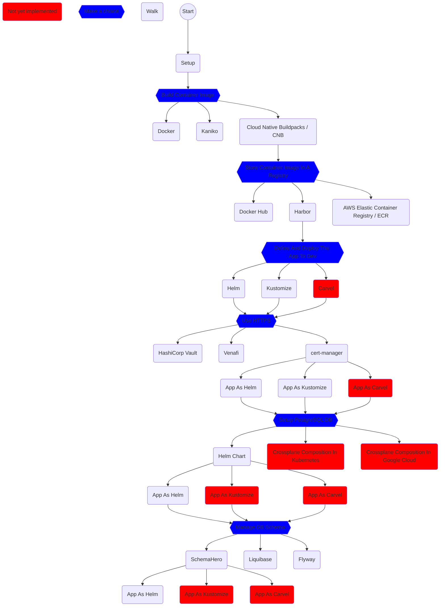

## The Whole Story

## TODO:

* KEDA
* KubeVirt
* k3s
* LinkerD
* Dapr
* Istio
* Open Policy Agent (OPA)
* Falco
* Kyverno
* Argo Rollout
* Knative
* KubeVela
* CDK For Kubernetes (cdk8s)
* Argo Workflows
* Keptn
* Argo CD
* Flux
* Argo Workflows
* FluentD (logging)
* Jaeger (tracing)
* Prometheus (monitoring)
* containerd
* CoreDNS
* Envoy
* etcd
* Rook
* Spiffe
* Spire
* The Update Framework (TUF)
* TiKV
* Vitess
* Backstage
* Chaos Mesh
* Cilium
* Cloud Custodian
* CloudEvents
* Container Network Interface (CNI)
* Contour
* Cortex
* CRI-O
* CubeFS
* Emissary Ingress
* Falco
* gRPC
* in-toto
* KubeEdge
* Litmus
* Longhorn
* NATS
* Notary
* OpenMetrics
* OpenTelemetry
* OperatorFramework
* Thanos
* Volcano
* Aeraki Mesh
* Akri
* Antrea
* Artifact Hub
* Athenz
* BFE
* Chaosblade
* Clusterpedia
* CNI-Genie
* Confidential Containers
* ContainerSSH
* Curiefense
* Curve
* Devfile
* DevStream
* Dex
* Distribution
* external-secrets
* Fluid
* Fonio
* Hexa
* Inclavare Containers
* k8gb
* K8up
* Karmada
* Keylime
* Konveyor
* Krator
* Krustlet
* Kube-OVN
* kube-rs
* KubeArmor
* KubeDL
* Kuberhealthy
* Kubewarden
* KUDO
* Kuma
* Kured
* Lima
* Meshery
* Metal3-io
* Network Service Mesh
* Nocalhost
* Open Cluster Management
* Open Service Mesh
* OpenGitOps
* OpenKruise
* OpenYurt
* ORAS
* Parsec
* Piraeus Datastore
* Pixie
* Porter
* Pravega
* sealer
* Serverless Devs
* Serverless Workflow
* Service Mesh Interface (SMI)
* Service Mesh Performance
* Skooner
* Strimzi
* Submariner
* SuperEdge
* Telepresence
* Teller
* Tinkerbell
* Tremor
* Trickster
* Vineyard
* Virtual Kubelet
* wasmCloud
* WasmEdge Runtime