## The Whole Story

```mermaid
flowchart TD;

    subgraph "Legend"
        red(Not yet implemented)
        style red fill:red
        blue{{Make a choice}}
        style blue fill:blue
        transparent(Walk)
    end

    Legend---Development

    subgraph Development
        setup-dev((Setup));
        click setup-dev "vfarcic/cncf-demo/blob/main/manuscript/setup.md" _blank

        setup-dev-->bci

        bci{{Build Container Image In Dev}}
        click bci "vfarcic/cncf-demo/blob/main/manuscript/build-container-image/story.md" _blank
        style bci fill:blue
        bci-kbld(Carvel kbld)
        click bci-kbld "vfarcic/cncf-demo/blob/main/manuscript/build-container-image/kbld.md" _blank
        bci-lima(Lima)
        click bci-lima "vfarcic/cncf-demo/blob/main/manuscript/build-container-image/lima.md" _blank
        bci-buildpacks(Cloud Native Buildpacks / CNB)
        click bci-buildpacks "vfarcic/cncf-demo/blob/main/manuscript/build-container-image/buildpacks.md" _blank

        bci-->bci-kbld-->registry;
        bci-->bci-lima-->registry;
        bci-->bci-buildpacks-->registry;

        registry{{Store Container Image In A Registry}}
        click registry "vfarcic/cncf-demo/blob/main/manuscript/registry/story.md" _blank
        style registry fill:blue
        registry-distribution(Distribution)
        click registry-distribution "vfarcic/cncf-demo/blob/main/manuscript/registry/distribution.md" _blank
        registry-harbor(Harbor)
        click registry-harbor "vfarcic/cncf-demo/blob/main/manuscript/registry/harbor.md" _blank
        registry-dragonfly(Dragonfly)
        click registry-dragonfly "vfarcic/cncf-demo/blob/main/manuscript/registry/dragonfly.md" _blank
        style registry-dragonfly fill:red

        registry-->registry-distribution-->ddd;
        registry-->registry-harbor-->ddd;
        registry-->registry-dragonfly-->ddd;

        ddd{{Define And Deploy The App To Dev}}
        click ddd "vfarcic/cncf-demo/blob/main/manuscript/define-deploy-dev/story.md" _blank
        style ddd fill:blue
        ddd1(Helm)
        click ddd1 "vfarcic/cncf-demo/blob/main/manuscript/define-deploy-dev/helm.md" _blank
        ddd2(Kustomize)
        click ddd2 "vfarcic/cncf-demo/blob/main/manuscript/define-deploy-dev/kustomize.md" _blank
        ddd3(Carvel)
        style ddd3 fill:red

        ddd-->ddd1-->https;
        ddd-->ddd2-->https;
        ddd-->ddd3-->https;

        https{{Use HTTPS}}
        click https "vfarcic/cncf-demo/blob/main/manuscript/https/story.md" _blank
        style https fill:blue
        https1(HashiCorp Vault)
        click https1 "vfarcic/cncf-demo/blob/main/manuscript/https/vault.md" _blank
        https2(Venafi)
        click https2 "vfarcic/cncf-demo/blob/main/manuscript/https/venafi.md" _blank
        https3(cert-manager)
        click https3 "vfarcic/cncf-demo/blob/main/manuscript/https/cert-manager.md" _blank
        https3-helm(App as Helm)
        click https3-helm "vfarcic/cncf-demo/blob/main/manuscript/https/cert-manager-helm.md" _blank
        https3-kustomize(App as Kustomize)
        click https3-kustomize "vfarcic/cncf-demo/blob/main/manuscript/https/cert-manager-kustomize.md" _blank
        https3-carvel(App as Carvel)
        style https3-carvel fill:red

        https-->https1;
        https-->https2;
        https-->https3;
        https3-->https3-helm-->db;
        https3-->https3-kustomize-->db;
        https3-->https3-carvel-->db;

        db{{Setup PostgreSQL DB In Dev}}
        click db "vfarcic/cncf-demo/blob/main/manuscript/db/story.md" _blank
        style db fill:blue
        db-helm(Helm Chart)
        click db-helm "vfarcic/cncf-demo/blob/main/manuscript/db/helm.md" _blank
        db-helm-helm(App as Helm)
        click db-helm-helm "vfarcic/cncf-demo/blob/main/manuscript/db/helm-helm.md" _blank
        db-helm-kustomize(App as Kustomize)
        click db-helm-kustomize "vfarcic/cncf-demo/blob/main/manuscript/db/helm-kustomize.md" _blank
        db-helm-carvel(App as Carvel)
        click db-helm-carvel "vfarcic/cncf-demo/blob/main/manuscript/db/helm-carvel.md" _blank
        style db-helm-carvel fill:red
        db-crossplane-local(Crossplane Composition In Kubernetes)
        click db-crossplane-local "vfarcic/cncf-demo/blob/main/manuscript/db/crossplane-local.md" _blank
        db-crossplane-local-helm(App as Helm)
        click db-crossplane-local-helm "vfarcic/cncf-demo/blob/main/manuscript/db/crossplane-local-helm.md" _blank
        db-crossplane-local-kustomize(App as Kustomize)
        click db-crossplane-local-kustomize "vfarcic/cncf-demo/blob/main/manuscript/db/crossplane-local-kustomize.md" _blank
        db-crossplane-local-carvel(App as Carvel)
        click db-crossplane-local-carvel "vfarcic/cncf-demo/blob/main/manuscript/db/crossplane-local-carvel.md" _blank
        style db-crossplane-local-carvel fill:red
        db-crossplane-cloud(Crossplane Composition In Cloud)
        click db-crossplane-cloud "vfarcic/cncf-demo/blob/main/manuscript/db/crossplane-cloud.md" _blank
        db-crossplane-google(Google Cloud)
        click db-crossplane-google "vfarcic/cncf-demo/blob/main/manuscript/db/crossplane-google.md" _blank
        style db-crossplane-google fill:red
        db-crossplane-aws(AWS)
        click db-crossplane-aws "vfarcic/cncf-demo/blob/main/manuscript/db/crossplane-aws.md" _blank
        style db-crossplane-aws fill:red
        db-crossplane-azure(Azure)
        click db-crossplane-azure "vfarcic/cncf-demo/blob/main/manuscript/db/crossplane-azure.md" _blank
        style db-crossplane-azure fill:red

        db-->db-helm;
        db-helm-->db-helm-helm-->db-schema;
        db-helm-->db-helm-kustomize-->db-schema;
        db-helm-->db-helm-carvel-->db-schema;
        db-->db-crossplane-local;
        db-crossplane-local-->db-crossplane-local-helm-->db-schema;
        db-crossplane-local-->db-crossplane-local-kustomize-->db-schema;
        db-crossplane-local-->db-crossplane-local-carvel-->db-schema;
        db-->db-crossplane-cloud;
        db-crossplane-cloud-->db-crossplane-google-->db-schema;
        db-crossplane-cloud-->db-crossplane-aws-->db-schema;
        db-crossplane-cloud-->db-crossplane-azure-->db-schema;

        db-schema{{Manage DB Schema}}
        click db-schema "vfarcic/cncf-demo/blob/main/manuscript/db-schema/story.md" _blank
        style db-schema fill:blue
        db-schema-schemahero(SchemaHero)
        click db-schema-schemahero "vfarcic/cncf-demo/blob/main/manuscript/db-schema/schemahero.md" _blank
        db-schema-liquibase(Liquibase)
        click db-schema-liquibase "vfarcic/cncf-demo/blob/main/manuscript/db-schema/liquibase.md" _blank
        db-schema-flyway(Flyway)
        click db-schema-flyway "vfarcic/cncf-demo/blob/main/manuscript/db-schema/flyway.md" _blank
        db-schema-schemahero-helm(App as Helm)
        click db-schema-schemahero-helm "vfarcic/cncf-demo/blob/main/manuscript/db-schema/schemahero-helm.md" _blank
        db-schema-schemahero-kustomize(App as Kustomize)
        click db-schema-schemahero-kustomize "vfarcic/cncf-demo/blob/main/manuscript/db-schema/schemahero-kustomize.md" _blank
        db-schema-schemahero-carvel(App as Carvel)
        click db-schema-schemahero-carvel "vfarcic/cncf-demo/blob/main/manuscript/db-schema/schemahero-carvel.md" _blank
        style db-schema-schemahero-carvel fill:red

        db-schema-->db-schema-flyway;
        db-schema-->db-schema-liquibase;
        db-schema-->db-schema-schemahero;
        db-schema-schemahero-->db-schema-schemahero-helm-->develop;
        db-schema-schemahero-->db-schema-schemahero-kustomize-->develop;
        db-schema-schemahero-->db-schema-schemahero-carvel-->develop;

        develop{{Develop}}
        click develop "vfarcic/cncf-demo/blob/main/manuscript/develop/story.md" _blank
        style develop fill:blue
        telepresence(Telepresence)
        click telepresence "vfarcic/cncf-demo/blob/main/manuscript/develop/telepresence.md" _blank
        style telepresence fill:red
        devspace(DevSpace)
        click devspace "vfarcic/cncf-demo/blob/main/manuscript/develop/devspace.md" _blank
        style devspace fill:red
        okteto(Okteto)
        click okteto "vfarcic/cncf-demo/blob/main/manuscript/develop/okteto.md" _blank

        develop-->telepresence
        develop-->devspace
        develop-->okteto
    end

    Development-->Production

    subgraph Production
        production-todo(TODO)
        style production-todo fill:red
    end

    Production-->Observability

    subgraph Observability
        observability-todo(TODO)
        style observability-todo fill:red
    end

    Observability-->Previews

    subgraph Previews
        previews-todo(TODO)
        style previews-todo fill:red
    end

    Previews-->Automation

    subgraph Automation
        automation-todo(TODO)
        style automation-todo fill:red
    end
```

## TODO:

* OpenTelemetry
* Jaeger (tracing)
* Prometheus (monitoring)
* containerd
* CoreDNS
* Envoy
* etcd
* Rook
* Spiffe
* Spire
* The Update Framework (TUF)
* TiKV
* Vitess
* Backstage
* Chaos Mesh
* Cilium
* Cloud Custodian
* CloudEvents
* Container Network Interface (CNI)
* Contour
* Cortex
* CRI-O
* CubeFS
* Emissary Ingress
* gRPC
* in-toto
* KubeEdge
* Litmus
* Longhorn
* NATS
* Notary
* OpenMetrics
* OperatorFramework
* Thanos
* Volcano
* Aeraki Mesh
* Akri
* Antrea
* Artifact Hub
* Athenz
* BFE
* Chaosblade
* Clusterpedia
* CNI-Genie
* Confidential Containers
* ContainerSSH
* Curiefense
* Curve
* Devfile
* DevStream
* Dex
* external-secrets
* Fluid
* Fonio
* Hexa
* Inclavare Containers
* k8gb
* K8up
* Karmada
* Keylime
* Konveyor
* Krator
* Krustlet
* Kube-OVN
* kube-rs
* KubeArmor
* KubeDL
* Kuberhealthy
* Kubewarden
* KUDO
* Kuma
* Kured
* Meshery
* Metal3-io
* Network Service Mesh
* Nocalhost
* Open Cluster Management
* Open Service Mesh
* OpenGitOps
* OpenKruise
* OpenYurt
* ORAS
* Parsec
* Piraeus Datastore
* Pixie
* Porter
* Pravega
* sealer
* Serverless Devs
* Serverless Workflow
* Service Mesh Interface (SMI)
* Service Mesh Performance
* Skooner
* Strimzi
* Submariner
* SuperEdge
* Teller
* Tinkerbell
* Tremor
* Trickster
* Vineyard
* Virtual Kubelet
* wasmCloud
* WasmEdge Runtime
* KEDA (after Prometheus)
* KubeVirt
* k3s
* LinkerD
* Dapr
* Istio
* Open Policy Agent (OPA)
* Falco
* Kyverno
* Argo Rollout
* Knative
* KubeVela
* CDK For Kubernetes (cdk8s)
* Argo Workflows
* Keptn
* Argo CD
* Flux
* Argo Workflows
* FluentD (logging)
